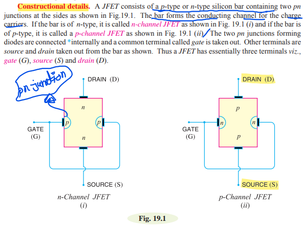
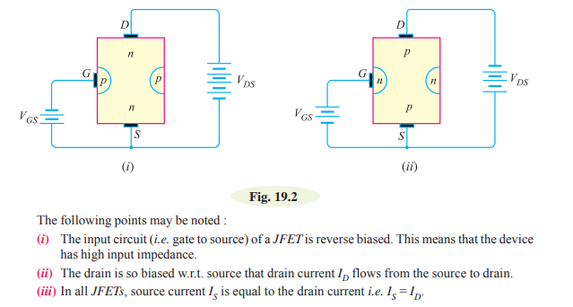
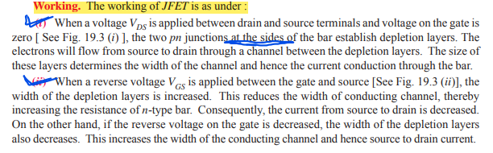
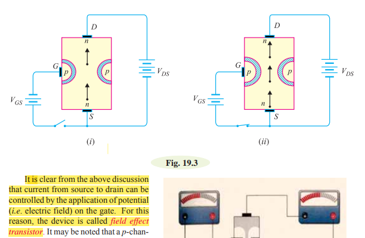

 # JFET 

 **Defination:**
  
 Junction field effect transistor is a three terminal semiconductor device in which current conduction is by one type of carrier either electrons or holes.

**Constructional details:**
 

**JFET polarities:**
 

### Principle and Working of JFET:

**Principle:**
 
There two pn junctions at the sides form two depletion layers.The width of the depletion layer and hence resistance of this channel can be controlled by changing the input voltage $V_{GS}$. The greater the reverse voltage $V_{GS}$, the wider will be the depletion layers and narrower will be the conducting channel. The narrower channel means greater resistance and hence source to drain current decreases. Reverse will happen should  $V_{GS}$ decrease.

 

  
