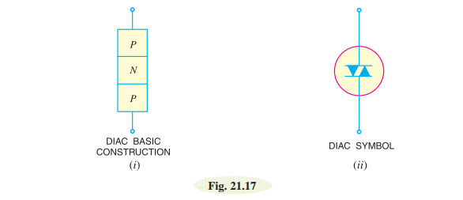
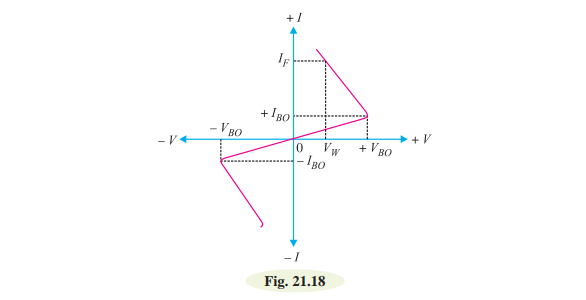
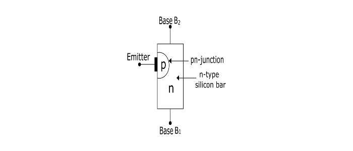

# Triac 

# Construction of Traiac:

# Diac 
 A diac is a two-terminal, three layer bidirectional device which can be switched from its OFF
state to ON state for either polarity of applied voltage.

The diac can be constructed in either npn or pnp form. Fig. 21.17 (i) shows the basic structure of
a diac in pnp form. The two leads are connected to p-regions of silicon separated by an n-region. The
structure of diac is very much similar to that of a transistor.

### **Operations:**

When a positive or negative voltage is applied across the terminals of a diac, only a
small leakage current $I_{BO}$ will flow through the device. As the applied voltage is increased, the
leakage current will continue to flow until the voltage reaches the breakover voltage $V_{BO}$.

Fig. 21.18 shows the V-I characteristics of a diac. For applied positive voltage less than + $V_{BO}$
and negative voltage less than − $V_{BO}$, a small leakage current (± $I_{BO}$) flows through the device. Under such conditions, the diac blocks the flow of current and effectively behaves as an open circuit. The voltages + $V_{BO}$ and − $V_{BO}$ are the breakdown voltages and usually have a range of 30 to 50 volts. 

# UJT (Unijunction Transistors:)
A unijunction transistor (abbreviated as UJT) is a three-terminal semiconductor switching device.

**Construction:** 
 
The UJT consists of an n-type silicon semiconductor bar with an electrical on each end. The terminals of these connections are called Base terminals (B1 and B2). Near to base B2, a pn-junction is formed between a p-type emitter and the n-type silicon bar. The terminal of this junction is called emitter terminal (E).

Since the device has three terminals and one pn-junction, for this region this is called as a Unijunction Transistor (UJT).

The device has only one pn-junction so it forms a diode. Because the two base leads are taken from one section of the diode, hence the device is also called as Double-Based Diode.

The emitter is heavily doped while the n-region is lightly doped. Thus, the resistance between base terminals is very high when emitter terminal is open.

