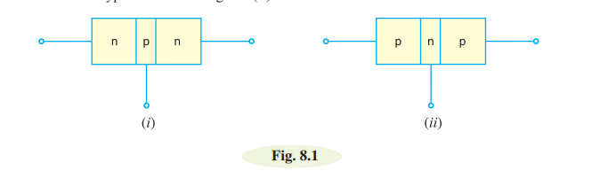
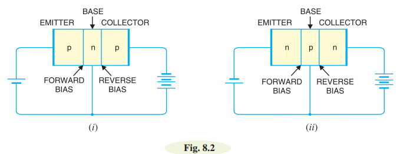
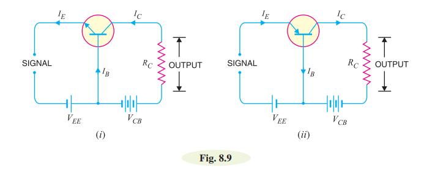
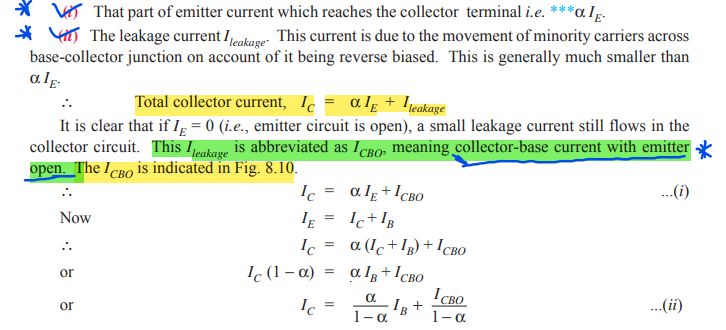

# Transistors:

A transistor consists of two pn junctions formed by *sandwiching either p-type or n-type semiconductor between a pair of opposite types. Accordingly, there are two types of transistors, namely;
(i) n-p-n transistor (ii) p-n-p transistor

An n-p-n transistor is composed of two n-type semiconductors separated by a thin section of ptype as shown in Fig. 8.1 (i). However, a p-n-p transistor is formed by two p-sections separated by a
thin section of n-type as shown in Fig. 8.1 (ii).

# Naming the Transistor Terminals:

A transistor (pnp or npn) has three sections of doped semiconductors. The section on one side is the
emitter and the section on the opposite side is the collector. The middle section is called the base and
forms two junctions between the emitter and collector.

i)  **Emitter:** The section on one side that supplies charge carriers (electrons or holes) is
called the emitter. The emitter is always forward biased w.r.t. base so that it can supply a
large number of *majority carriers. In Fig. 8.2 (i), the emitter (p-type) of pnp transistor is forward
biased and supplies hole charges to its junction with the base.

ii) **Collector:** The section on the other side that collects the charges is called the collector. The
collector is always reverse biased w.r.t. base. 

iii) **Base:** The middle section which forms two pn-junctions between the emitter and collector
is called the base.

#  Transistor Circuit as an Amplifier:

# Transistor Connections:

 A transistor can be connected in a circuit in the following three ways :
    
    i) Common Base connection
    ii) Common Emitter connection
    iii) Common collector connection

# Common Base Connection: 

In this circuit arrangement, input is applied between emitter and base and output is taken from collector and base. Here, base of the transistor is common to both input and output circuits and hence the name common base connection. In Fig. 8.9 (i), a common base npn transistor circuit is shown whereas
Fig. 8.9 (ii) shows the common base pnp transistor circuit.

**Current amplification factor (α)** It is the ratio of output current to input current. In a
common base connection, the input current is the emitter current IE and output current is the collector
current IC. The current amplification factor is denoted by α . The mathematical representaion of α is 

$\[ \alpha = \frac{\Delta I_C}{\Delta I_E} \]$

Practical values of α in commercial transistors range from 0.1 to 0.99.

**Expression for collector current:**
The whole of emitter current does not reach the collector. It is because a small percentage of it, as a result of electron-hole combinations occurring in base area. Moreover, as the collector-base junction is reverse biased, therefore, some leakage current flows due to minority carriers. 

Let, 

Therefore, the expression for collector current is  ... 

# Characteristics of Common Base Connection:

The most important characteristics of common base connection are input characteristics and output characteristics.

i) **input charavteristic:** 
It is the curve between emitter current IE and emitter-base voltage VEB at constant collector-base voltage VCB. The emitter current is generally taken along y-axis and emitter-base voltage along x-axis. Fig. 8.14 shows the input characteristics of a typical transistor in CB arrangement .
