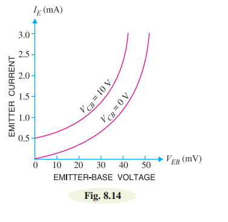
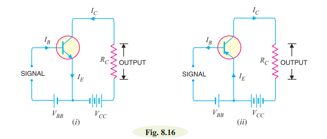
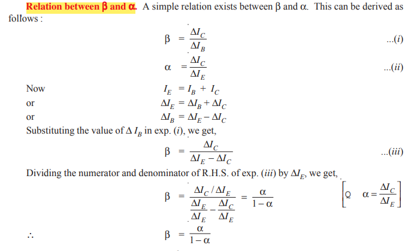
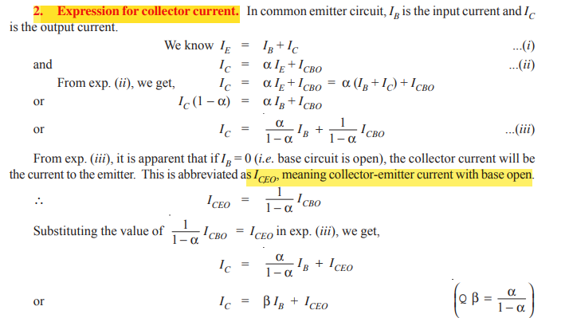
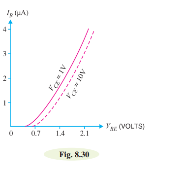
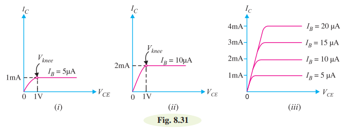
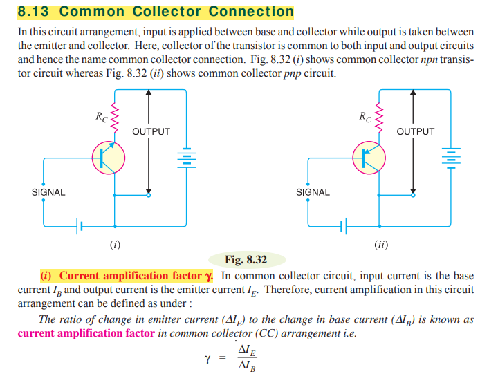
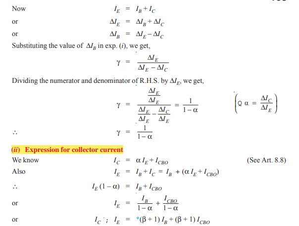
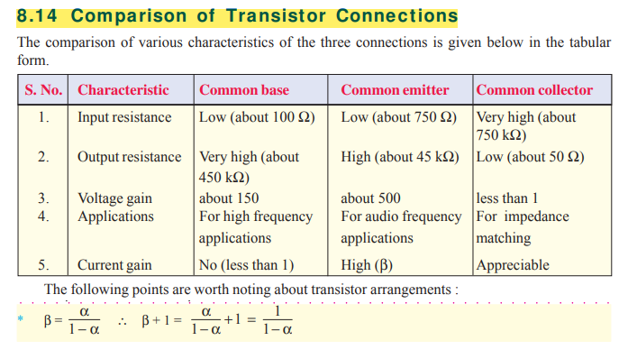

# Transistors:

A transistor consists of two pn junctions formed by *sandwiching either p-type or n-type semiconductor between a pair of opposite types. Accordingly, there are two types of transistors, namely;
(i) n-p-n transistor (ii) p-n-p transistor

An n-p-n transistor is composed of two n-type semiconductors separated by a thin section of ptype as shown in Fig. 8.1 (i). However, a p-n-p transistor is formed by two p-sections separated by a
thin section of n-type as shown in Fig. 8.1 (ii).

# Naming the Transistor Terminals:

A transistor (pnp or npn) has three sections of doped semiconductors. The section on one side is the
emitter and the section on the opposite side is the collector. The middle section is called the base and
forms two junctions between the emitter and collector.

i)  **Emitter:** The section on one side that supplies charge carriers (electrons or holes) is
called the emitter. The emitter is always forward biased w.r.t. base so that it can supply a
large number of *majority carriers. In Fig. 8.2 (i), the emitter (p-type) of pnp transistor is forward
biased and supplies hole charges to its junction with the base.

ii) **Collector:** The section on the other side that collects the charges is called the collector. The
collector is always reverse biased w.r.t. base. 

iii) **Base:** The middle section which forms two pn-junctions between the emitter and collector
is called the base.

#  Transistor Circuit as an Amplifier:

# Transistor Connections:

 A transistor can be connected in a circuit in the following three ways :
    
    i) Common Base connection
    ii) Common Emitter connection
    iii) Common collector connection

# Common Base Connection: 

In this circuit arrangement, input is applied between emitter and base and output is taken from collector and base. Here, base of the transistor is common to both input and output circuits and hence the name common base connection. In Fig. 8.9 (i), a common base npn transistor circuit is shown whereas
Fig. 8.9 (ii) shows the common base pnp transistor circuit.

**Current amplification factor (α)** It is the ratio of output current to input current. In a
common base connection, the input current is the emitter current IE and output current is the collector
current IC. The current amplification factor is denoted by α . The mathematical representaion of α is 

$\[ \alpha = \frac{\Delta I_C}{\Delta I_E} \]$

Practical values of α in commercial transistors range from 0.1 to 0.99.

**Expression for collector current:**
The whole of emitter current does not reach the collector. It is because a small percentage of it, as a result of electron-hole combinations occurring in base area. Moreover, as the collector-base junction is reverse biased, therefore, some leakage current flows due to minority carriers. 

Let, 

Therefore, the expression for collector current is  ... 

# Characteristics of Common Base Connection:

The most important characteristics of common base connection are input characteristics and output characteristics.

i) **input charavteristic:** 
It is the curve between emitter current $I_{E}$ and emitter-base voltage $V_{EB}$ at constant collector-base voltage $V_{CB}$. The emitter current is generally taken along y-axis and emitter-base voltage along x-axis. Fig. 8.14 shows the input characteristics of a typical transistor in CB arrangement . The following points may be noted from these characteristics :

(i) The emitter current IE increases rapidly with small increase in emitter-base voltage VEB. It means that input resistance is very small.

(ii) When the collector-base voltage $(\(V_{CB}\))$ is increased:

1. The reverse bias across the collector-base junction increases.
2. This increased reverse bias causes the depletion region at the collector-base junction to widen.
3. As a result, the effective width of the base region decreases.

This narrowing of the base region enhances the efficiency of the transistor as a current amplifier. The reduced width allows more electrons to diffuse across the narrow base region and reach the collector, contributing to an increase in collector current $(\(I_C\))$.

**Input Resistance:** 
It is the ratio of change in emitter-base voltage (ΔVEB) to the resulting change in emitter current (ΔIE) at constant collector-base voltage (VCB).

$\[ r_{in} = \frac{\Delta V_{BE}}{\Delta I_B} \]$

ii) **Output Characteristics:**

It is the curve between collector current $I_{C}$ and collector-base voltage $V_{CB}$ at constant emitter current $I_{E}$. Generally, collector current is taken along y-axis and collector-base voltage along x-axis. Fig. 8.15 shows the output characteristics of a typical transistor in CB arrangement.
The following points may be noted from the characteristics :

i) The collector current IC varies with $V_{CB}$ only at very low voltages ( < 1V). The transistor is never operated in this region.(For the lecakge current).

ii) When the value of $V_{CB}$ is raised above 1 − 2 V, the collector current becomes constant. It means that now $I_{C}$  is independent of $V_{CB}$ and depends upon $I_{E}$ only.

iii) A very large change in collector-base voltage produces only a tiny change in collector current. This means that output resistance is very high.

**Output Resistance:** It is the ratio of change in collector-base voltage $(ΔV_{CB})$ to the resulting change in collector current (ΔIC) at constant emitter current,

$\[ r_{out} = \frac{\Delta V_{CE}}{\Delta I_C} \]$

# Common Emitter Connection: 

In this circuit arrangement, input is applied between base and emitter and output is taken from the
collector and emitter. Here, emitter of the transistor is common to both input and output circuits and
hence the name common emitter connection. Fig. 8.16 (i) shows common emitter npn transistor
circuit whereas Fig. 8.16 (ii) shows common emitter pnp transistor circuit

**Base current amplification factor ( β):** In common emitter connection, input current is IB
and output current is $I_{C}$ .The ratio of change in collector current (ΔIC) to the change in base current (ΔIB) is known as base current amplification factor.

### **Relation between β and α:** 

### **Expression for collector current:**

### Characteristics of common emitter connection:

The most important characteristics of common emitter connection are input characteristics and output characteristics.

**Input characteristics:** 

It is the curve between base current $I_{B}$ and emitter-base voltage $V_{EB}$ at constant collector-emitter voltage $V_{CE}$. The base current is generally taken along y-axis and emitter-base voltage along x-axis. Fig. 8.30 shows the input characteristics of a transistor in CE arrangement . The following points may be noted from these characteristics :

i)  When the collector-base voltage $(\(V_{CB}\))$ is increased:

1. The reverse bias across the collector-emittor junction increases.
2. This increased reverse bias causes the depletion region at the collector-emittor junction to widen.
3. As a result, the effective width of the base region decreases.

This narrowing of the base region decrease the efficiency of the transistor as a current. The reduced width allows more electrons to diffuse across the narrow base region and reach the collector, contributing to an decrease in the base current $(\(I_B\))$.

ii) As compare to the Common-Base $(CB)$ arrangement, the increase in base current $(\(I_B\))$ with base-emitter voltage $(\(V_{BE}\))$ is less rapid in the Common-Emitter (CE) circuit.
Therefore, the input resistance of a CE circuit is higher than that of a CB circuit.

**Input Resistance Formula:**
Input resistance $(\(r_i\))$ is defined as the ratio of the change in base-emitter voltage $(\(ΔV_{BE}\))$ to the change in base current $(\(ΔI_B\))$ at constant collector-emitter voltage $(\(V_{CE}\))$. The formula is expressed as:
$\[ r_i = \frac{ΔV_{BE}}{ΔI_B} \]$

**Output Characteristics:** 
 It is the curve between collector current $(I_{C})$ and collector-emitter voltage $(V_{CE})$ at constant base current $(I_{B})$. The collector current $(I_{C})$ is generally taken along y-axis and collector-emitter voltage $(V_{CE})$ along x-axis. Fig. 8.31 shows the output characteristics of a transistor in CE arrangement . The following points may be noted from these characteristics :

 

 i) The collector current $(I_{C})$ varies with $(V_{CE})$ for $(V_{CE})$ between 0 and 1V only. After this, collector current becomes almost constant and independent of $(V_{CE})$. This value of $(V_{CE})$ upto which collector current $(I_{C})$ changes with VCE is called the knee voltage (Vknee). The transistors are always operated in the region above knee voltage.

 ii) Above knee voltage, $(I_{C})$ is almost constant. For any value of $(V_{CE})$ above knee voltage, the collector current $(I_{C})$ is approximately equl to β × $(I_{B})$ .

 **Ouput Resistance Formula:**
Output resistance $(\(r_out\))$ is defined as the ratio of the change in collector-emitter voltage $(\(ΔV_{CE}\))$ to the change in collector current $(\(ΔI_C\))$ at constant Base current $(\(I_{B}\))$. The formula is expressed as:
$\[ r_out = \frac{ΔV_{CE}}{ΔI_C} \]$

# Common Collector Connection:

**Relation between γ and α:** and **expresion for collector current**

# Comparison of Transistor Connections:

# Transistors Versus Vacuum Tubes

# Transistor Circuit as an Amplifier

