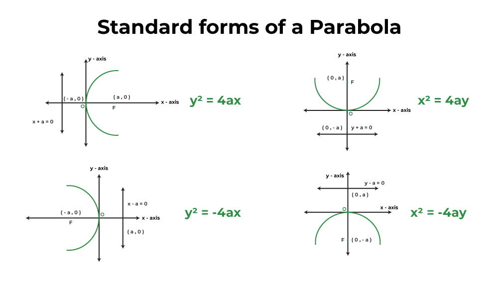
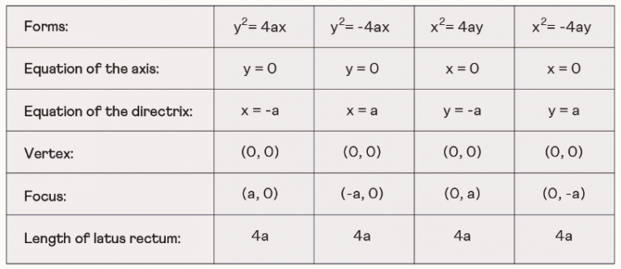
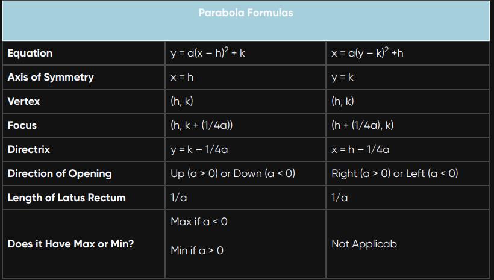

# Parabola:

**Definition of a Parabola:**
A parabola is a conic section, a curve formed by the intersection of a right circular cone and a plane parallel to one of the cone's generating lines. Geometrically, a parabola is defined as the set of all points in a plane that are equidistant from a fixed point (called the focus) and a fixed straight line (called the directrix).

**Properties of a Parabola:**

1. **Focus and Directrix:**
   - The parabola is symmetric with respect to its axis of symmetry, which is a line passing through the focus and the vertex.
   - The distance between the vertex and the focus is the same as the distance between the vertex and the directrix. This distance is called the focal length.

2. **Vertex:**
   - The vertex is the point on the parabola closest to both the focus and the directrix.
   - The axis of symmetry passes through the vertex.

3. **Standard Form Equations:**
   - The standard form of the equation for a parabola with its vertex at the origin is $\(y = ax^2\)$ or $\(x = ay^2\)$, where $\(a\)$ is a constant.
   - When the vertex is at $\((h, k)\)$, the standard form becomes $\(y = a(x - h)^2 + k\)$ or $\(x = a(y - k)^2 + h\)$.

4. **Direction of Opening:**
   - The sign of the coefficient $\(a\)$ in the standard form determines the direction of opening. A positive $\(a\)$ opens the parabola upwards (for $\(y\)$) or to the right (for $\(x\)$), and a negative $\(a\)$ opens it downwards (for $\(y\)$) or to the left (for $\(x\)$).

   

5. **Latus Rectum:**
   - The latus rectum is a line segment passing through the focus and perpendicular to the axis of symmetry. Its length is equal to the |4a|.

6. **Focal Length:**
   - The focal length is the distance between the focus and the vertex. It is also the distance between the vertex and the directrix.

7. **Tangent and Normal:**
   - The tangent at any point on the parabola is perpendicular to the radius drawn from the point to the focus.
   - The normal at any point on the parabola is perpendicular to the tangent at that point.

8. **Parabola Formula:**

# Ellipse:

**Definition of an Ellipse:**
An ellipse is a conic section, a curve formed by the intersection of a right circular cone and a plane that is not parallel to the cone's base. Geometrically, an ellipse is defined as the set of all points in a plane, such that the sum of the distances from two fixed points (called the foci) to any point on the ellipse remains constant.

**Properties of an Ellipse:**

1. **Foci and Major/Minor Axes:**
   - An ellipse has two foci, and the line segment joining the foci is the major axis.
   - The midpoint of the major axis is the center of the ellipse.
   - The minor axis is perpendicular to the major axis and passes through the center.

2. **Distance between Foci:**
   - The sum of the distances from any point on the ellipse to the two foci is constant and equal to the length of the major axis.

3. **Standard Form Equations:**
   - The standard form of the equation for an ellipse centered at the origin is $\frac{x^2}{a^2} + \frac{y^2}{b^2} = 1$, where $a$ and $b$ are the lengths of the semi-major and semi-minor axes, respectively.
   - When the ellipse is centered at $(h, k)$, the standard form becomes $\frac{(x - h)^2}{a^2} + \frac{(y - k)^2}{b^2} = 1$.

4. **Eccentricity:**
   - The eccentricity of an ellipse, denoted by $e$, is a measure of its deviation from a perfect circle. It is calculated as $e = \sqrt{1 - \frac{b^2}{a^2}}$.

5. **Focal Length and Focal Points:**
   - The focal length is the distance between the two foci .Therefore it is the sum of distances from the foci point to the centre.
   - The foci are located at the points $(\pm c, 0)$ or $(0, \pm c)$.

6. **Vertices:**
   - The vertices of the ellipse are the points where the ellipse intersects the major axis. They are located at $(h \pm a, k)$ when the ellipse is centered at $(h, k)$.
   
   - Co-Vertices are the ponts where the ellipse minor axis intersects with the ellipse.

7. **Directrices:**
   - The directrices of an ellipse are two lines that are equidistant from the center and parallel to the minor axis. The distance between the center and a directrix is given by $d = \frac{a}{e}$.

8. **Ellipse Formula:**

   