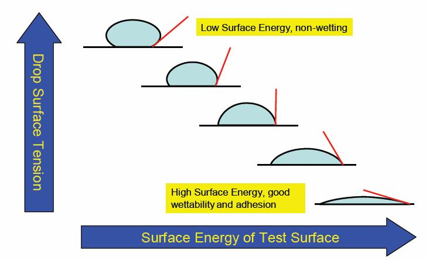

1. **Cohesive Forces**:
   - **Definition**: Cohesive forces are the attractive forces between molecules of the same type. These forces help hold the substance together and are responsible for the liquid or solid state of a material.
   - **Example**: Water molecules in a liquid state are held together by cohesive forces. This is why water droplets form and water has a tendency to bead up.

2. **Adhesive Forces**:
   - **Definition**: Adhesive forces are the attractive forces between molecules of different types. These forces occur when molecules from different substances are attracted to each other.
   - **Example**: When water adheres to the surface of a glass, adhesive forces between water molecules and the glass molecules are at play. This is often observed in phenomena like capillary action.

[access pressure in a sperical bubble](https://www.shaalaa.com/question-bank-solutions/derive-expression-excess-pressure-inside-drop-liquid-surface-tension_495)

[soap video](https://www.youtube.com/watch?v=h6pVwlxEubE)

[soap derivation](https://www.vedantu.com/question-answer/give-the-expression-for-the-excess-pressure-in-a-class-11-physics-cbse-5f92b2e0f00fb52b327bb9f4)

# Surface Energy and surface flim:

Certainly, let's define surface film and surface energy:

 **Surface Energy**:
   - **Definition**: Surface energy is the amount of work that must be done to increase the surface area of a liquid or solid by a unit amount. It is a measure of the energy required to expose additional surface of a material.

   - **Explanation**: At the molecular level, particles on the surface of a material have higher energy compared to those in the bulk. This difference in energy is due to the unbalanced forces at the surface. Surface energy is an important factor in determining the behavior of liquids and solids. It influences phenomena such as wetting, spreading, and adhesion. Materials with lower surface energy tend to repel liquids, while those with higher surface energy may readily interact with and be wetted by liquids.

   **Surface Film**

   - **Defination**: Surface film is a thin film of liquid near its surface and having the thickness equal to the molecular range of attraction of the liquid.
   

