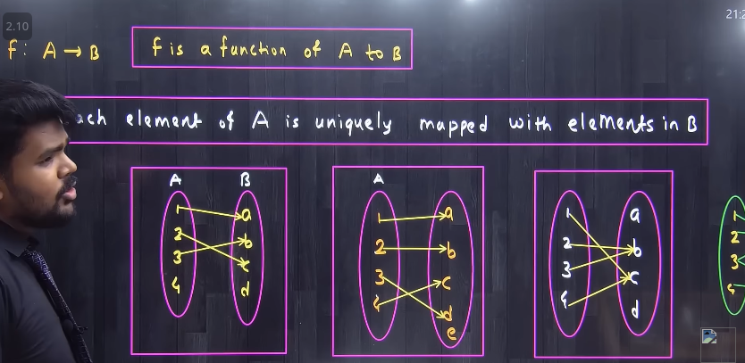
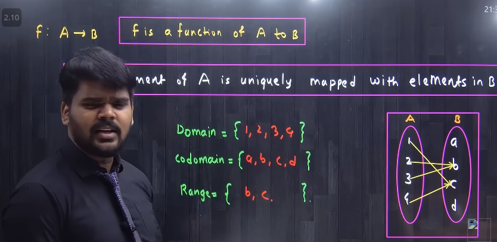
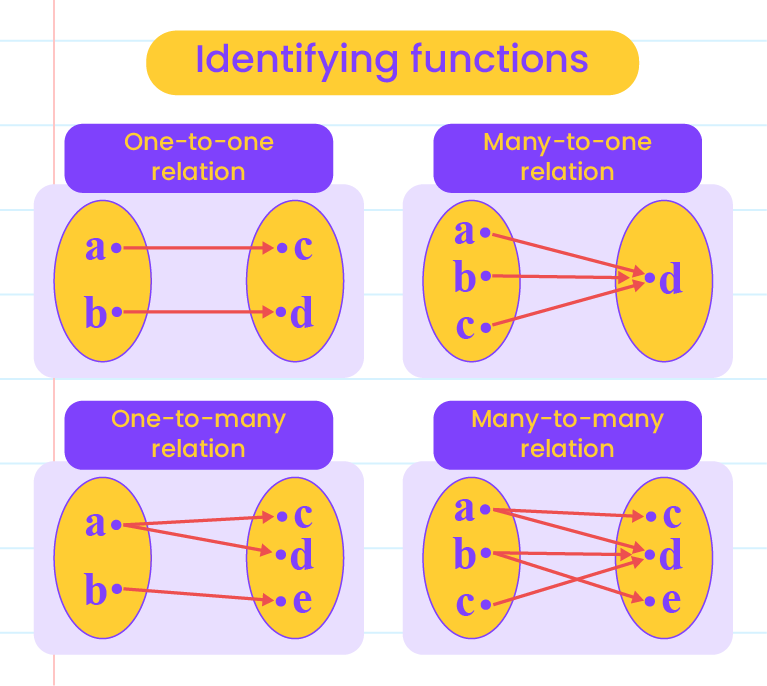
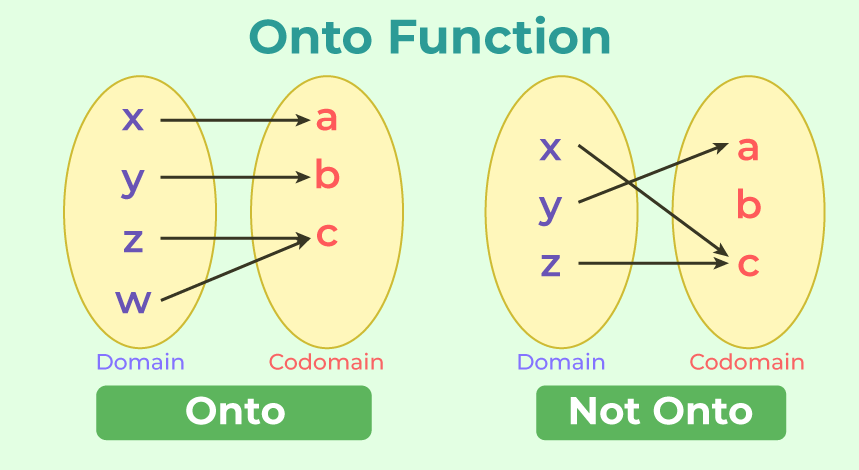
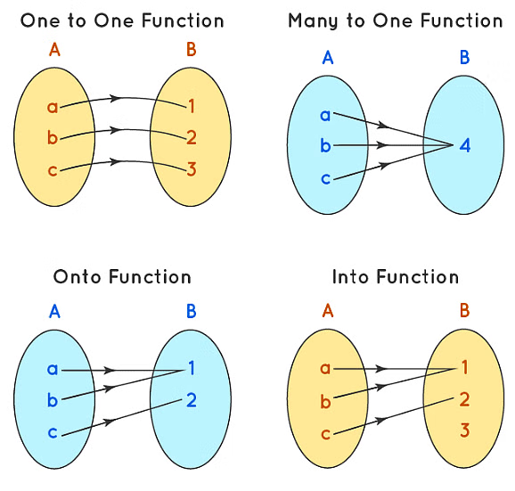
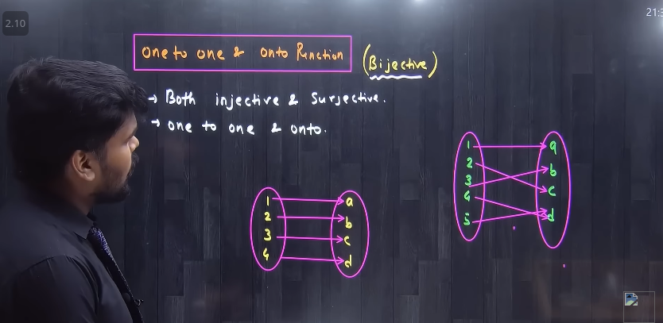

   

(video)[https://www.youtube.com/watch?v=r2pvNu4sY6s&list=PLT3bOBUU3L9gF5nz4y1j2lb6q6IDbA6PQ&index=6]

   

# Function: 

### Domain, Co-domain, Range

### ONE TO ONE

   

   

### Onto Function

co-domain এ ফাঁকা থাকা যাবে না । 

   

### Into Function:

co-domain এ ফাঁকা থাকবে । 

### Bijective

