[Video-1](https://www.youtube.com/watch?v=ynHoB_0li_o&list=PLT3bOBUU3L9gF5nz4y1j2lb6q6IDbA6PQ)

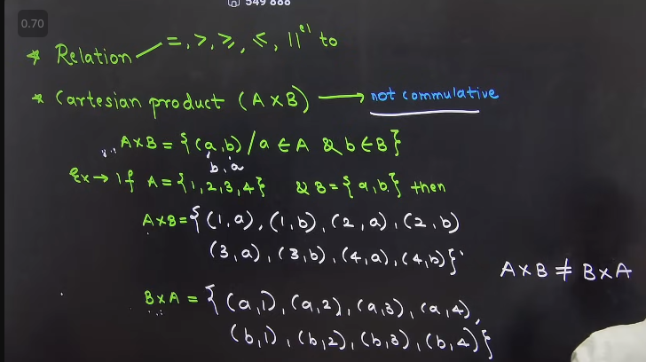

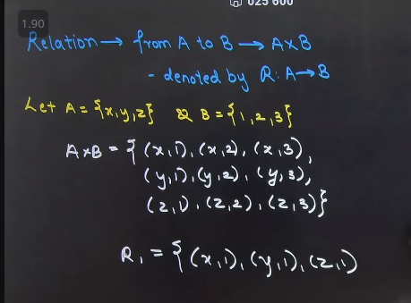

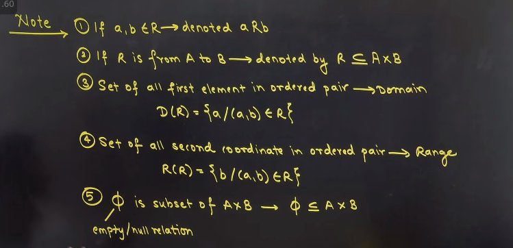

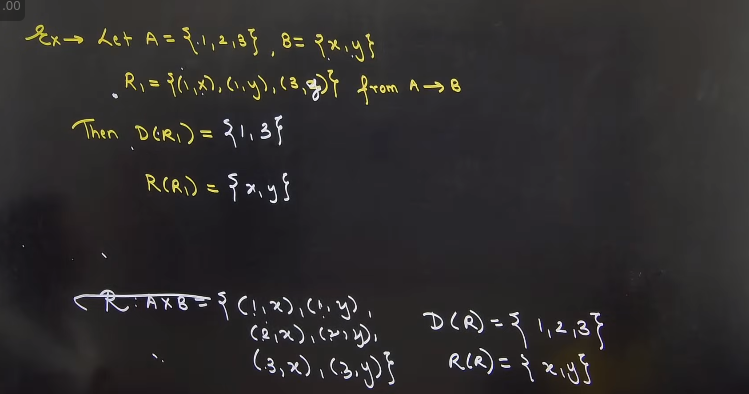

#### Mr(Matrix relationship)
### condition ture -> 1 
### else condition falase -> 0

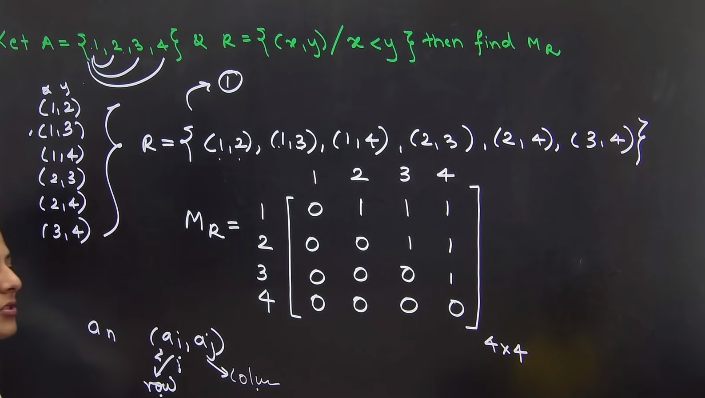

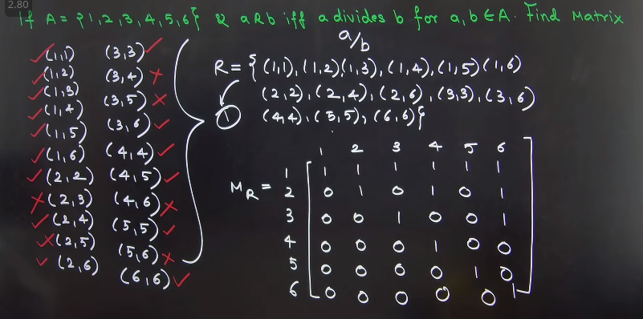
 
Matrix representation multipication and  addition:  

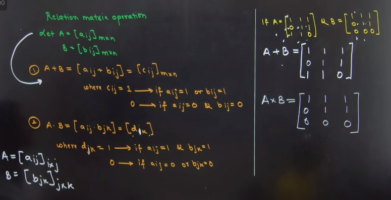

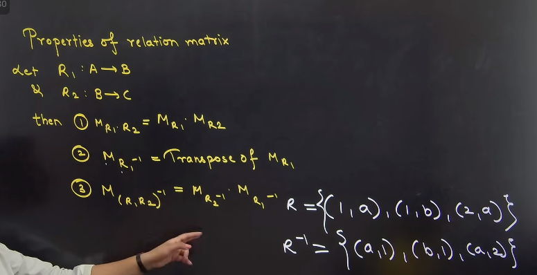

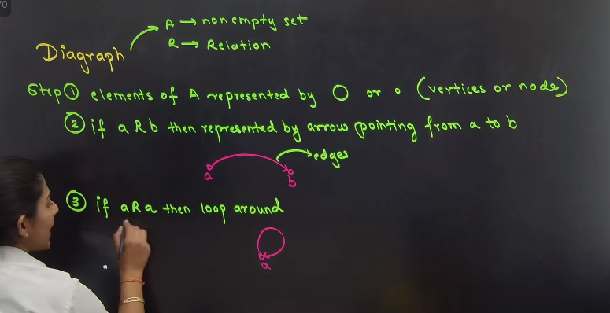

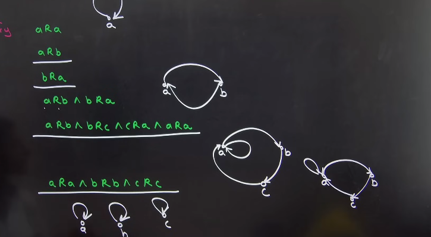

### H.W.

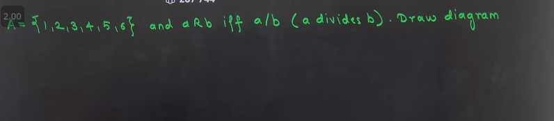

 
 
 

Video No: 02

 
 
 

যদি diagraph দিয়ে relation গুলো দেওয়া থাকে তাইলে, direction গুলো শুধু change হয়ে যাবে । 
inverse  করার সময় । 

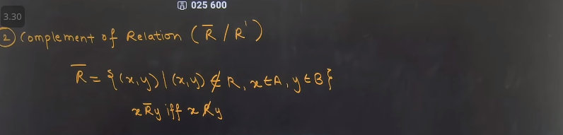

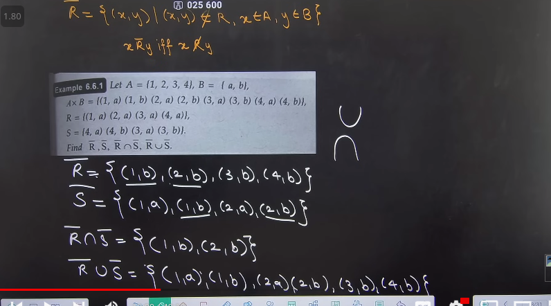

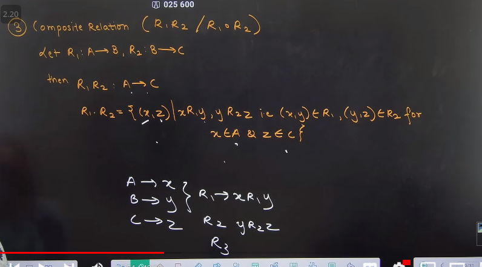

## Types of relations of set:

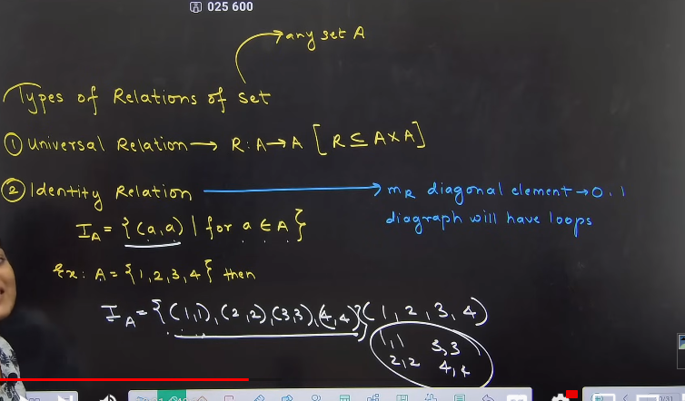

R4 -> Irreflective relation;

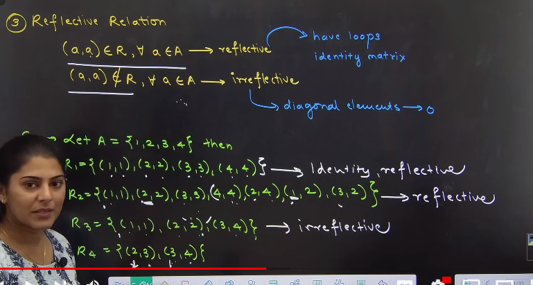

# Symmetric

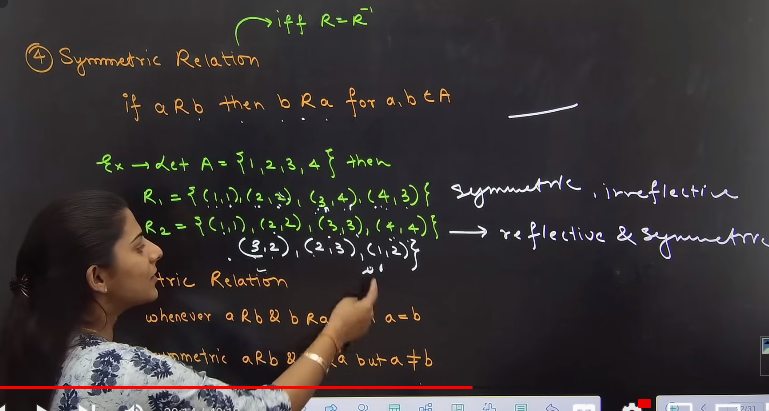

# Antisymmetric

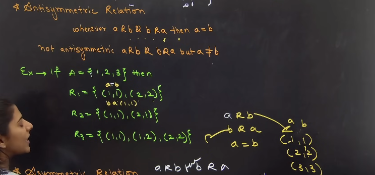

# Asymmetric 

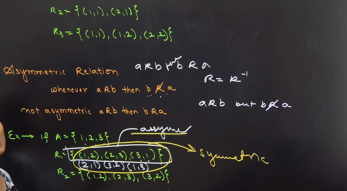

# Compatible

