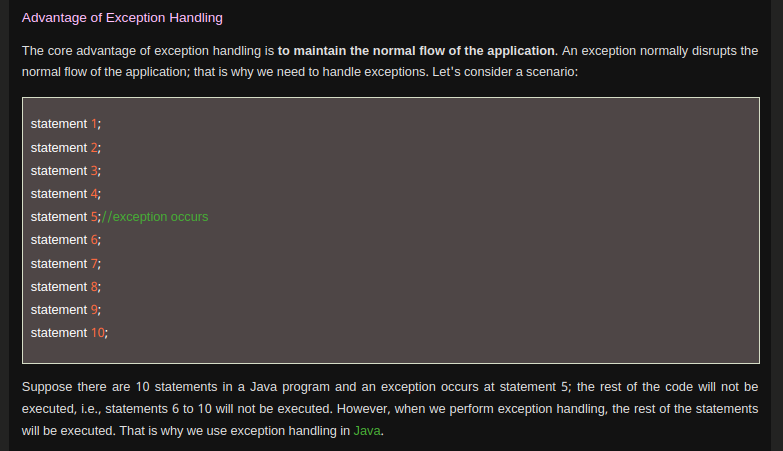
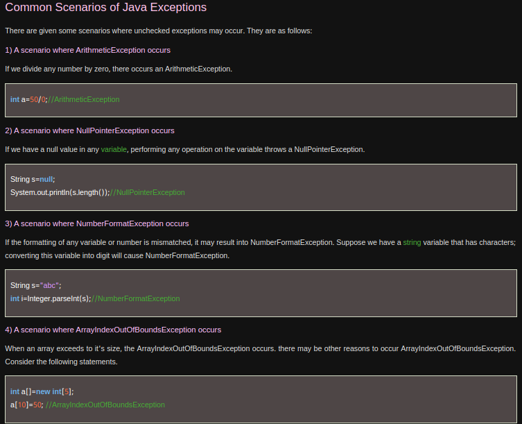

# Advantage of ExceptionHandling: 

### To maintain the normal flow of the application:



### Common Scenarioes of exception in java



### Java Catch Multiple Exceptions:
```java
public class MultipleCatchBlock2 {  
  
    public static void main(String[] args) {  
          
           try{    
                int a[]=new int[5];    
                
                System.out.println(a[10]);  
               }    
               catch(ArithmeticException e)  
                  {  
                   System.out.println("Arithmetic Exception occurs");  
                  }    
               catch(ArrayIndexOutOfBoundsException e)  
                  {  
                   System.out.println("ArrayIndexOutOfBounds Exception occurs");  
                  }    
               catch(Exception e)  
                  {  
                   System.out.println("Parent Exception occurs");  
                  }             
               System.out.println("rest of the code");    
    }  
}  

```
<br>


