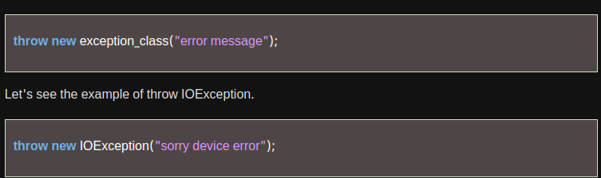
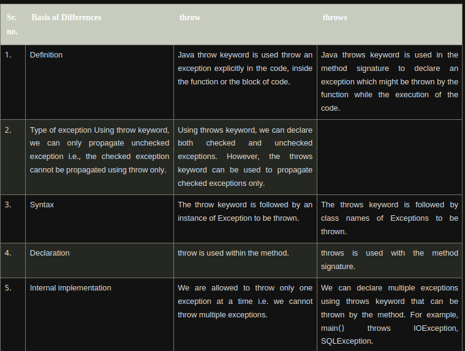
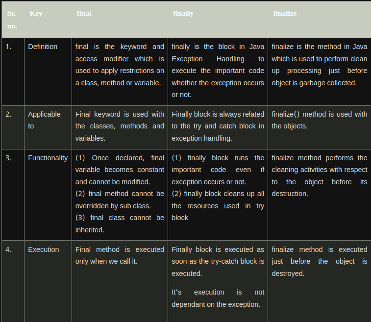

# Advantage of ExceptionHandling: 

### To maintain the normal flow of the application:


### Common Scenarioes of exception in java


### Java Catch Multiple Exceptions:
```java
public class MultipleCatchBlock2 {  
  
    public static void main(String[] args) {  
          
           try{    
                int a[]=new int[5];    
                
                System.out.println(a[10]);  
               }    
               catch(ArithmeticException e)  
                  {  
                   System.out.println("Arithmetic Exception occurs");  
                  }    
               catch(ArrayIndexOutOfBoundsException e)  
                  {  
                   System.out.println("ArrayIndexOutOfBounds Exception occurs");  
                  }    
               catch(Exception e)  
                  {  
                   System.out.println("Parent Exception occurs");  
                  }             
               System.out.println("rest of the code");    
    }  
}  

```
<br>

### Java Nested try block:

```java
public class NestedTryBlock{    
 public static void main(String args[]){   
 //outer try block   
  try{    
  //inner try block 1  
    try{    
     System.out.println("going to divide by 0");    
     int b =39/0;    
   }  
    //catch block of inner try block 1  
    catch(ArithmeticException e)  
    {  
      System.out.println(e);  
    }    
       
    
    //inner try block 2  
    try{    
    int a[]=new int[5];    
  
    //assigning the value out of array bounds  
     a[5]=4;    
     }  
  
    //catch block of inner try block 2  
    catch(ArrayIndexOutOfBoundsException e)  
    {  
       System.out.println(e);  
    }    
  
      
    System.out.println("other statement");    
  }  
  //catch block of outer try block  
  catch(Exception e)  
  {  
    System.out.println("handled the exception (outer catch)");  
  }    
    
  System.out.println("normal flow..");    
 }    
}  
```


# Java throw Exception : 

The Java throw keyword is used to throw an exception explicitly.



```java
public class TestThrow1 {   
    //function to check if person is eligible to vote or not   
    public static void validate(int age) {  
        if(age<18) {  
            //throw Arithmetic exception if not eligible to vote  
            throw new ArithmeticException("Person is not eligible to vote");    
        }  
        else {  
            System.out.println("Person is eligible to vote!!");  
        }  
    }  
    //main method  
    public static void main(String args[]){  
        //calling the function  
        validate(13);  
        System.out.println("rest of the code...");    
  }    
}   
```
<br>
<br>

# java thows keyword:
**Java throws keyword:**
<br>
The Java throws keyword is used to declare an exception. It gives an information to the programmer that there may occur an exception. So, it is better for the programmer to provide the exception handling code so that the normal flow of the program can be maintained.

# Case 1: Handle Exception Using try-catch block

```java
import java.io.*;  
class M{  
 void method()throws IOException{  
  throw new IOException("device error");  
 }  
}  
public class Testthrows2{  
   public static void main(String args[]){  
    try{  
     M m=new M();  
     m.method();  
    }catch(Exception e){System.out.println("exception handled");}     
  
    System.out.println("normal flow...");  
  }  
}  
```


# case2: Declare Exception: 

```java

mport java.io.*;  
class M{  
 void method()throws IOException{  
  System.out.println("device operation performed");  
 }  
}  
class Testthrows3{  
   public static void main(String args[])throws IOException{//declare exception  
     M m=new M();  
     m.method();  
  
    System.out.println("normal flow...");  
  }  
}  

```

# Difference between throw and throws



# final, finally and finalize keyword:




