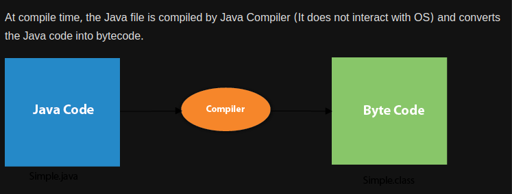

# Introduction And Basic

### Feature of java


### Compiler in java
**To compile:**
javac Simple.java
**To execute:**
java Simple

### Java is both complie and interpreted language.


### What happens at compile time?



### What happens at run time?


**explanation:**

**Classloader:** It is the subsystem of JVM that is used to load class files.

**Bytecode Verifier:** Checks the code fragments for illegal code that can violate access rights to objects.

**Interpreter:** Read bytecode stream then execute the instructions.

### Q) Can you save a Java source file by another name than the class name?
Yes, if the class is not public

### Q) Can java allow multiple class in one source file?
Here, source file is D.java


# Difference between JDK, JRE, and JVM


# JVM 
JVM (Java Virtual Machine) is an abstract machine. It is called a virtual machine because it doesn't physically exist. It is a specification that provides a runtime environment in which Java bytecode can be executed. It can also run those programs which are written in other languages and compiled to Java bytecode.

**The JVM performs the following main tasks:**

    - Loads code
    - Verifies code
    - Executes code
    - Provides runtime environme


# JRE
JRE is an acronym for Java Runtime Environment. It is also written as Java RTE. The Java Runtime Environment is a set of software tools which are used for developing Java applications. It is used to provide the runtime environment. It is the implementation of JVM. It physically exists. It contains a set of libraries + other files that JVM uses at runtime.

The implementation of JVM is also actively released by other companies besides Sun Micro Systems.


# JDK
JDK is an acronym for Java Development Kit. The Java Development Kit (JDK) is a software development environment which is used to develop Java applications. It physically exists. It contains JRE + development tools.


# JVM : 


### In Execution engine we have JIT(just in time compiler)

<br>
<br>

# Variable in java:

**1) Local Variable:**
A variable declared inside the body of the method is called local variable. You can use this variable only within that method and the other methods in the class aren't even aware that the variable exists.

A local variable cannot be defined with "static" keyword.

**2) Instance Variable:**
A variable declared inside the class but outside the body of the method, is called an instance variable. It is not declared as static.

It is called an instance variable because its value is instance-specific and is not shared among instances.

**3) Static variable:**
A variable that is declared as static is called a static variable. It cannot be local. You can create a single copy of the static variable and share it among all the instances of the class. Memory allocation for static variables happens only once when the class is loaded in the memory.


<br>
<br>

# Data type in java


```java
public class MyClass {
    public static void main(String args[]) {
        int myInteger = 42;
        float myFloat = 3.14f;
        double myDouble = 6.28d;
        char myChar = 'A';
        boolean isTrue = true; //boolean not bool
        byte myByte = 127;
        short myShort = 32000;
        long myLong = 123456789L;
        int myUnsignedInt = 500;  // Use int for unsigned integers
        long myUnsignedLong = 123456789L;  // Use long for unsigned long integers
    }
}
```
