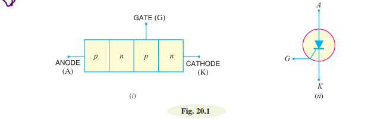

# Silicon Controlled Rectifier (SCR)
A silicon controlled rectifier is a semiconductor device that acts as a true electronic switch.

**Constructional details:**
When a pn junction is added to a junction transistor, the resulting three
pn junction device is called a silicon controlled rectifier. Fig. 20.1 (i) shows its construction.

Three are three terminals of a SCR. One is selected from the outer p-type material called anode
A, the next one is selected from the outer n-type material called cathode K and the third from the base of transistor section and is called gate G.
 
**Why a SCR is called thyristor:**
The silicon controlled rectifier is a solid state equivalent of thyratron. The gate, anode and
cathode of SCR correspond to the grid, plate and cathode of thyratron. For this reason, SCR is
sometimes called thyristor.

# Working Of SCR

**When Gate is Open Circuited:**
When no voltage applied to gate terminal, junction J2, is reverse biased and the junctions J1 and J3 are forward biased. Since one of the three junctions is reverse biased so there is no current can flow through the load, hence the SCR is OFF. However if the applied voltage is gradually increased, a stage is reached, when reverse biased junction (J2) breaks down. The SCR now, starts conducting and become ON. The value of applied voltage at which the reverse biased junction breaks down and the SCR becomes ON is known as Breakover Voltage.

**When Gate is Positive with Respect to Cathode:**
The SCR can be turned ON at smaller applied voltage by the application of a small positive voltage at the gate terminal. When gate voltage is applied the junction J3 is forward biased and junction J2 is reverse biased. Thus, the electrons from n – type layer starts moving across the junction J3 toward p –type material and the holes from p –type material towards the n – type material. Due to the movement of holes and electrons across the junction J3 the gate current starts flowing. Because of gate current the anode current increases. The increased anode current makes the more electrons available at the junction J2. As a result of this process, in a small time, the junction J2 breaks down and the SCR is turn ON.

Even if the voltage at the gate terminal is removed, the SCR the anode current does not decrease. The SCR can only be turned off by reducing the applied voltage to zero.

# Silicon controlled rectifier as a switch:

