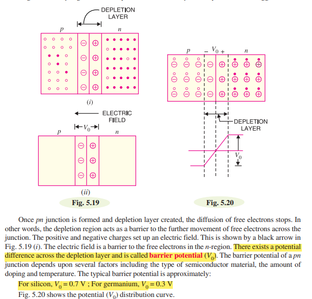
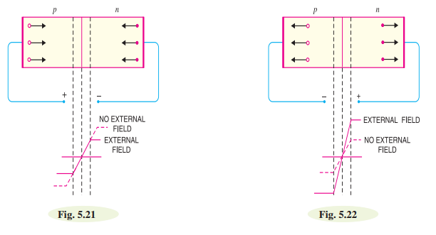
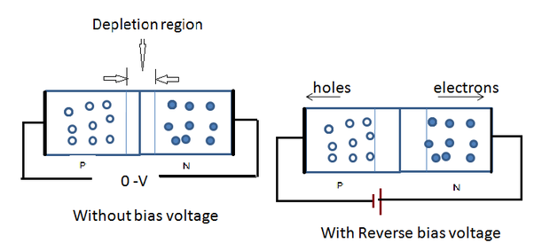
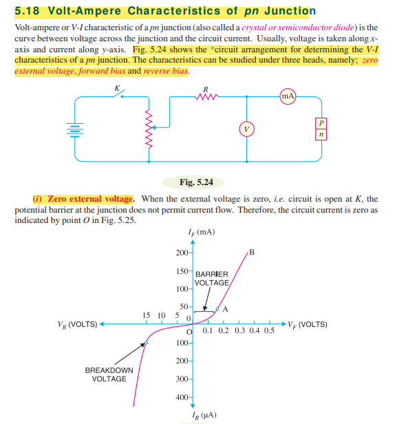

# PN Junction: 
When a p-type semiconductor is suitably joined to n-type semiconductor, the contact surface is called
pn junction.

# Properties of pn junction:

At the instant of pn-junction formation, the free electrons near the junction in the n region begin to
diffuse across the junction into the p region where they combine with holes near the junction. The
result is that n region loses free electrons and p region loses its holes. This creates a layer of
positive charges (pentavalent ions) and simillary a layer of  negative charges (Trivalent ions) near the junction.

# Applying D.C. Voltage Across pn Junction or Biasing a pn Junction:

A DC source voltage can be connected to a pn junction in two ways. This connection is called biasing. There are two type of biasing, given below:

i) Forward Biasing 
ii) Reverse Biasing

1. **Forward Bias:**
    **Defination:**
    When the applied external voltage positive terminal of the battery connected to p-type and negative terminal to the n-type as shown in (Fig. 5.21) is called forward biasing.

     
    **Important points:**
   - In forward bias, the positive terminal of the DC source is connected to the p-type semiconductor, and the negative terminal is connected to the n-type semiconductor.
   - This arrangement reduces the potential barrier and allows the current to flow across the junction.
   - Under forward bias, the diode conducts electricity efficiently, and it is in its ON state.

    

2. **Reverse Bias:**

    **Defination:**
    When the applied external voltage positive terminal of the battery connected to n-type and negative terminal to the p-type as shown in (Fig. 5.21) is called reverse biasing.

     
    **Important points:**

   - In reverse bias, the positive terminal of the DC source is connected to the n-type semiconductor, and the negative terminal is connected to the p-type semiconductor.
   - This increases the potential barrier, making it difficult for current to flow across the junction.
   - Under reverse bias, the diode has a high resistance, and only a small leakage current flows. The diode is in its OFF state.

