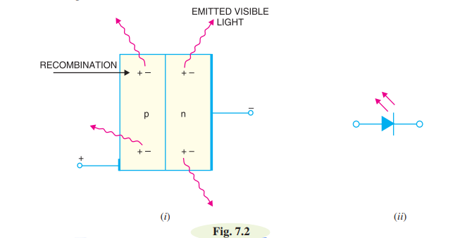
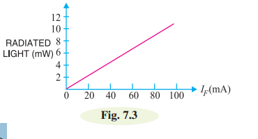
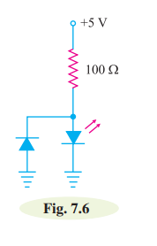

# Light Emitting Diode:

**Defination:** A light-emitting diode (LED) is a diode that gives off visible light when forward biased. Light-emitting diodes are not made from silicon or germanium but are made by using elements like
gallium, phosphorus and arsenic. ->(gap)

**Theory:**  When light-emitting diode (LED) is forward biased as shown in Fig. 7.2 (i), the electrons
from the n-type material cross the pn junction and recombine with holes in the p-type material. 

Recall that these free electrons are in the conduction band and at a higher energy level than the holes in the valence band. When recombination takes place, the recombining electrons release energy in the form of heat and light. In germanium and silicon diodes, almost the entire energy is given up in the form of heat and emitted light is insignificant. However, in materials like gallium arsenide, the number of photons of light energy is sufficient to produce quite intense visible light.

Fig. 7.2 (ii) shows the schematic symbol for a LED. The arrows are shown as pointing away from the diode, indicating that light is being emitted by the device when forward biased.

Fig. 7.3 shows the graph between radiated light and the forward current of the LED. It is clear from the
graph that the intensity of radiated light is directly proportional to the forward current of LED.

# Advantage of LED:

 i) Low Voltage.

 ii) Longer life (more thean 20 years).

 iii) Fast on-off switching.

 # Protecting LED against reverse bias:

 

 The LEDs have low reverse voltage ratings. For example, a typical LED may have a maximum reverse voltage rating of 3V. This means that if a reverse voltage greater than 3 V is applied to
 the LED, the LED may be destroyed. Therefore, one must be careful not to use LEDs with a high level of reverse bias. One way to protect a LED is to connect a rectifier diode in parallel with LED as shown in Fig. 7.6. If reverse voltage greater than the reverse voltage rating of LED is accidentally 
 applied, the rectifier diode will be turned on. This protects the LED from damage.
