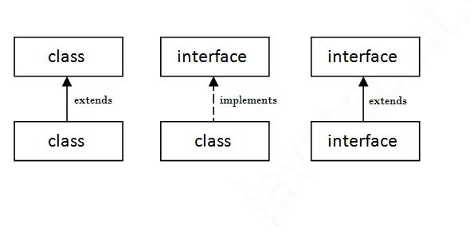
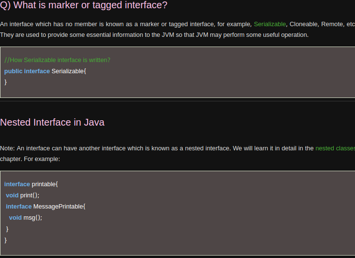
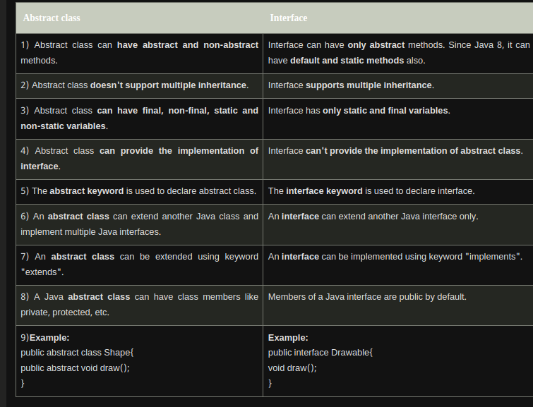

- Java Interface also represents the IS-A relationship.

- It cannot be instantiated just like the abstract class.

- Since Java 8, we can have default and static methods in an interface.

- Since Java 9, we can have private methods in an interface.


# The relationship between classes and interfaces




# Multiple inheritance in Java by interface

```java
interface Printable{  
void print();  
}  
interface Showable{  
void show();  
}  
class A7 implements Printable,Showable{  
public void print(){System.out.println("Hello");}  
public void show(){System.out.println("Welcome");}  
  
public static void main(String args[]){  
A7 obj = new A7();  
obj.print();  
obj.show();  
 }  
}
```
```
OUTPUT:
Hello
Welcome
```

# Interface inheritance
```java
interface Printable{  
void print();  
}  
interface Showable extends Printable{  
void show();  
}  
class TestInterface4 implements Showable{  
public void print(){System.out.println("Hello");}  
public void show(){System.out.println("Welcome");}  
  
public static void main(String args[]){  
TestInterface4 obj = new TestInterface4();  
obj.print();  
obj.show();  
 }  
}  
```

# Java 8 Default Method in Interface

```java
interface Drawable{  
void draw();  
default void msg(){System.out.println("default method");}  
}  
class Rectangle implements Drawable{  
public void draw(){System.out.println("drawing rectangle");}  
}  
class TestInterfaceDefault{  
public static void main(String args[]){  
Drawable d=new Rectangle();  
d.draw();  
d.msg();  
}}
```
```
OUTPUT:
drawing rectangle
default method
```

# Java 8 Static Method in Interface

```java

interface Drawable{  
void draw();  
static int cube(int x){return x*x*x;}  
}  
class Rectangle implements Drawable{  
public void draw(){System.out.println("drawing rectangle");}  
}  
  
class TestInterfaceStatic{  
public static void main(String args[]){  
Drawable d=new Rectangle();  
d.draw();  
System.out.println(Drawable.cube(3));  
}}  

```
```
OUTPUT:
drawing rectangle
27
```

# Q) What is marker or tagged interface?



# Difference between Interface and abstract Class:



