 

---

 

# _________________  Topology  __________________

### Topology : [Video_Link](https://www.youtube.com/watch?v=gGTDFG2Q_UM&ab_channel=LearnCoding)

#### What is topology?

`The physical arrangement of the computer system or node, which is connected to each other via communication medium is called topology.`

#### Types of topology

- Bus
- Ring
- Star
- Mesh
- Hybrid
- Tree

---

# Bus topology:

`In Bus topology, one long cable acts as a single communication channel and all the deviecs are connected to this cable. `

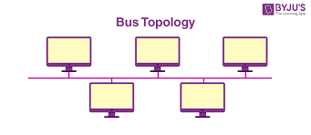

 

# `**Advantage and Disadvantage of bus topology:**`

 

### Advantage:

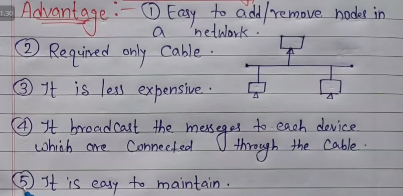

`It broadcast the message to each device means লাইনের কোন computer কোন message send করলে সেইটা line এ থাকা সব computer এ যাবে ।`

`কোন একটা computer নষ্ট হয়ে গেলে বাকী কোন computer কোন effect পড়বে না ।`

### Disadvantage:

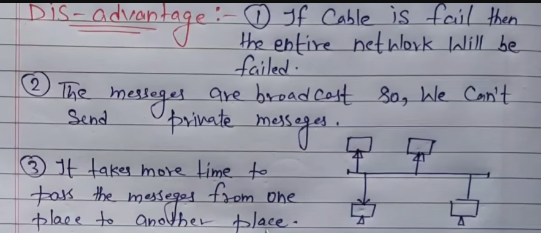
 

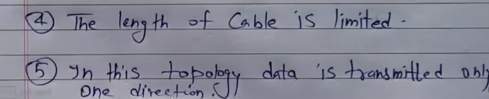

`wire length নিজের ইচ্ছে মতো দেওয়া যাবে না । `

 

---

# Ring Topology:

`It is called ring topology because it forms a ring. In this topology each node is Strongly connected with its adjacent node.`

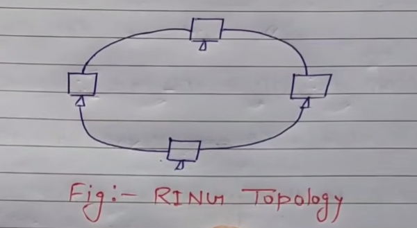

# `**Advantage and Disadvantage of Ring Topology:**`

####  Advantage:

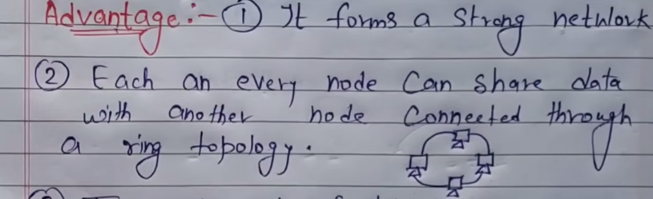

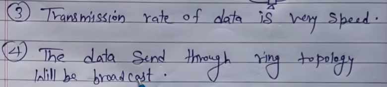

#### Disadvantage:

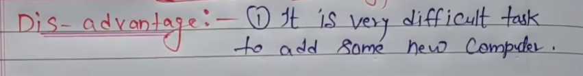

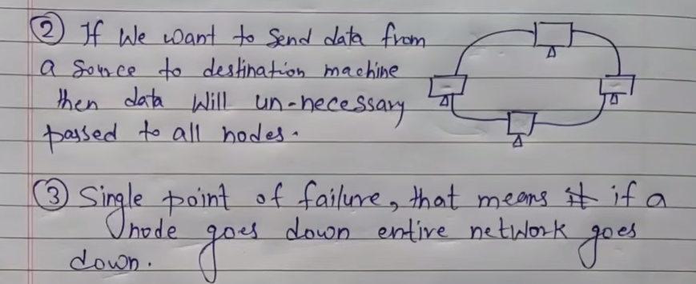

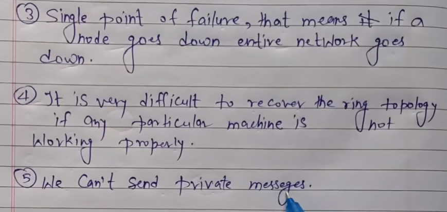

   

---

   

# Star Topology:

`In star topology all the nodes are connected with a central device called HUB. And the sharing of data is only possible throught HUB.`

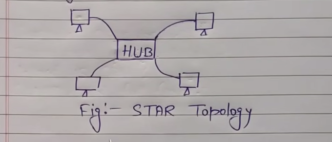

#### Advantage:

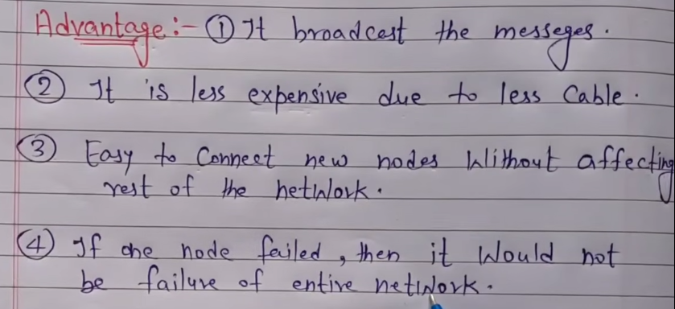

#### Disadvantage:

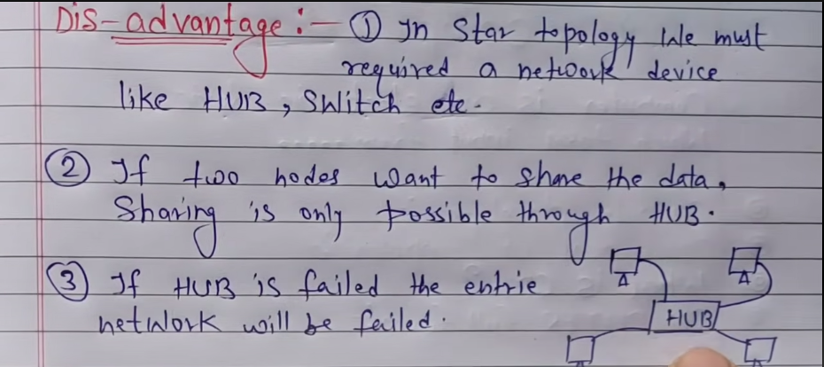

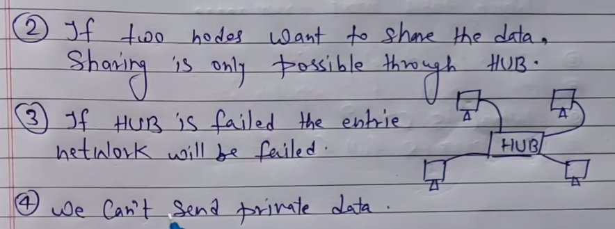

---

# Mesh Topology:

---

`In this topology each and every node is directly connected with each-other, so we can directly send the data to the destination machine without going to intermediate machine . `

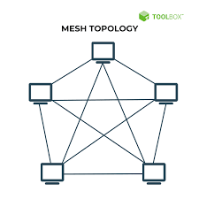

## Advantages:

- It is very good topology to send the private message.
- All nodes are directly associated with another node. So, it provide point to point connection
- Unline ring topology, if a particular machine is failed then entire network will not fail.
- Multiple devices can send or receive data simultaneously.

## Disadvantages.

- It is very difficult to add a new node because each an every computer directly connected with another one.
- If a particular machine not working then, we can't send or receive data from the failure machine.

 

---

# Hybrid :

---

### Definition of Hybrid Topology:
A **hybrid topology** in networking refers to a combination of two or more different types of network topologies, such as star, bus, ring, and mesh, to form a single network. By integrating multiple topologies, hybrid networks leverage the strengths of various topologies while minimizing their weaknesses.

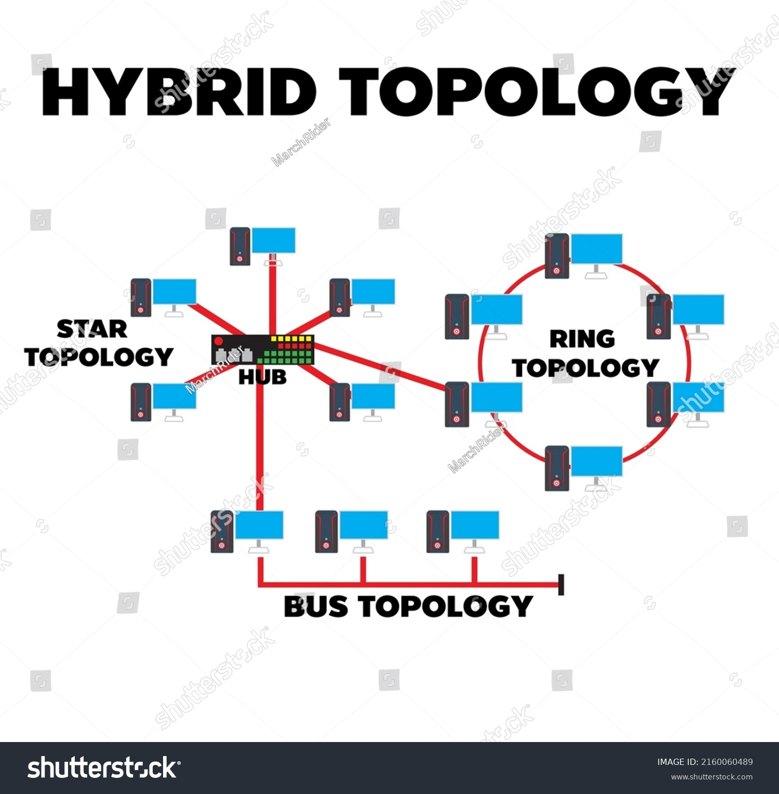

### Advantages of Hybrid Topology:
1. **Scalability**: Hybrid topologies allow easy expansion and flexibility to add more nodes or systems without affecting performance.
2. **Reliability**: It increases reliability as failure in one part of the network doesn’t impact the entire network. For example, a fault in the bus part doesn’t affect the star part.
3. **Efficient Performance**: Combining topologies optimizes performance based on the needs of the different sections of the network.
4. **Fault Tolerance**: The hybrid structure isolates faults better than other topologies, as problems in one section won’t spread to other parts.
5. **Customizability**: Offers flexibility in designing network architecture based on specific requirements (e.g., performance, cost, and reliability).

### Disadvantages of Hybrid Topology:
1. **Complexity**: Designing, configuring, and managing hybrid topologies can be complicated due to the mix of different topologies.
2. **Cost**: Hybrid networks are often expensive to set up and maintain because they require more cabling, hardware, and configuration compared to simpler topologies.
3. **Difficult Troubleshooting**: Since the topology is a combination of various types, diagnosing and troubleshooting issues can be more challenging.
4. **Maintenance**: Ongoing maintenance might require specialized knowledge of each integrated topology, increasing time and costs for network management.

