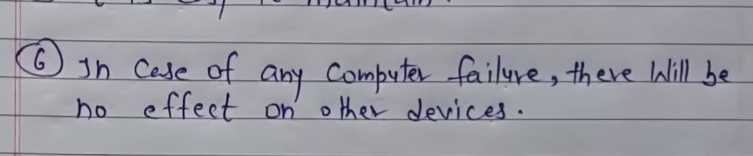

 

---

 

# _________________  Topology  __________________

### Topology : [Video_Link](https://www.youtube.com/watch?v=gGTDFG2Q_UM&ab_channel=LearnCoding)

#### What is topology?

`The physical arrangement of the computer system or node, which is connected to each other via communication medium is called topology.`

#### Types of topology

- Bus
- Ring
- Star
- Mesh
- Hybrid
- Tree

#### Bus topology:

`In Bus topology, one long cable acts as a single communication channel and all the deviecs are connected to this cable. `

 

# `**Advantage and Disadvantage of bus topology:**`

 

### Advantage:

`It broadcast the message to each device means লাইনের কোন computer কোন message send করলে সেইটা line এ থাকা সব computer এ যাবে ।`

`কোন একটা computer নষ্ট হয়ে গেলে বাকী কোন computer কোন effect পড়বে না ।`

