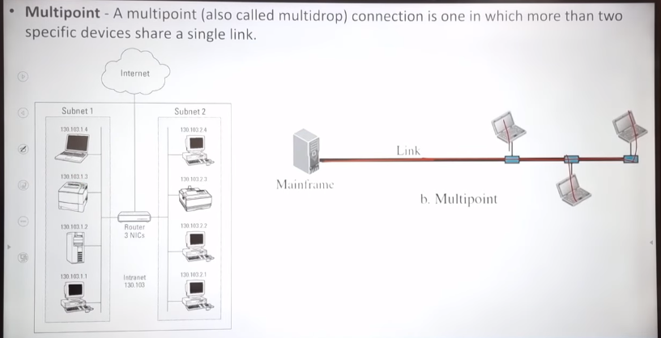
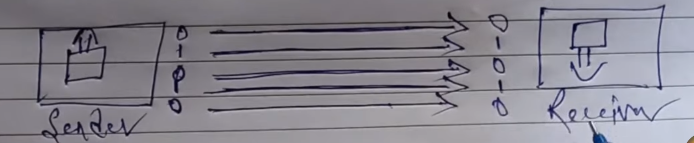
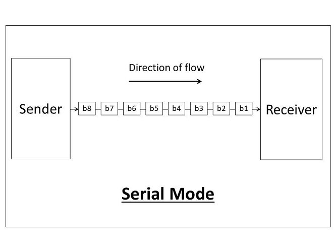
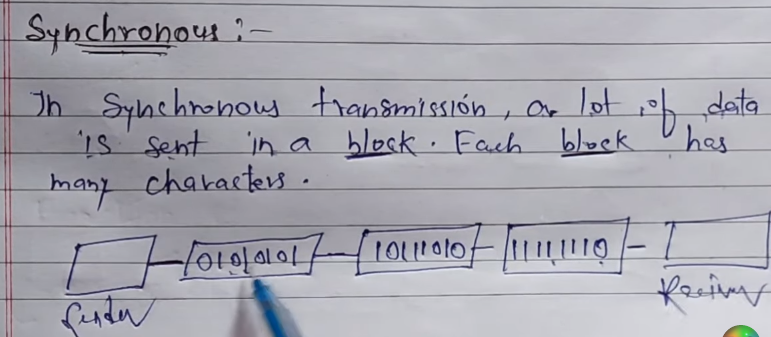
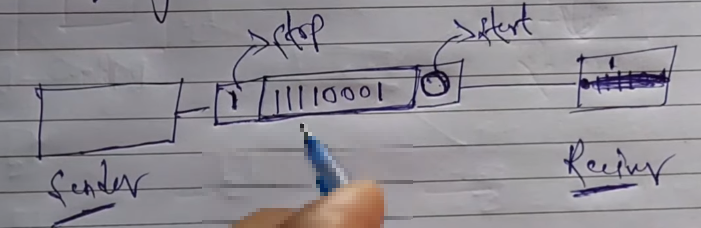

# _________________ Network __________________

### Network: [video_link](https://www.youtube.com/watch?v=VwN91x5i25g&list=PLBlnK6fEyqRgMCUAG0XRw78UA8qnv6jEx&ab_channel=NesoAcademy)

**Network:** A network is a set of nodes connected by communication links.
**Node:** A node can be a computer, printer or any other device capable of sending/receiving data generated by other notdes in the network.
**Communication Link:** A communication link can be a wired link or wireless link. The link carries the information.

# _________________ Network Criteria __________________

### Newtork Criteria: [Video_Link](https://www.youtube.com/watch?v=yXGdMPk0rE4&ab_channel=EngineeringDrive)

In order to find out the quality of a network we have some criteria. Based on this 
criteria we will determine the quality of the network. These criteria are:

- Performance
- Reliability
- Security

Certainly! Let's explore the network criteria in the context of data communication from Node A to Node B:

i) **Performance:**
   - **Transit Time:** Transit time, also known as latency or propagation time, is the time it takes for a signal to travel from the source (Node A) to the destination (Node B). It includes the time spent in propagation, transmission, and queuing delays.
   - **Response Time:** Response time is the total time it takes for a system to respond to a given input or request. In the context of data communication, it encompasses transit time along with processing delays at both ends (Node A and Node B).
   - **Throughput:** Throughput is the actual amount of data transferred successfully between Node A and Node B in a given time period. It reflects the efficiency and capacity of the network to handle data transmission.
   - **Delay:** Delay refers to the total time it takes for a message to travel from Node A to Node B. It includes propagation delay, transmission delay, processing delay, and queuing delay.

ii) **Reliability:**
   - **Reliability** in network communication refers to the ability of the network to deliver data accurately and consistently. A reliable network minimizes errors, ensures data integrity, and provides consistent performance over time.

iii) **Security:**
   - **Security** involves protecting the data being transmitted from unauthorized access, disclosure, alteration, or destruction. It includes measures such as encryption, authentication, and authorization to ensure that only authorized entities can access or manipulate the data during its journey from Node A to Node B.

# _________________ Line Configration __________________

### Line Configratoin: [Video_Link](https://www.youtube.com/watch?v=ei5fvr6NHf4&ab_channel=KnowledgeGATEbySanchitSir)

A network is two or more devices connected through links. A link is a communications pathway that transfers data from one device to another. For communication to occur, two devices must be connected in some way to the same link at the same time. There are two possible types of connections: 

- **point-to-point**

    

- **multipoint**

    

 

# _________________ Data Transmission __________________

### Data Transmission: [Video_Link](https://www.youtube.com/watch?v=seG-aeL3LdA&ab_channel=LearnCoding)

#### Data Transmission:
`Data transmission refers to the process of transferring the data between two or more digital devices in analog or digital format. This data is fransferred in the term of bits.`

### There are 2 types of data transmission:

- i) Parallel
- ii) Serial 
   - i) synchronous
   - ii) asynchronous

### Parallel data transmission:

`Parallel data transmission sends multiple data bits at the same time over multiple channels.`

`Parallel data transmission এ data একবারেই reciver এর কাছে অনেক fast পৌছে যায় । কারণ, প্রত্যেক bit এর জন্য আলাদা আলাদা communication wire থাকে । যেহেতু,প্রত্যেক bit এর জন্য আলাদা আলাদা communication wire থাকে থাকে তাই অনেক বেশি cost পড়ে । এর ব্যবহার আমরা short distance এ data transmission এর জন্য করে থাকি। `
 

- Parallel
    - Simultaneous transmission results in high speed
    - Required more data lines, hence higher cost
    - Usually limited to short distances because its of costs and crosstalk
    - Example: VGA Cable

 
 

### Serial data transmission:

`Serial data transmission sends data bits one after another over a single channel.`

`Serial data transmission এ data, reciver এর কাছে অনেক slow পৌছে Parallel data transmission এর তুলনায় । কারণ, প্রত্যেক bit এর জন্য একটি communication wire থাকে । যেহেতু,প্রত্যেক bit এর জন্য একটি communication wire থাকে তাই  cost অনেক কম পড়ে । এর ব্যবহার আমরা long distance এ data transmission এর জন্য করে থাকি। ` 

**Example:** USB - Universal Serial Bus

 

### Synchronous Data Transmission:

### Asynchronous Data Transmission:

`In asynchronous transmission only one character is sent at a time. Weather that a character is number or alphabet. It uses start(0) and stop(1) bits for transferring data.`

