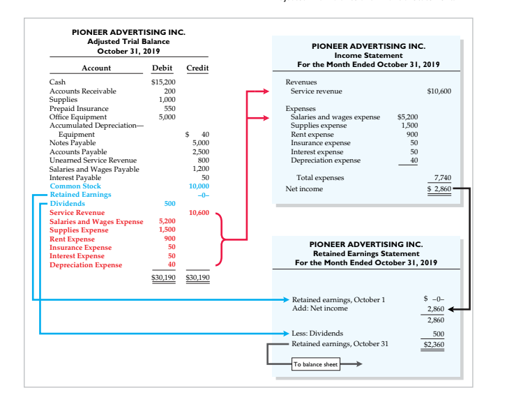

# ledger before adjusting:

# trail balance before adjusting: 

# Adjusting: 

# General Ledger After Adjusting: 

# Trial balance after adjusting:

# adjusted (income,retained earning,balance sheet)

