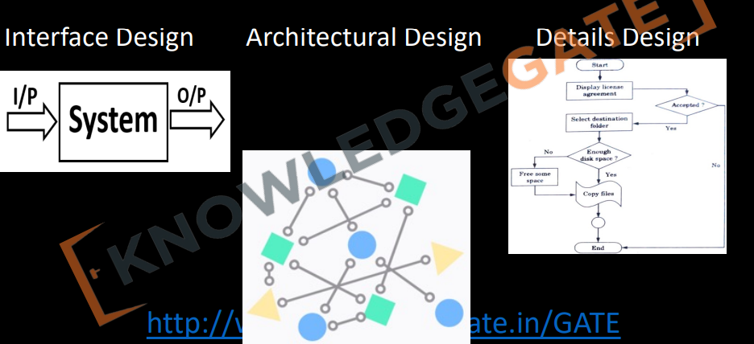
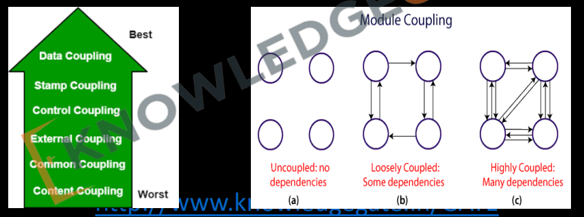
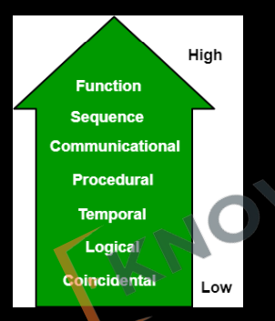

# `Topics: `

- `Why Design?`

# ` # 1. Design: `

• In software design phase input is `SRS( Software Requirement Specifications)` document and output is `SDD(Software Design Document)`.

• Software designing is most creative process, where we actually decide how a
problem will be solved.

# `# 2. Setps of Design: `

Software designing is a 3-step process.
- Interface design.
- Architectural design / High level design.
- Details design / Low level design.

`Interface design: কি করবে সেইটার design । Architectural design: এখানে আমরা system এর মধ্যে যায়, গিয়ে কয়টা module আছে, module গুলোর কাজ কি কি । কোন module কার সাথে কীভাবে কাজ করবে সেইগুলো design করি । Details design: এ আমরা প্রত্যেক module গুলোকে আলাদা আলাদা করে design করি ।  `

### Interface design

• In this, we treat system as a whole and understand the relationship between the
system & environment.

• Here we treat system as a black box and do not concentrate how a function will be
implemented but we decide `what is input & what should be the output` according to
user requirement or SRS.

`Interface design আমরা সঠিক প্রডোক্টটি design করতেছি কি না তা ব্যাখ্যা করে । `

### Architectural design / High level design: 

• In this we understand what are the major modules that must be
implemented in the system and what are their responsibility and how
they will communicate with each other.

• We do not give stress on individual modules but concentrate coupling
and cohesion between the modules. Here we treat modules as black
box.

`(We do not give stress on indivudual modules but concentrate coupling) This means that, at this stage of design (likely in high-level design or architectural design), you are not focusing heavily on the internal details or functionality of individual modules (which would be covered in low-level design). Instead, the emphasis is on: Coupling and cohesion`

`Coupling: How the different modules or components interact with each other. Ideally, you want low coupling, meaning modules should be as independent as possible to ensure flexibility and ease of maintenance.`

`Cohesion: How well the elements within a single module work together to achieve a specific task. High cohesion within a module ensures that it performs a well-defined function.`

`The phrase "treat modules as black boxes" means you don't need to know the internal workings of a module at this s tage. `

### Details design / Low level design:

• In this, specification of internal elements of all modules their functions, their
processing methods, data structure, algorithms, everything is defined properly

# `# 3. Modularity or Modularization: `

MOdularity or Modularization is a technique to divide a software system into multiple discrete and independent modules, which are expected to be capable of carrying out tasks
independently. These modules may work as basic constructs for the entire software. 
Designers tend to design modules such that they can be executed and/or compiled 
separately and independently.
Modular design unintentionally follows the rules of ‘divide and conquer’ problem-solving 
strategy this is because there are many other benefits attached with the modular design 
of a software.

Advantage of modularization:
- Smaller components are easier to maintain
- Program can be divided based on functional aspects
- Desired level of abstraction can be brought in the program
- Components with high cohesion can be re-used again
- Concurrent execution can be made possible
- Desired from security aspect

`আমরা যখন করি তখন code গুলোকে function and class আকারে ভাগ করে  maintain  করি। এতে আমাদের code জানা ও বুঝা সহজ হয়ে যায় । Modularity সেম কাজ করে ।  `

# `# 4. Coupling and Cohesion: `

`Coupling: How the different modules or components interact with each other. Ideally, you want low coupling, meaning modules should be as independent as possible to ensure flexibility and ease of maintenance.`

`যদি আমাদের দেশ অন্য দেশের থেকে অনেক কিছু আমদানি করে সেইটা কিন্ত আমাদের জন্য ভালো না । তেমনভাবে Coupling হচ্ছে, আমাদের আশেপাশের অন্যান্য modules or components এর সাথে সম্পর্ক । যদি আমাদের দেশ ভালো হতে হয় তাহলে আমরা সব কিছু যেন করতে পারি । তেমন ভাবে, low coupling হলে সেই software ভালো ।   `

`সবচেয়ে ভালো Data Coupling সবচেয়ে খারাপ Content Coupling । `

There are five levels of coupling, namely -

- `Data coupling:` - Data coupling is when two modules interact with each other by 
means of passing data (as parameter). If a module passes data structure as 
parameter, then the receiving module should use all its components. Example: call by value in programming.

- `Stamp coupling:` - When multiple modules share common data structure and 
work on different part of it, it is called stamp coupling. Example: call by reference in programming. 

- `Control coupling:` - Two modules are called control-coupled if one of them 
decides the function of the other module or changes its flow of execution. `Like, in a function they calculate a value after finishing calclation, then now, in other function can procced his works.`

- `Common coupling:` - When multiple modules have read and write access to 
some global data, it is called common or global coupling.

- `Content coupling:` - When a module can directly access or modify or refer to the 
content of another module, it is called content level coupling. `A moudle inside another module.`

`Cohesion: How well the elements within a single module work together to achieve a specific task. High cohesion within a module ensures that it performs a well-defined function.`

`Cohesion কে তুলনা করতে পারি, যদি আমাদের দেশের এক জায়গার মানুষ, অন্য জায়গায় মানুষের প্রতি অনেক বেশি depended হয় । তবে সেইটা আমাদের দেশের জন্য ভালো ।  `

`সবচেয়ে ভালো Functional cohesion সবচেয়ে খারাপ Co-incidental cohesion । `

There are seven types of cohesion, namely –

- `Functional cohesion:` - It is considered to be the highest degree of cohesion, 
and it is highly expected. Elements of module in functional cohesion are grouped 
because they all contribute to a single well-defined function. It can also be 
reused. `একটা কাজ করার জন্য সব গুলো Elements যদি এক জায়গায় থাকে তখন তাকে Functional cohesion বলে ।   `

- `Sequential cohesion:` - When elements of module are grouped because the 
output of one element serves as input to another and so on, it is called sequential 
cohesion.

- `Communicational cohesion:` - When elements of module are grouped together, 
which are executed sequentially and work on same data (information), it is called 
communicational cohesion.

- `Procedural cohesion:` - When elements of module are grouped together, which 
are executed sequentially in order to perform a task, it is called procedural 
cohesion.

- `Emporal Cohesion:` - When elements of module are organized such that they are 
processed at a similar point in time, it is called temporal cohesion.

`যদি দুইটা module বা function একসাথে কাজ করে তাহলে তাকে Emporal বলে । `

- `Logical cohesion:` - When logically categorized elements are put together into a 
module, it is called logical cohesion. 

`Co-incidental cohesion  কোন logic ছিল না কিন্তু logic এখানে থাকবে । `

- `Co-incidental cohesion:` - It is unplanned and random cohesion, which might be 
the result of breaking the program into smaller modules for the sake of 
modularization. Because it is unplanned, it may serve confusion to the 
programmers and is generally not-accepted.

`plan ছাড়া অনেকগুলো module করলে। Like: যদি একটা আলমারিতে অনেক গুলো product একসাথে রাখি। যদি আলাদা আলাদা রাখতাম তাহলে তো ভালো হতো । `

