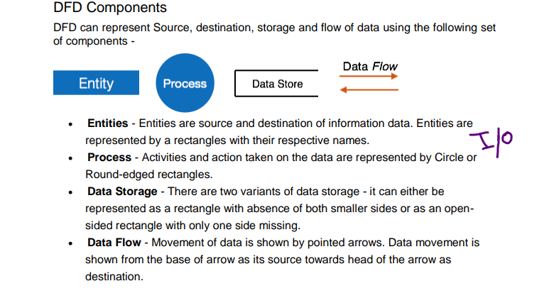
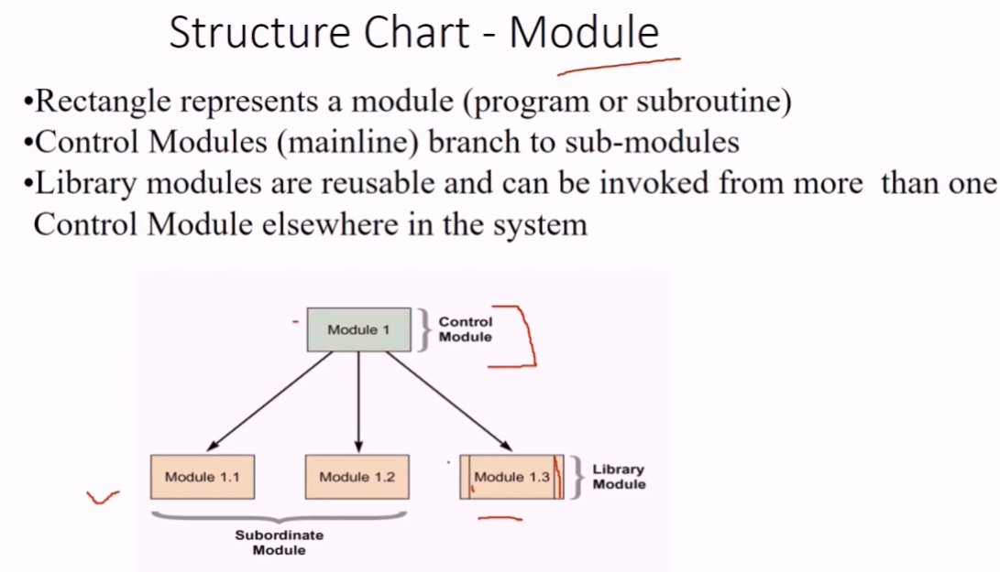
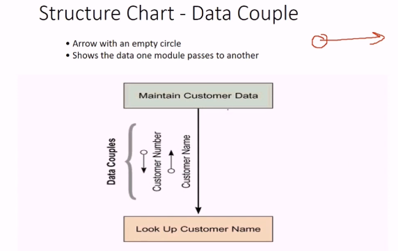
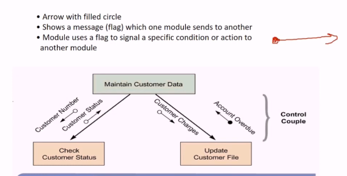
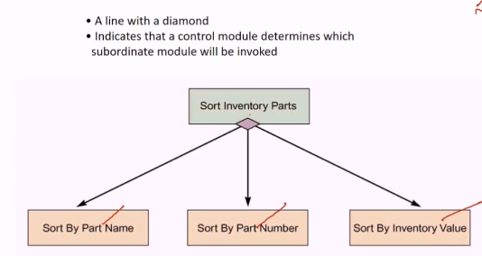
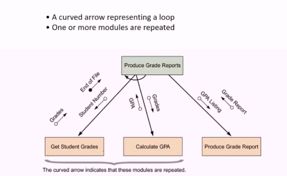
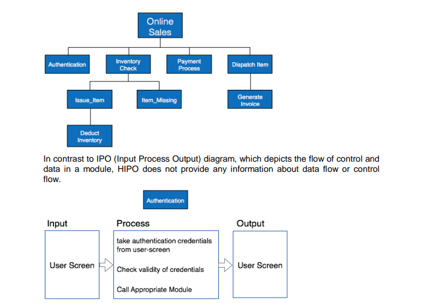
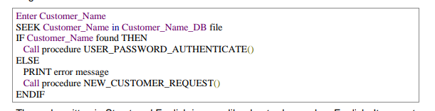
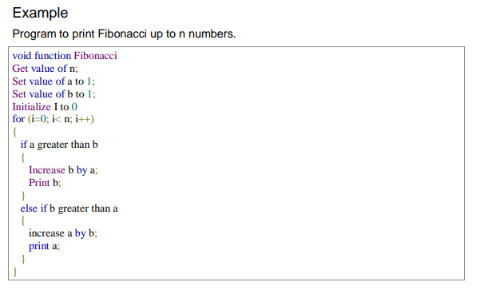
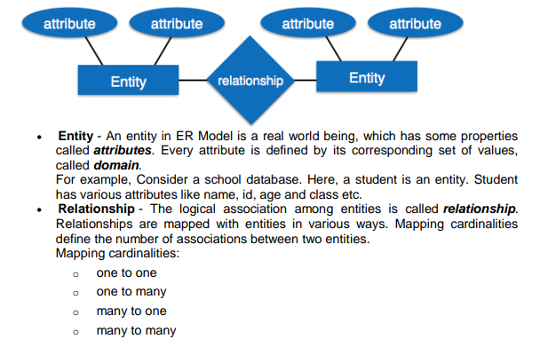

# ` # 1. Data Flow Diagram: `

DFD Stands for "Data Flow Diagram" . It is also know as "Bubble chart" through which we can represent the flow of data graphically in an information system/ computer system.

`Data flow কে যদি Diagram এর মাধ্যমে  graphically প্রকাশ করতে পারি তাহলে তাকে  DFD বলে ।`

By using DFD we can easily understand the overall functionality of system because diagram represents the incoming data flow, outgoing data flow and stored data in a graphical from. It describes how data is processed in a system in term of input and output .

`data প্রথমে কোন system এ input then processed হয় then output  এ যায় overall Data Flow functionality of system আমরা বুঝতে পারি ।  `

<br>

# `A DFD Model use some symbol to represent of flow of data: (Data_Components)`

<br>



<br>

`Entity  ইনপুট আর আউটপুট জন্য ব্যবহার করা হয় ।  `
`Process হচ্ছে data এর উপর কোন অপারেশন (+,-,*,/ ) or something else.` 


### Rule of DFD: 

- i) Each **process** shuld have atleast one input and one output.
- ii) Each **data store** should have at least one data flow in and one data flow in out.
- iii) All process in a DFD go to either another process or data store.
- iv) All the **external entities** must be connected through a process and entity can provide something to the software as well as the entity can consume some data from the software.

<br>


<br>
<br>


# `# Types of DFD: `

Data Flow Diagrams are either Logical or Physical:

- Logical DFD - This type of DFD concentrates on the system process, and flow of 
data in the system.For example in a Banking software system, how data is moved 
between different entities.
- Physical DFD - This type of DFD shows how the data flow is actually 
implemented in the system. It is more specific and close to the implementation

<br>

# `# Levels of DFD: `

### Level-0 DFD :
It is a diagram which provides the entire systems data flows and processing 
with a single process is also called context level DFD.  

`single process বা একটা process এ কাজ হয় । External entity থেকে ইনপুট নেয় তারপর সেইটাকে আউটপুট দিয়ে দেয়।  `

### Level-1 DFD :
1st level DFD is more detailed version of the oth level DFD that includes the database and various important units.

`এইটা একটু complex এখানে database সহ আরো important units থাকবে । `

<br>

### Level-2 DFD :
A Level-2 Data Flow Diagram (DFD) is a more detailed view of the processes and data flows inside a system than a Level-1 DFD. While a Level-1 DFD breaks down the main system processes into high-level components, the Level-2 DFD zooms into those processes to show internal details—specifically how data flows within each module (or process) and interacts with internal sub-processes, data stores, and external entitie.

<br>

Example: level-1 and level-2 DFD:

<br>


<br>


# `# 2. Structure Chart: `

Structure Chart: Structure chart is a chart derived from data flow diagram . It represents the system in more detail than DFD. It breaks down the entire system into lowest functional modules, describes functions and sub-functions of each module of the system to a greater detail than DFD.

( আমরা Structure Chart এ ব্যবহার করি in Software Design । অন্যদিকে, এ আমরা  DFD বানীয়ে থাকি in Software Analysis ।  )

### Structure Chart Uses :

- Describe functions and sub-functions of each part of system (in more detail than a DFD)

- Show relationships between common and unique modules of a computer program.


### Here are the symbols used in construction of structure charts -

### `Module: `



`Rectangle দিয়ে আমরা module কে প্রকাশ করে থাকি । প্রোগ্রামিং এ একে আমরা sub-routine বলে থাকি । module এ control-module(mainline) থাকে sub-module তৈরি হয় । যে module এর Rectangle এর দুই পাশে দুইটা line থাকে সেই module কে library module বলে ।  library module reuasble and যে কোন control-module একে invoke করতে পারে।  `

### `Data Flow: `

A directed arrow with empty circle at the end represents data flow.




### `Control Flow: `

A directed arrow with filled circle at the end represents control flow.




`maintain customer data থেকে যখন customer charges data flow  হয় তখন Control flow, maintain customer কে  message or flag দিতেছে ।  `


### `Codintion: `

Indicate that a control module can select any of sub-routine based on some 
condition.



` আমরা sort করবো, এখানে আমরা নিচের name,number,inventory value তিনটা দিয়েই করতে পারি । আমাদের control module যেই sub-routine or sub-module select করবে সেইটা দিয়েই sort হবে । `


### `Loop:`



` A curved arrow represents loop in the module. All sub-modules covered by loop repeat execution of module.`

`Like: in the example, calculation cgpa of a students. `


# `# 3. Hipo Diagram: `

`Hierarchical means tree like diagram.` 

### Defination: 

The Hierarchical Input Process Output (HIPO) diagram is a combination of two organized methods, one of which is the IPO (Input-Process-Output) diagram, and the other is a hierarchical structure chart.

- **IPO (Input-Process-Output) Diagram:** This represents how data flows through a system or a process. It shows the inputs to the system, how the inputs are processed, and the outputs generated from these processes.

- **Hierarchical Structure Chart:** This represents the hierarchical decomposition of the system or the process into smaller, more manageable parts. It shows how the entire system or process is broken down into modules or functions and how these modules relate to each other.




<br>

# `# 4. Structured English And Pseudocode: `

<br>

**Structured English** and **pseudocode** are methods used in software engineering to describe algorithms and processes in a way that is easy to understand. They are written using a mixture of natural language and programming constructs, without adhering to a specific programming syntax.

### **Structured English**
Structured English uses simple, plain English statements to describe logic and procedures. It typically follows a format of action words and decision-making constructs (e.g., IF, ELSE, WHILE).

### Example of Structured English:

#### Task: **Check if a user can log in**

1. Get the **username** and **password**.
2. IF the **username** exists in the system:
   - Check if the **password** matches the one stored.
   - IF the **password** is correct:
     - Display the message "Login Successful."
   - ELSE:
     - Display the message "Incorrect Password."
3. ELSE:
   - Display the message "User does not exist."

---

### **Pseudocode**
Pseudocode is a more detailed and structured way of writing an algorithm, often resembling programming languages but without specific syntax rules.

### Example of Pseudocode:

#### Task: **Calculate the sum of the first N positive integers**

```
BEGIN
   READ N
   SET sum = 0
   FOR i = 1 TO N DO
      sum = sum + i
   END FOR
   PRINT "The sum of the first", N, "numbers is", sum
END
```

In this example:
- **BEGIN** and **END** indicate the start and end of the pseudocode.
- **READ N** is used to get input.
- **FOR i = 1 TO N DO** is a loop that runs from 1 to N.
- **sum = sum + i** performs the addition.
- **PRINT** outputs the final result.

---

### Key Differences:
- **Structured English** is more readable and close to plain English.
- **Pseudocode** is closer to real code but still not bound to any particular programming language's syntax.

Both methods are widely used for communicating algorithms before actual coding begins.

<br>

### Example: Structured English:

<br>



<br>

### Example: Pseudocode:

<br>



<br>


# `# Entity Relationship - Diagram: `

An **Entity-Relationship (E-R) Diagram** is a visual representation of the relationships between entities in a database. It is used in software engineering to plan how data is organized in a database.

- **Entities**: These are objects or concepts, usually represented as rectangles. Examples include *Customer*, *Order*, or *Product*.
  
- **Attributes**: These are properties or characteristics of an entity, shown as ovals. For example, an entity *Customer* might have attributes like *CustomerID*, *Name*, and *Email*.

- **Relationships**: These define how entities are related, represented by diamonds. For example, a *Customer* can "place" an *Order*.

- **Cardinality**: Specifies the number of instances in one entity that can be associated with instances in another entity (e.g., one-to-one, one-to-many, many-to-many).

In short, E-R diagrams help in designing the database structure by illustrating the entities, their attributes, and how they interact with each other.





# `# Decision Table: `

A Decision table represents conditions and the respective actions to be taken to 
address them, in a structured tabular format. It is a powerful tool to debug and prevent errors. It helps group similar information into a single table and then by combining tables it delivers easy and convenient decision making.


### Key Components:
1. **Conditions**: The criteria or factors that influence a decision (e.g., "Is the customer a member?" or "Is the order value above $100?").
2. **Actions**: The outcomes or responses based on the conditions (e.g., "Apply a discount" or "Charge shipping fee").
3. **Rules**: The combinations of conditions and corresponding actions that define what should happen in each scenario.

### Structure of a Decision Table:
| Conditions             | Rule 1 | Rule 2 | Rule 3 | Rule 4 |
|------------------------|--------|--------|--------|--------|
| Is customer a member?   | Yes    | Yes    | No     | No     |
| Is order > $100?        | Yes    | No     | Yes    | No     |
| **Actions**             |        |        |        |        |
| Apply discount          | Yes    | No     | No     | No     |
| Charge shipping fee     | No     | Yes    | Yes    | Yes    |

### Benefits:
- **Clarity**: Makes complex decision-making easier to understand.
- **Coverage**: Ensures all possible conditions are accounted for.
- **Testing**: Helps identify missing or conflicting rules.

In short, decision tables are a way to organize decision rules clearly and are useful in designing systems with many conditions and outcomes.