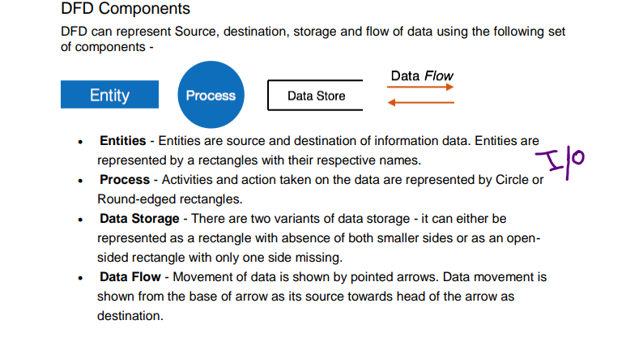
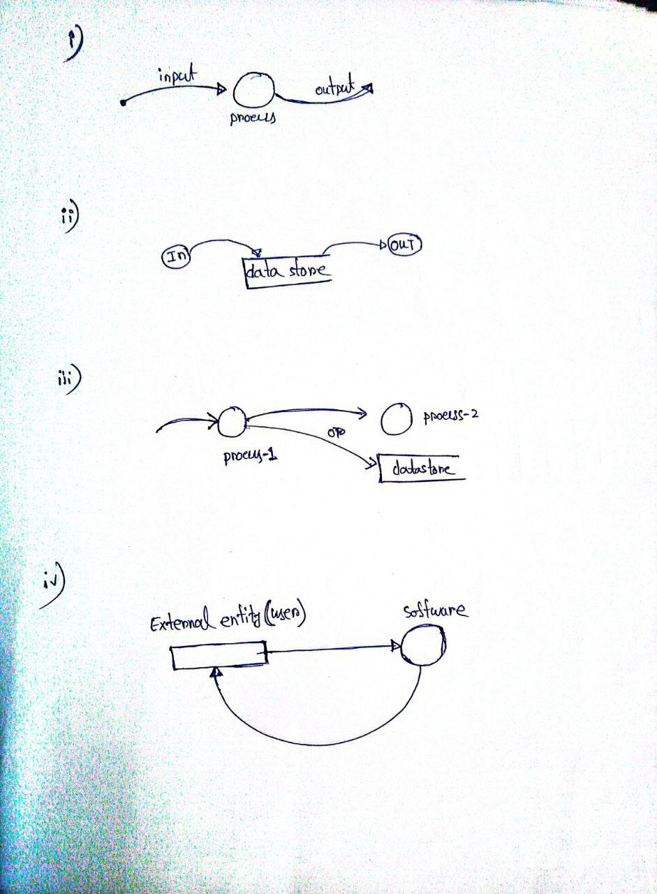
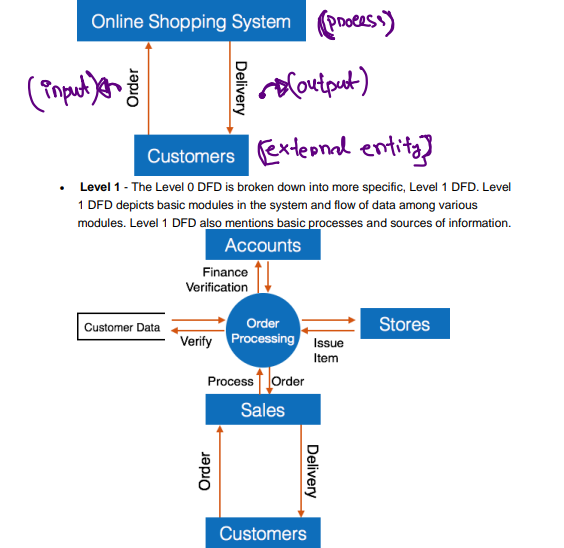

# Data Flow Diagram: 

DFD Stands for "Data Flow Diagram" . It is also know as "Bubble chart" through which we can represent the flow of data graphically in an information system/ computer system.

`Data flow কে যদি Diagram এর মাধ্যমে  graphically প্রকাশ করতে পারি তাহলে তাকে  DFD বলে ।`

By using DFD we can easily understand the overall functionality of system because diagram represents the incoming data flow, outgoing data flow and stored data in a graphical from. It describes how data is processed in a system in term of input and output .

`data প্রথমে কোন system এ input then processed হয় then output  এ যায় overall Data Flow functionality of system আমরা বুঝতে পারি ।  `

 

# `A DFD Model use some symbol to represent of flow of data: (Data_Components)`

 

 

`Entity  ইনপুট আর আউটপুট জন্য ব্যবহার করা হয় ।  `
`Process হচ্ছে data এর উপর কোন অপারেশন (+,-,*,/ ) or something else.` 

### Rule of DFD: 

- i) Each **process** shuld have atleast one input and one output.
- ii) Each **data store** should have at least one data flow in and one data flow in out.
- iii) All process in a DFD go to either another process or data store.
- iv) All the **external entities** must be connected through a process and entity can provide something to the software as well as the entity can consume some data from the software.

 

 
 

# `# Types of DFD: `

Data Flow Diagrams are either Logical or Physical:

- Logical DFD - This type of DFD concentrates on the system process, and flow of 
data in the system.For example in a Banking software system, how data is moved 
between different entities.
- Physical DFD - This type of DFD shows how the data flow is actually 
implemented in the system. It is more specific and close to the implementation

 

# `# Levels of DFD: `

### Level-0 DFD :
It is a diagram which provides the entire systems data flows and processing 
with a single process is also called context level DFD.  

`single process বা একটা process এ কাজ হয় । External entity থেকে ইনপুট নেয় তারপর সেইটাকে আউটপুট দিয়ে দেয়।  `

### Level-1 DFD :
1st level DFD is more detailed version of the oth level DFD that includes the database and various important units.

`এইটা একটু complex এখানে database সহ আরো important units থাকবে । `

 

### Level-2 DFD :
A Level-2 Data Flow Diagram (DFD) is a more detailed view of the processes and data flows inside a system than a Level-1 DFD. While a Level-1 DFD breaks down the main system processes into high-level components, the Level-2 DFD zooms into those processes to show internal details—specifically how data flows within each module (or process) and interacts with internal sub-processes, data stores, and external entitie.

 

Example: level-1 and level-2 DFD:

 

 

