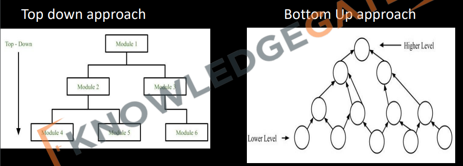

# Software Design Approach:

There are two popular approach in designing:
- Top-down Approach 
- Bottom-up Approach

`Top-down যখন আমরা একটা সম্পর্কে জানি এবং সেইটা সম্পর্কে ভালো আইডিয়া আছে । তখন আমরা সেই প্রবলেমকে ছোট ছোট প্রবলেমকে ভাগ করতে পারি । একেই, Top-down Approach বলে । Like: microsft can build another operating system.  `

`আমাদের প্রবলেম টা এত বিশাল যে, আমরা সেই একবারে বুঝতে পারতেছি না । তখন, আমরা ছোট ছোট কাজ করা শুরু করে সেই প্রবলেমটাকে বুঝার চেষ্টা করবো । Like: building ai . ` 

### Top Down:

In top down approach, the problem is divided into small no of
programs according to user requirements and we repeat the process
until the problem become so easy till we can solve it directly.

### Advantage:
• More Systematic. 
• Easy to understand and provide a modular architecture. 
• In correspondence with user requirement cost and time prediction is
possible. 
• Should be used with small and medium size products. 
• Used mostly. 

### Disadvantage:
• When a problem is very complex and very large then we can not understand
the entire problem as a whole. 

### Bottom Up:

**Bottom Up:** This approach is important as the s/w grows in complexity in a
systematic fashion. if the problem is very difficult to understand instead of
understanding the entire problem, we must solve some sub-problem and then
should keep repeating the process until the entire problem is solved.

### Advantage:
• Should be used on large size projects. 
• Easy to use by designers as we work in incremental fashion. 
### Disadvantage:
• it has complex architecture very difficult to understand and manage. 

