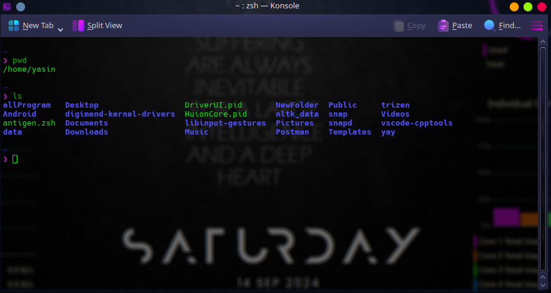
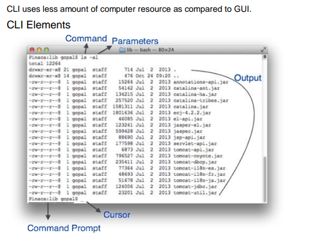
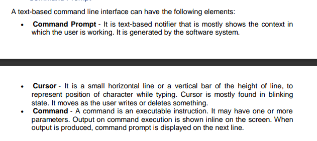

# Software User Interface Design: 

User interface is the front-end application view to which user interacts in order to use 
the software. User can manipulate and control the software as well as hardware by 
means of user interface.

The software becomes more popular if its user interface is:
- Attractive
- Simple to use
- Responsive in short time
- Clear to understand
- Consistent on all interfacing screens

UI is broadly divided into two categories:
- Command Line Interface
- Graphical User Interface

# `CLI: Command Line Interface: `

#### Example of a cli, of zsh shell in unix base system.

CLI has been a great tool of interaction with computers until the video display monitors 
came into existence. CLI is first choice of many technical users and programmers. CLI 
is minimum interface a software can provide to its users.

