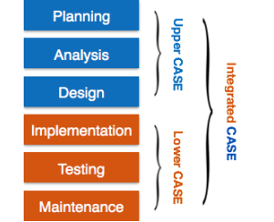

# `# Software Case Tools : `

- CASE means "Computer Aided Software Engineering"

It means development and maintenance of software projects with the help of various automated sofwate tools. 

`Software development process কে easy করতে অনেক ধরনের tools আছে । সেইগুলোকে কে ব্যবহার করে software কে  proper way তে design করায় হচ্ছে Software Case Tools এর কাজ । `

- CASE tools are set of software application programs, which are used to automate SDLC activities.

- CASE tools are used by softwre project managers, analysts and enginners to develop software system.

- There are number of CASE tools available to simplify various stages of Software 
Development Life Cycle such as Analysis tools, Design tools, Project management 
tools, Database Management tools, Documentation tools are to name a few.

# `# Componants of Case tools: `

CASE tools can be broadly divided CASE tools can be broadly divided into the following parts based on their use at a 
particular SDLC stage:

- **Central Repository** - A **central repository**, like in the case of **Git**, is a single storage location where all project files, code, and documents are kept. In this repository:

- **All product specifications, requirement documents, diagrams, and reports** are stored, ensuring everyone on the team has access to the same, updated information.
- It's similar to a **data dictionary**, where consistent and integrated information is stored and can be referenced during the project's lifecycle.

For example, in Git, the central repository serves as the main location where the latest versions of code, along with historical changes, are stored. Team members can pull updates, make changes, and push new versions back to the repository. This central repository ensures that the entire development team is working with synchronized, accurate data, making it an essential part of the project management process.

- **Upper Case Tools** - Upper CASE tools are used in planning, analysis and 
design stages of SDLC.

- **Lower Case Tools** - Lower CASE tools are used in implementation, testing and 
maintenance.

- **Integrated Case Tools** - Integrated CASE tools are helpful in all the stages of 
SDLC, from Requirement gathering to Testing and documentation.

# ` # Scope of CASE Tools: `

**Scope of CASE Tools**  
CASE tools (Computer-Aided Software Engineering tools) are used throughout the entire software development process, from planning to maintenance, to help with different tasks.

### Types of CASE Tools:
1. **Diagram Tools**:  
   These tools help visualize system components, data, and workflows using diagrams. For example, a **flowchart maker**.

2. **Process Modeling Tools**:  
   These tools assist in designing the process used to develop software, helping managers choose or adjust a process model. For example, **EPF Composer**.

3. **Project Management Tools**:  
   These tools help in project planning, cost estimation, scheduling, and sharing project details. Examples include **Basecamp** and **Trac Project**.

4. **Documentation Tools**:  
   These tools create documents for both technical staff (manuals, guides) and end-users (how-to manuals). Examples include **Doxygen** and **Adobe RoboHelp**.

5. **Analysis Tools**:  
   These tools help gather requirements, check for mistakes, and identify any missing or redundant data. For example, **CaseComplete** and **Visible Analyst**.

6. **Design Tools**:  
   These tools assist in creating software designs, breaking them into modules, and showing how they connect. For example, **Animated Software Design**.

7. **Configuration Management Tools**:  
   These tools manage different versions of the software and track changes. Examples include **Git** and **Accu REV**.

8. **Change Control Tools**:  
   These tools track and manage changes to software after it’s released. They are often part of configuration management tools.

9. **Programming Tools**:  
   These are environments where developers write and test code. For example, **Eclipse** and **Cscope**.

10. **Prototyping Tools**:  
    These tools allow developers to quickly build a basic version (prototype) of the software to test out ideas. Examples include **Mockup Builder**.

11. **Web Development Tools**:  
    These tools help in designing websites, allowing developers to see how the final site will look while it's being created. For example, **Brackets** and **Fontello**.

12. **Quality Assurance Tools**:  
    These tools ensure the software meets quality standards through testing and tracking changes. For example, **JMeter** and **SoapTest**.

13. **Maintenance Tools**:  
    These tools help with updates and fixing problems after the software is released. Examples include **Bugzilla** and **HP Quality Center**.

In summary, CASE tools help automate and manage different tasks throughout the software development life cycle (SDLC), improving efficiency and quality.

---
---
---

1. **DPDPA** – Diagram Tools, Process Modeling Tools,Documentation Tools, Project Management Tools,  Analysis Tools
2. **DCCCP** – Design Tools, Configuration Management Tools, Change Control Tools, Code (Programming Tools), Prototype Tools
3. **WQM** – Web Development Tools, Quality Assurance Tools, Maintenance Tools

---
---
---
---