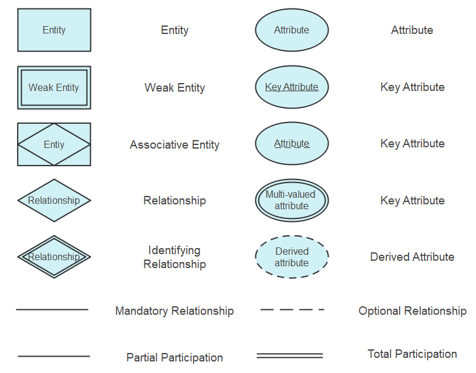

Here’s a summary of all the requested software engineering topics with explanations, and for the ones with an asterisk (*), I’ll highlight them at the end of their title. I’ll also provide a Bangla translation for each section.

---

### i) **Modified Waterfall Model**

**Explanation:**  
The Modified Waterfall Model is a variation of the traditional waterfall model where feedback loops are introduced between phases. Unlike the strict linear sequence of the original waterfall model, this allows revisiting earlier phases, improving flexibility and reducing errors.

**Bangla Translation:**  
পরিবর্তিত ওয়াটারফল মডেল হল মূল ওয়াটারফল মডেলের একটি সংস্করণ যেখানে পর্যায়গুলির মধ্যে প্রতিক্রিয়া লুপ অন্তর্ভুক্ত করা হয়। এটি কঠোর ক্রমিক ধারাবাহিকতার পরিবর্তে পূর্ববর্তী পর্যায়ে ফিরে যাওয়ার সুযোগ দেয়।

---

### ii) **Evolutionary Development***

**Explanation:**  
In evolutionary development, software is developed and refined over time through repeated cycles (iterations). It focuses on customer feedback and gradually improves the product based on the requirements.

**Bangla Translation:**  
উদ্ভাবনমূলক উন্নয়ন পদ্ধতিতে সফটওয়্যারটি পুনরাবৃত্তি চক্রের মাধ্যমে সময়ের সাথে সাথে বিকশিত হয়। এটি গ্রাহকের প্রতিক্রিয়ার উপর ভিত্তি করে ধীরে ধীরে পণ্যটিকে উন্নত করে।

---

### iii) **Agile Development***

- **Agile Methods:**  
Agile methods emphasize incremental delivery, collaboration, and adaptability. Development is broken into small, manageable iterations, and customer feedback is key.

- **Extreme Programming (XP)***:  
Extreme Programming is an Agile methodology that focuses on frequent releases, high-quality code, and constant customer feedback. It encourages practices like test-driven development and pair programming.

- **Pair Programming:**  
In pair programming, two developers work together at one computer. One writes the code (driver), while the other reviews it (observer), improving quality and reducing errors.

- **Scrum:**  
Scrum is an Agile framework that divides projects into small, iterative sprints, typically lasting 2-4 weeks. Teams have daily meetings to track progress and adjust plans.

- **Scaling Out and Scaling Up:**  
Scaling out refers to adding more teams or resources to increase capacity, while scaling up involves increasing the capabilities of the existing system or team.

- **Plan-driven and Agile Methods*:**  
Plan-driven methods follow a fixed, upfront plan, while Agile methods are flexible, adapting to changing requirements through iterative development.

**Bangla Translation:**  
- অ্যাজাইল পদ্ধতি ক্রমবর্ধমান সরবরাহ, সহযোগিতা এবং অভিযোজনের উপর জোর দেয়।  
- এক্সট্রিম প্রোগ্রামিং গ্রাহকের প্রতিক্রিয়া এবং ঘন ঘন রিলিজের উপর ভিত্তি করে একটি উচ্চ মানের পণ্য তৈরির চেষ্টা করে।  
- পেয়ার প্রোগ্রামিংয়ে দুটি ডেভেলপার একসাথে কোড লেখে ও রিভিউ করে।  
- স্ক্রাম পদ্ধতি ছোট ছোট কাজ ভাগ করে দ্রুত উন্নয়ন নিশ্চিত করে।  
- স্কেলিং আউট বলতে আরো টিম যোগ করা বোঝায়, আর স্কেলিং আপ মানে বিদ্যমান টিম বা সিস্টেমের সক্ষমতা বাড়ানো।  
- পরিকল্পনা-চালিত এবং অ্যাজাইল পদ্ধতি: পূর্বনির্ধারিত পরিকল্পনা বনাম অভিযোজনশীল পদ্ধতি।

---

### iv) **Component-based Software Engineering**

**Explanation:**  
Component-based software engineering (CBSE) emphasizes building systems from existing, reusable components. This approach speeds up development and enhances system flexibility.

**Bangla Translation:**  
উপাদান-ভিত্তিক সফটওয়্যার ইঞ্জিনিয়ারিং এমন একটি পদ্ধতি যেখানে পূর্ববর্তী উপাদানগুলির পুনরায় ব্যবহার করা হয়, যা বিকাশের গতি বাড়ায় এবং সিস্টেমের নমনীয়তা বাড়ায়।

---

### v) **Reuse-Oriented Development**

**Explanation:**  
In reuse-oriented development, software is built by assembling existing components or systems, minimizing new code development.

**Bangla Translation:**  
পুনঃব্যবহারমুখী উন্নয়ন পদ্ধতিতে বিদ্যমান উপাদানগুলি পুনঃব্যবহার করে সফটওয়্যার তৈরি করা হয়, নতুন কোড লেখার প্রয়োজন কম হয়।

---

### vi) **Process Iteration**

**Explanation:**  
Process iteration refers to repeating certain phases of software development, refining the product incrementally. This is common in Agile and evolutionary development models.

**Bangla Translation:**  
প্রক্রিয়া পুনরাবৃত্তি হল সফটওয়্যার বিকাশের নির্দিষ্ট পর্যায়গুলি বারবার সম্পন্ন করা, যা ধাপে ধাপে পণ্য উন্নত করে।

---

### vii) **Incremental Delivery**

**Explanation:**  
In incremental delivery, the software is built and delivered in small parts, or increments, allowing early feedback and reducing risks.

**Bangla Translation:**  
ক্রমান্বয়ে সরবরাহের ক্ষেত্রে সফটওয়্যারটি ছোট ছোট অংশে তৈরি করা হয় এবং বিতরণ করা হয়, যা দ্রুত প্রতিক্রিয়া পাওয়ার সুযোগ তৈরি করে এবং ঝুঁকি কমায়।

---

### viii) **Extreme Programming**

**Explanation:**  
Extreme Programming (XP) focuses on frequent releases and high customer involvement. Practices include pair programming and test-driven development.

**Bangla Translation:**  
এক্সট্রিম প্রোগ্রামিং ঘন ঘন রিলিজ এবং গ্রাহকের অংশগ্রহণের উপর জোর দেয়। এতে পেয়ার প্রোগ্রামিং এবং টেস্ট ড্রিভেন ডেভেলপমেন্ট অন্তর্ভুক্ত।

---

### ix) **Spiral Development**

**Explanation:**  
Spiral development combines elements of both iterative and waterfall models. It includes risk assessment at every iteration, allowing the product to evolve with controlled risk.

**Bangla Translation:**  
স্পাইরাল ডেভেলপমেন্ট পদ্ধতিতে পুনরাবৃত্তিমূলক এবং ওয়াটারফল মডেলের বৈশিষ্ট্যগুলি একত্রিত হয় এবং প্রতিটি পুনরাবৃত্তিতে ঝুঁকি মূল্যায়ন অন্তর্ভুক্ত থাকে।

---

### x) **RUP Phase Model**

**Explanation:**  
The Rational Unified Process (RUP) is an iterative software development process framework that divides the development process into four phases: inception, elaboration, construction, and transition.

**Bangla Translation:**  
রেশনাল ইউনিফাইড প্রক্রিয়া (RUP) হল একটি পুনরাবৃত্তিমূলক সফটওয়্যার উন্নয়ন কাঠামো যা চারটি পর্যায়ে বিভক্ত: ধারণা, বিস্তৃতি, নির্মাণ এবং রূপান্তর।

---

### xi) **The 4 P’s***  
   - **Stakeholders*:** People or organizations with an interest in the project, such as customers, managers, and developers.  
   - **Software Teams*:** Groups of individuals who work together to develop the software.  
   - **The MOI Model*:** Management, Organization, and Infrastructure model, which focuses on the structure and resources needed for software projects.  
   - **Agile Teams:** Cross-functional teams that work collaboratively using Agile methodologies.

**Bangla Translation:**  
- স্টেকহোল্ডার বলতে বোঝায় সেই সকল ব্যক্তি বা সংগঠন যারা প্রকল্পের সাথে আগ্রহী।  
- সফটওয়্যার টিম হল তারা যারা একসাথে কাজ করে সফটওয়্যার তৈরি করে।  
- MOI মডেল হল একটি কাঠামো যা ব্যবস্থাপনা, সংগঠন এবং প্রয়োজনীয় সম্পদের উপর গুরুত্ব দেয়।  
- অ্যাজাইল টিমগুলি পারস্পরিক সহযোগিতামূলকভাবে কাজ করে।

---

Let’s continue with the rest of the topics:

---

### xii) **Process Specification (PSPEC)**

**Explanation:**  
Process Specification (PSPEC) defines the detailed processes and their interactions in a system. It helps in understanding the functionality of a system.

**Bangla Translation:**  
প্রক্রিয়া স্পেসিফিকেশন (PSPEC) একটি সিস্টেমের বিস্তারিত প্রক্রিয়া এবং তাদের মিথস্ক্রিয়াগুলিকে সংজ্ঞায়িত করে। এটি সিস্টেমের কার্যকারিতা বোঝাতে সহায়ক।

---

### xiii) **Use-Case Diagram***  
**Explanation:**  
A use-case diagram represents the interaction between users (actors) and the system, showing the system's functionality from an external point of view.

**Bangla Translation:**  
ইউজ-কেস ডায়াগ্রাম ব্যবহারকারী (অভিনেতা) এবং সিস্টেমের মধ্যে মিথস্ক্রিয়া প্রদর্শন করে এবং সিস্টেমের কার্যকারিতা দেখায়।

---

- **Activity Diagram***:  
An activity diagram visually represents the flow of control or activities in a system or process, highlighting decision points and parallel processes.

- **Swimlane Diagrams***:  
A swimlane diagram is a type of activity diagram where different actors or departments are separated into lanes, showing the roles in a process.

- **Flow-Oriented Modeling***:  
Flow-oriented modeling focuses on the flow of data or control through a system and how information is processed step-by-step.

**Bangla Translation:**  
- কার্যক্রম চিত্র হল একটি চিত্র যা সিস্টেমের বিভিন্ন কার্যক্রমের প্রবাহ দেখায়।  
- সুইমলেইন ডায়াগ্রামে বিভিন্ন বিভাগের কার্যকলাপ প্রদর্শিত হয়, যা দেখায় কোন বিভাগ কী কাজ করছে।  
- ফ্লো-ওরিয়েন্টেড মডেলিং সিস্টেমের তথ্য বা নিয়ন্ত্রণ প্রবাহ দেখায় এবং কীভাবে তথ্য ধাপে ধাপে প্রক্রিয়া করা হয় তা বোঝায়।

---

### xiv) **Flow Modeling Notation**

**Explanation:**  
Flow modeling notation uses symbols to represent the movement of data, control, or information through a system. It’s used in flowcharts and activity diagrams.

**Bangla Translation:**  
ফ্লো মডেলিং নোটেশন হল প্রতীক যা সিস্টেমের মাধ্যমে ডেটা বা নিয়ন্ত্রণের গতি দেখাতে ব্যবহৃত হয়। এটি ফ্লোচার্ট এবং কার্যক্রম চিত্রে ব্যবহৃত হয়।

---

- **Control Flow Diagram***:  
A control flow diagram illustrates how different parts of a system control the execution of processes, often used in real-time systems.

**Bangla Translation:**  
কন্ট্রোল ফ্লো ডায়াগ্রাম সিস্টেমের বিভিন্ন অংশ কীভাবে প্রক্রিয়া সম্পাদনা করে তা চিত্রিত করে। এটি সাধারণত বাস্তব-সময়ের সিস্টেমে ব্যবহৃত হয়।

---

### xv) **Control Specification (CSPEC)**

**Explanation:**  
Control Specification (CSPEC) defines how different system controls are implemented and how they interact with other components in a software system.

**Bangla Translation:**  
কন্ট্রোল স্পেসিফিকেশন (CSPEC) সিস্টেম নিয়ন্ত্রণ কীভাবে বাস্তবায়িত হয় এবং তারা অন্যান্য উপাদানের সাথে কীভাবে মিথস্ক্রিয়া করে তা সংজ্ঞায়িত করে।

---

- **Class-Based Modeling**:  
Class-based modeling represents the system's objects, their attributes, behaviors, and relationships in terms of classes and objects.

**Bangla Translation:**  
ক্লাস-ভিত্তিক মডেলিং সিস্টেমের অবজেক্টগুলি, তাদের বৈশিষ্ট্য এবং সম্পর্কগুলি ক্লাস এবং অবজেক্টের মাধ্যমে দেখায়।

---

### xvi) **Analysis Classes**

**Explanation:**  
Analysis classes are used in object-oriented analysis to identify the key classes and objects that are essential to a system, including their attributes and operations.

**Bangla Translation:**  
বিশ্লেষণ ক্লাসগুলি একটি সিস্টেমের প্রধান শ্রেণি এবং অবজেক্টগুলি চিহ্নিত করতে ব্যবহৃত হয় যা সিস্টেমে প্রয়োজনীয়।

---

### xvii) **Class Diagram**

**Explanation:**  
A class diagram is a type of UML diagram that shows the structure of a system by representing its classes, attributes, methods, and the relationships between objects.

**Bangla Translation:**  
ক্লাস ডায়াগ্রাম একটি UML ডায়াগ্রাম যা সিস্টেমের শ্রেণি, তাদের বৈশিষ্ট্য, পদ্ধতি এবং অবজেক্টগুলির মধ্যে সম্পর্কগুলি প্রদর্শন করে।

---

### xviii) **CRC Modeling**

**Explanation:**  
CRC (Class-Responsibility-Collaborator) modeling is a technique used in object-oriented design to represent classes, their responsibilities, and their collaborators in a system.

**Bangla Translation:**  
CRC মডেলিং ক্লাসের দায়িত্ব এবং তাদের সহযোগীদের প্রতিনিধিত্ব করে, এটি অবজেক্ট ওরিয়েন্টেড ডিজাইনে ব্যবহৃত একটি পদ্ধতি।

---

### xix) **Analysis Package**

**Explanation:**  
An analysis package is a set of related analysis classes grouped together to simplify the development process.

**Bangla Translation:**  
একটি বিশ্লেষণ প্যাকেজ হল একসাথে গোষ্ঠীভুক্ত সম্পর্কিত বিশ্লেষণ ক্লাসগুলির একটি সেট যা উন্নয়ন প্রক্রিয়াকে সহজ করে।

---

### xx) **Sequence Diagram**

**Explanation:**  
A sequence diagram shows how objects in a system interact with each other over time. It illustrates the order of messages exchanged between objects to accomplish a task.

**Bangla Translation:**  
সিকোয়েন্স ডায়াগ্রাম দেখায় কিভাবে সিস্টেমের অবজেক্টগুলি একে অপরের সাথে সময়ের সাথে মিথস্ক্রিয়া করে এবং বার্তাগুলি বিনিময় করে।

---

### xxi) **Data Modeling**

**Explanation:**  
Data modeling represents the data structures in a system, including data objects and their relationships, typically using ERD (Entity-Relationship Diagram).

**Bangla Translation:**  
ডেটা মডেলিং হল সিস্টেমের ডেটা স্ট্রাকচার এবং তাদের সম্পর্ক দেখানো। এটি সাধারণত ERD (এন্টিটি-রিলেশনশিপ ডায়াগ্রাম) ব্যবহার করে।

---

- **Data Object**:  
A data object is any entity that contains information about the system, such as a user, product, or order.

**Bangla Translation:**  
ডেটা অবজেক্ট হল একটি সত্তা যা সিস্টেমের তথ্য ধারণ করে, যেমন ব্যবহারকারী, পণ্য বা অর্ডার।

---

### xxii) **ERD Notation**

**Explanation:**  
Entity-Relationship Diagram (ERD) notation is a visual representation of the relationships between entities in a system, showing how data is structured.

**Bangla Translation:**  
এন্টিটি-রিলেশনশিপ ডায়াগ্রাম (ERD) একটি চিত্র যা সিস্টেমের সত্তাগুলির মধ্যে সম্পর্ক এবং ডেটা কিভাবে গঠিত তা দেখায়।

---

### xxiii) **Software Testing Principle**

- **Software Testing**:  
Software testing is the process of evaluating a software application to find bugs and ensure it meets the specified requirements.

**Bangla Translation:**  
সফটওয়্যার টেস্টিং হল একটি সফটওয়্যার অ্যাপ্লিকেশন পরীক্ষা করা যাতে ত্রুটি খুঁজে পাওয়া যায় এবং এটি নির্ধারিত প্রয়োজনীয়তা পূরণ করে কিনা তা নিশ্চিত করা যায়।

---

### xxiv) **Software Debugging**

**Explanation:**  
Software debugging is the process of identifying, analyzing, and removing bugs or errors in software code to ensure the system runs correctly.

**Bangla Translation:**  
সফটওয়্যার ডিবাগিং হল ত্রুটি শনাক্তকরণ, বিশ্লেষণ এবং মুছে ফেলার প্রক্রিয়া, যা সফটওয়্যারকে সঠিকভাবে চালানোর জন্য সহায়তা করে।

---

### xxv) **Test Planning**

**Explanation:**  
Test planning involves creating a strategy and approach for testing a software system, defining the scope, resources, and schedule for testing activities.

**Bangla Translation:**  
টেস্ট প্ল্যানিং সফটওয়্যার সিস্টেমের জন্য পরীক্ষা কৌশল এবং পদ্ধতি তৈরির প্রক্রিয়া, যেখানে পরিধি, সম্পদ এবং সময়সূচী নির্ধারণ করা হয়।

---

### xxvi) **Test Execution & Reporting**

**Explanation:**  
Test execution involves running the test cases, and test reporting documents the results, including any defects found during testing.

**Bangla Translation:**  
টেস্ট এক্সিকিউশন হল পরীক্ষার ক্ষেত্রে চালানো, এবং টেস্ট রিপোর্টিং পরীক্ষার ফলাফল এবং কোন ত্রুটি পাওয়া গেলে তা নথিভুক্ত করা।

---

### xxvii) **Real-Time Testing**

**Explanation:**  
Real-time testing ensures that a system performs within its time constraints and responds to inputs or events in a timely manner.

**Bangla Translation:**  
বাস্তব-সময়ের পরীক্ষা নিশ্চিত করে যে একটি সিস্টেম সময়ের মধ্যে সঠিকভাবে কাজ করছে এবং ইনপুট বা ইভেন্টগুলিতে সময়মতো প্রতিক্রিয়া জানাচ্ছে।

---

### xxviii) **Logical Organization of Testing**

**Explanation:**  
Logical organization of testing refers to how testing activities are planned, structured, and managed to ensure thorough and systematic coverage.

**Bangla Translation:**  
পরীক্ষার যৌক্তিক সংগঠন পরীক্ষা কার্যক্রম পরিকল্পনা, কাঠামোগত এবং সুশৃঙ্খলভাবে পরিচালিত হয় যাতে পরীক্ষার সামগ্রিকতা নিশ্চিত হয়।

---

Here are the remaining topics:

---

### **xxviv) Software Quality Assurance (SQA)**

**Explanation:**  
Software Quality Assurance (SQA) is the process of ensuring that the software development process and the resulting product meet specified quality standards. It focuses on improving the processes to prevent defects and ensure high-quality software.

**Bangla Translation:**  
সফটওয়্যার কোয়ালিটি অ্যাসিওরেন্স (SQA) হল এমন একটি প্রক্রিয়া যা নিশ্চিত করে যে সফটওয়্যার উন্নয়ন প্রক্রিয়া এবং ফলাফল নির্দিষ্ট মান পূরণ করছে। এটি ত্রুটি প্রতিরোধ এবং উচ্চ মানের সফটওয়্যার নিশ্চিত করতে প্রক্রিয়াগুলি উন্নত করার উপর মনোযোগ দেয়।

---

- **Quality**:  
Quality in software means the degree to which the software fulfills the requirements, is free of defects, and provides value to the user.

**Bangla Translation:**  
সফটওয়্যারের গুণমান হল সফটওয়্যার কতটা ভালভাবে নির্ধারিত প্রয়োজনীয়তা পূরণ করছে, ত্রুটিমুক্ত এবং ব্যবহারকারীর জন্য মূল্যবান তা বোঝায়।

---

- **Sample Driven Reviews (SDRs)**:  
Sample Driven Reviews are a software quality control technique where random samples of code, design, or documents are reviewed to assess quality.

**Bangla Translation:**  
স্যাম্পল ড্রিভেন রিভিউ হল একটি সফটওয়্যার গুণমান নিয়ন্ত্রণ পদ্ধতি, যেখানে কোড, ডিজাইন বা ডকুমেন্টের নমুনা পর্যালোচনা করা হয় গুণমান মূল্যায়নের জন্য।

---

- **Six Sigma for Software Engineering (SE)**:  
Six Sigma is a data-driven approach to eliminating defects in a process. In software engineering, it aims to improve quality by identifying and removing the causes of errors and minimizing variability.

**Bangla Translation:**  
সিক্স সিগমা একটি তথ্য-ভিত্তিক পদ্ধতি যা প্রক্রিয়ায় ত্রুটি দূর করার উদ্দেশ্যে। সফটওয়্যার ইঞ্জিনিয়ারিংয়ে, এটি ত্রুটির কারণগুলি সনাক্ত এবং অপসারণের মাধ্যমে গুণমান উন্নত করার জন্য কাজ করে।

---

### **xxvv) Software Reliability**

**Explanation:**  
Software reliability refers to the probability that software will work without failure under specified conditions for a specified period. It measures how dependable the software is.

**Bangla Translation:**  
সফটওয়্যার নির্ভরযোগ্যতা হল সম্ভাব্যতা যে সফটওয়্যার নির্দিষ্ট শর্তে এবং নির্দিষ্ট সময়ের জন্য ত্রুটিমুক্ত কাজ করবে। এটি সফটওয়্যার কতটা নির্ভরযোগ্য তা মাপে।

---

### **xxvvi) Software Safety**

**Explanation:**  
Software safety ensures that the software will not cause any harm or pose risks to users, systems, or environments. It focuses on identifying and mitigating potential hazards in the software.

**Bangla Translation:**  
সফটওয়্যার সেফটি নিশ্চিত করে যে সফটওয়্যার ব্যবহারকারীদের, সিস্টেমের বা পরিবেশের জন্য কোনো ক্ষতি বা ঝুঁকি সৃষ্টি করবে না। এটি সফটওয়্যারের সম্ভাব্য বিপদ চিহ্নিত করা এবং তা প্রতিরোধের উপর মনোযোগ দেয়।

---

