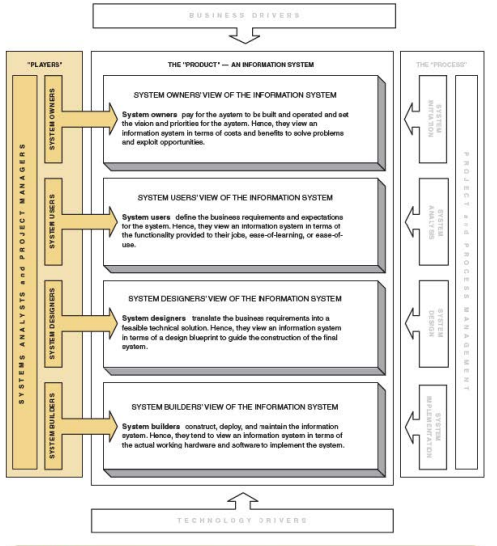

### What is an Information System?

### 1. Why are information systems (IS) essential in organizations?
**Answer**: **Brief Answer**:  
An information system (IS) is a combination of hardware, software, data, processes, and people that work together to collect, process, store, and distribute information to support decision-making, coordination, and operations in an organization.  
**Bangla Translation**:  
**তথ্য সিস্টেম কী?**  
তথ্য সিস্টেম (IS) হল হার্ডওয়্যার, সফটওয়্যার, ডেটা, প্রক্রিয়া এবং মানুষের সমন্বয় যা একটি সংস্থায় সিদ্ধান্ত গ্রহণ, সমন্বয় এবং কার্যক্রম সমর্থন করতে তথ্য সংগ্রহ, প্রক্রিয়াকরণ, সংরক্ষণ এবং বিতরণ করে।  

### 1. Why are information systems (IS) essential in organizations?

**Brief Answer**:  
Information systems (IS) are essential in organizations because they automate processes, enhance decision-making, improve communication, manage data efficiently, and provide a competitive advantage by enabling faster, more informed operations.

**Bangla Translation**:  
**তথ্য সিস্টেম (IS) সংস্থাগুলোতে কেন অপরিহার্য?**  
তথ্য সিস্টেম সংস্থাগুলোতে অপরিহার্য কারণ তারা প্রক্রিয়াগুলো স্বয়ংক্রিয় করে, সিদ্ধান্ত গ্রহণের উন্নতি করে, যোগাযোগ উন্নত করে, ডেটা দক্ষতার সাথে পরিচালনা করে এবং দ্রুত, তথ্যভিত্তিক কার্যক্রম সক্ষম করে প্রতিযোগিতামূলক সুবিধা প্রদান করে।  

**Real-Life Example: A Daraz Bangladesh Employee Using an Information System to Sell a Product**  
Let’s consider **Fatima**, a **Customer Service Representative** at Daraz Bangladesh, whose role involves assisting customers to complete purchases on the Daraz platform, Bangladesh’s largest e-commerce marketplace. Fatima uses an **Order Management System (OMS)** integrated with Daraz’s **Customer Relationship Management (CRM) System**, both part of Daraz’s information systems, to facilitate the sale of a product. Here’s how she uses the IS to sell a product, such as a **smartphone**:

- **Scenario**: A customer contacts Fatima through the Daraz mobile app’s chat feature, inquiring about a **Samsung Galaxy A14** listed on Daraz.com.bd. The customer is interested but has questions about the phone’s warranty and delivery options to their location in Chittagong.  
- **Hardware**: Fatima uses a desktop computer at Daraz’s Dhaka office, connected to the company’s servers hosting the OMS and CRM systems.  
- **Software**: The OMS provides Fatima with a dashboard showing the customer’s order details, product availability, and delivery options. The CRM system displays the customer’s profile, including past purchases and preferences.  
- **Data**: The IS contains data about the Samsung Galaxy A14, including its price (e.g., BDT 18,000), warranty details (e.g., 1-year manufacturer warranty), stock status, and delivery logistics for Chittagong. It also includes customer data, such as their contact information and browsing history.  
- **Processes**: Fatima uses the IS to:  
  1. Access the product page in the OMS to confirm the phone’s warranty and specifications, reassuring the customer.  
  2. Check real-time inventory to verify the phone is available in a Daraz Express (DEX) hub near Chittagong, ensuring delivery within 2-3 days.  
  3. Use the CRM system to identify a promotional offer (e.g., 5% cashback via bKash) based on the customer’s frequent use of mobile payments.  
  4. Process the customer’s order through the OMS, selecting cash-on-delivery (COD) as the payment method, a popular option in Bangladesh, and generating an order confirmation.  
- **People**: Fatima interacts with the customer, while the IS communicates with other teams, such as the Daraz Express logistics team to prepare the phone for delivery and the marketing team to track the effectiveness of the cashback offer.  

**বাস্তব জীবনের উদাহরণ: দারাজ বাংলাদেশে একজন কর্মী কীভাবে পণ্য বিক্রয়ের জন্য তথ্য সিস্টেম ব্যবহার করে**  
ধরুন, **ফাতিমা**, দারাজ বাংলাদেশের একজন **গ্রাহক সেবা প্রতিনিধি**, যার কাজ গ্রাহকদের দারাজ প্ল্যাটফর্মে ক্রয় সম্পন্ন করতে সহায়তা করা। ফাতিমা **অর্ডার ম্যানেজমেন্ট সিস্টেম (OMS)** এবং **কাস্টমার রিলেশনশিপ ম্যানেজমেন্ট (CRM) সিস্টেম** ব্যবহার করেন, যা দারাজের তথ্য সিস্টেমের অংশ, একটি **স্মার্টফোন** বিক্রয়ের জন্য। এখানে তিনি কীভাবে কাজ করেন:  

- **দৃশ্যপট**: একজন গ্রাহক দারাজ মোবাইল অ্যাপের চ্যাট ফিচারের মাধ্যমে ফাতিমার সাথে যোগাযোগ করেন, Daraz.com.bd-তে তালিকাভুক্ত একটি **স্যামসাং গ্যালাক্সি A14** সম্পর্কে জিজ্ঞাসা করেন। গ্রাহক ওয়ারেন্টি এবং চট্টগ্রামে ডেলিভারি সম্পর্কে জানতে চান।  
- **হার্ডওয়্যার**: ফাতিমা দারাজের ঢাকা অফিসে একটি ডেস্কটপ কম্পিউটার ব্যবহার করেন, যা OMS এবং CRM সিস্টেম হোস্ট করা সার্ভারের সাথে সংযুক্ত।  
- **সফটওয়্যার**: OMS ফাতিমাকে গ্রাহকের অর্ডার বিবরণ, পণ্যের প্রাপ্যতা এবং ডেলিভারি অপশন দেখায়। CRM সিস্টেম গ্রাহকের প্রোফাইল, পূর্ববর্তী ক্রয় এবং পছন্দ দেখায়।  
- **ডেটা**: IS-এ স্যামসাং গ্যালাক্সি A14-এর তথ্য রয়েছে, যেমন মূল্য (BDT ১৮,০০০), ওয়ারেন্টি (১ বছরের ম্যানুফ্যাকচারার ওয়ারেন্টি), স্টক স্ট্যাটাস এবং চট্টগ্রামের জন্য ডেলিভারি লজিস্টিক্স। এছাড়া গ্রাহকের যোগাযোগের তথ্য এবং ব্রাউজিং ইতিহাসও রয়েছে।  
- **প্রক্রিয়া**: ফাতিমা IS ব্যবহার করে:  
  1. OMS-এ পণ্যের পৃষ্ঠা দেখে ফোনের ওয়ারেন্টি এবং স্পেসিফিকেশন নিশ্চিত করেন।  
  2. রিয়েল-টাইম ইনভেন্টরি চেক করে দেখেন চট্টগ্রামের কাছে দারাজ এক্সপ্রেস হাবে ফোনটি আছে, ২-৩ দিনের মধ্যে ডেলিভারি সম্ভব।  
  3. CRM সিস্টেমে গ্রাহকের মোবাইল পেমেন্ট ব্যবহারের উপর ভিত্তি করে ৫% বিকাশ ক্যাশব্যাক অফার দেখেন।  
  4. OMS-এর মাধ্যমে গ্রাহকের অর্ডার প্রক্রিয়া করেন, ক্যাশ-অন-ডেলিভারি (COD) পেমেন্ট নির্বাচন করে এবং অর্ডার কনফার্মেশন তৈরি করেন।  
- **মানুষ**: ফাতিমা গ্রাহকের সাথে যোগাযোগ করেন, এবং IS দারাজ এক্সপ্রেস লজিস্টিক্স টিম এবং মার্কেটিং টিমের সাথে সংযোগ স্থাপন করে।  
  

---

### 2. Why do systems analysts need to know who the stakeholders are in the organization?
**Answer**: Systems analysts need to identify stakeholders to understand their needs, expectations, and influence, ensuring the system aligns with organizational goals and user requirements. To do this effectively, they must identify and engage with **stakeholders**—individuals or groups who have an interest in or are affected by the system. Knowing who the stakeholders are allows analysts to:

1. **Understand Needs and Requirements**: Different stakeholders (e.g., employees, managers, customers) have unique needs that the system must address.  
2. **Manage Expectations**: Stakeholders may have varying expectations, and analysts ensure these are realistic and prioritized.  
3. **Ensure Alignment with Goals**: Analysts align the system with the organization’s strategic objectives by consulting key decision-makers.  
4. **Resolve Conflicts**: Stakeholders may have conflicting interests, and analysts mediate to find balanced solutions.  
5. **Gain Support and Buy-In**: Engaging stakeholders early ensures their support, increasing the likelihood of project success.  

By identifying stakeholders, analysts can gather accurate requirements, design user-friendly systems, and avoid costly redesigns due to missed expectations.

**Bangla Detailed Explanation with Example**:   
সিস্টেম বিশ্লেষকদের স্টেকহোল্ডারদের চিহ্নিত করতে হয় তাদের চাহিদা, প্রত্যাশা এবং প্রভাব বুঝতে, যাতে সিস্টেম সংস্থার লক্ষ্য ও ব্যবহারকারীর প্রয়োজনের সাথে সামঞ্জস্যপূর্ণ হয়।

1. **চাহিদা বোঝা**: বিভিন্ন স্টেকহোল্ডারদের (যেমন, কর্মচারী, ম্যানেজার, গ্রাহক) অনন্য চাহিদা থাকে, যা সিস্টেমে পূরণ করতে হয়।  
2. **প্রত্যাশা ব্যবস্থাপনা**: স্টেকহোল্ডারদের ভিন্ন প্রত্যাশা থাকতে পারে, এবং বিশ্লেষকরা এগুলো বাস্তবসম্মত ও অগ্রাধিকার নিশ্চিত করে।  
3. **লক্ষ্যের সাথে সামঞ্জস্য**: বিশ্লেষকরা সিস্টেমকে সংস্থার কৌশলগত উদ্দেশ্যের সাথে সামঞ্জস্য করে।  
4. **দ্বন্দ্ব সমাধান**: স্টেকহোল্ডারদের মধ্যে দ্বন্দ্ব থাকতে পারে, এবং বিশ্লেষকরা মধ্যস্থতা করে সমাধান খুঁজে।  
5. **সমর্থন অর্জন**: প্রাথমিকভাবে স্টেকহোল্ডারদের সম্পৃক্ত করা তাদের সমর্থন নিশ্চিত করে, প্রকল্পের সাফল্য বাড়ায়।  

---

### 3. Who are the typical stakeholders in an information system? What are their roles?

**Answer**:  
**1.System owners:**  
System Owners pay for the system to be built and operated. They view the information system in terms of costs and benefits to solve problems and exploit opportunities, focusing on its alignment with business goals.  
**Bangla:**  
সিস্টেম মালিক সিস্টেম তৈরি ও পরিচালনার জন্য অর্থ প্রদান করে। তারা তথ্য সিস্টেমকে খরচ এবং সুবিধার দিক থেকে দেখে সমস্যা সমাধান ও সুযোগ কাজে লাগানোর জন্য, ব্যবসায়িক লক্ষ্যের সাথে সামঞ্জস্যের উপর ফোকাস করে।  

**2. System Users:**  
System Users define the business requirements and expectations functionally provided by their job. They view the information system in terms of ease-of-use, ease-of-learning, and ease-of-adoption to ensure it supports their daily tasks effectively.  
**Bangla:**  
সিস্টেম ব্যবহারকারী তাদের কাজের মাধ্যমে ব্যবসায়িক প্রয়োজনীয়তা এবং প্রত্যাশা কার্যকরভাবে নির্ধারণ করে। তারা তথ্য সিস্টেমকে ব্যবহারের সহজতা, শেখার সহজতা এবং গ্রহণের সহজতার দিক থেকে দেখে যাতে এটি তাদের দৈনন্দিন কাজকে কার্যকরভাবে সমর্থন করে।  

**3. System Designers:**  
System Designers translate the business requirements into a system. They view the information system in terms of a design blueprint to guide the construction of the final system, ensuring it meets the specified needs.  
**Bangla:**  
সিস্টেম ডিজাইনার ব্যবসায়িক প্রয়োজনীয়তাগুলো একটি সিস্টেমে রূপান্তর করে। তারা তথ্য সিস্টেমকে চূড়ান্ত সিস্টেম নির্মাণের জন্য একটি ডিজাইন ব্লুপ্রিন্টের দিক থেকে দেখে, নির্দিষ্ট চাহিদা পূরণ নিশ্চিত করে।  

**4. System Builders:**  
System Builders construct, deploy, and maintain the information system. They view the information system in terms of the actual hardware and software to implement the system design, ensuring it functions as intended.  
**Bangla:**  
সিস্টেম বিল্ডার তথ্য সিস্টেম তৈরি, স্থাপন এবং রক্ষণাবেক্ষণ করে। তারা তথ্য সিস্টেমকে সিস্টেম ডিজাইন বাস্তবায়নের জন্য প্রকৃত হার্ডওয়্যার এবং সফটওয়্যারের দিক থেকে দেখে, এটি উদ্দেশ্য অনুযায়ী কাজ করে তা নিশ্চিত করে।   

---

### 4. Please explain what the consequences are if an information system lacks a system owner.
**Answer**: Without a system owner, the system may face inadequate funding, unclear objectives, lack of accountability, scope creep, delays, or failure due to misalignment with business needs.  
**Example**: A university’s student portal project without an owner might lack direction, leading to features students don’t need and budget overruns.  
**Bangla**:  
সিস্টেম মালিক না থাকলে, সিস্টেমে অপর্যাপ্ত তহবিল, অস্পষ্ট উদ্দেশ্য, জবাবদিহিতার অভাব, স্কোপ বৃদ্ধি, বিলম্ব বা ব্যবসায়িক চাহিদার সাথে অসামঞ্জস্যতার কারণে ব্যর্থতা হতে পারে।  
**উদাহরণ**: একটি বিশ্ববিদ্যালয়ের ছাত্র পোর্টাল প্রকল্পে মালিক না থাকলে দিকনির্দেশনার অভাব হতে পারে, যা ছাত্রদের অপ্রয়োজনীয় ফিচার এবং বাজেট বৃদ্ধির দিকে নিয়ে যায়।  

---
`**EXAM:**
### 5. What are the differences between internal users and external users? Give examples.
**Answer**:  
- **Internal Users**: Employees within the organization who use the system for operations. Example: A cashier using a POS(Point Of Sell) system.  

- **External Users**: Customers or partners outside the organization who interact with the system. Example: A customer using an e-commerce website.  
 
**Real-Life Example:** In Daraz Bangladesh, internal users like warehouse staff use the inventory system to manage stock levels, while external users like customers use the Daraz app to shop online for products like smartphones.  

**Bangla**:  
- **অভ্যন্তরীণ ব্যবহারকারী**: সংস্থার কর্মচারী যারা কার্যক্রমের জন্য সিস্টেম ব্যবহার করে। উদাহরণ: একজন ক্যাশিয়ার POS সিস্টেম ব্যবহার করে।  
- **বাহ্যিক ব্যবহারকারী**: সংস্থার বাইরের গ্রাহক বা অংশীদার যারা সিস্টেমের সাথে 
**Bangla**: বাস্তব উদাহরণ: দারাজ বাংলাদেশে, অভ্যন্তরীণ ব্যবহারকারী যেমন গুদাম কর্মীরা স্টক লেভেল পরিচালনার জন্য ইনভেন্টরি সিস্টেম ব্যবহার করে, যখন বাহ্যিক ব্যবহারকারী যেমন গ্রাহকরা স্মার্টফোনের মতো পণ্য কেনাকাটার জন্য দারাজ অ্যাপ ব্যবহার করে।

---
`**EXAM:**
### 6. What are the differences between the role of system analysts and the role of the rest of the stakeholders?

| **Aspect**                     | **System Analysts**                                                                                   | **Other Stakeholders**                                                                                     | **Real-Life Example (Daraz Bangladesh)**                                                                                     |
|-------------------------------|------------------------------------------------------------------------------------------------------|-----------------------------------------------------------------------------------------------------------|-----------------------------------------------------------------------------------------------------------------------------|
| **Role**                      | Act as a bridge between business needs and technical solutions by gathering requirements, designing systems, and facilitating communication. | Provide input, use, fund, or build the system but do not design solutions.                                | Arif (system analyst) gathers requirements, designs the Order Management System (OMS), and communicates needs, while others contribute, use, or build it. |
| **Key Responsibilities**      | Gather and analyze requirements, design the system, and ensure alignment with business goals.        | System owners(see 4 type of stockholder) fund and oversee, users provide needs and use the system, designers create blueprints, and builders implement the system. | Arif interviews warehouse staff and customers, designs OMS (Order Management System) features like stock alerts, and shares specs with designers/builders. |
| **Focus**                     | Translate business problems into technical specifications, focusing on creating a feasible solution. | Focus on their specific roles: funding (owners), usability (users), technical planning (designers), or implementation (builders). | Arif focuses on OMS (Order Management System) design for efficiency, while management funds, staff/customers use, designers plan, and developers code it. |

| **দিক**                       | **সিস্টেম বিশ্লেষক**                                                                                  | **অন্যান্য স্টেকহোল্ডার**                                                                                 | **বাস্তব উদাহরণ (দারাজ বাংলাদেশ)**                                                                                          |
|-------------------------------|------------------------------------------------------------------------------------------------------|-----------------------------------------------------------------------------------------------------------|-----------------------------------------------------------------------------------------------------------------------------|
| **ভূমিকা**                    | ব্যবসায়িক চাহিদা এবং প্রযুক্তিগত সমাধানের মধ্যে সেতুবন্ধন তৈরি করে প্রয়োজনীয়তা সংগ্রহ, সিস্টেম ডিজাইন এবং যোগাযোগ সহজতর করে। | ইনপুট দেয়, ব্যবহার করে, তহবিল দেয় বা সিস্টেম তৈরি করে কিন্তু সমাধান ডিজাইন করে না।                     | আরিফ (সিস্টেম বিশ্লেষক) প্রয়োজনীয়তা সংগ্রহ করে, অর্ডার ম্যানেজমেন্ট সিস্টেম (OMS) ডিজাইন করে এবং চাহিদা যোগাযোগ করে, অন্যরা অবদান রাখে, ব্যবহার করে বা তৈরি করে। |
| **মূল দায়িত্ব**              | প্রয়োজনীয়তা সংগ্রহ ও বিশ্লেষণ করে, সিস্টেম ডিজাইন করে এবং ব্যবসায়িক লক্ষ্যের সাথে সামঞ্জস্য নিশ্চিত করে। | মালিক তহবিল ও তত্ত্বাবধান করে, ব্যবহারকারী চাহিদা দেয় ও ব্যবহার করে, ডিজাইনার ব্লুপ্রিন্ট তৈরি করে, বিল্ডার সিস্টেম বাস্তবায়ন করে। | আরিফ গুদাম কর্মী ও গ্রাহকদের সাক্ষাৎকার নিয়ে, অর্ডার ম্যানেজমেন্ট সিস্টেম (OMS)-এর স্টক সতর্কতার মতো ফিচার ডিজাইন করে এবং ডিজাইনার/বিল্ডারদের সাথে স্পেসিফিকেশন শেয়ার করে। |
| **ফোকাস**                     | ব্যবসায়িক সমস্যাকে প্রযুক্তিগত স্পেসিফিকেশনে রূপান্তর করে, একটি সম্ভাব্য সমাধান তৈরির উপর ফোকাস করে। | তাদের নির্দিষ্ট ভূমিকায় ফোকাস করে: তহবিল (মালিক), ব্যবহারযোগ্যতা (ব্যবহারকারী), প্রযুক্তিগত পরিকল্পনা (ডিজাইনার), বা বাস্তবায়ন (বিল্ডার)। | আরিফ অর্ডার ম্যানেজমেন্ট সিস্টেম (OMS)-এর দক্ষতার জন্য ডিজাইনের উপর ফোকাস করে, ম্যানেজমেন্ট তহবিল দেয়, কর্মী/গ্রাহক ব্যবহার করে, ডিজাইনার পরিকল্পনা করে, ডেভেলপার কোড করে। |

---
`**Exam:**`
### 7. What kind of knowledge and skills should a system analyst possess?

**Answer with Points and Expanded Explanation Using Daraz Context:**

- **Business Knowledge**:  
  System analysts must understand organizational processes, workflows, and strategic goals to align the system with the company’s objectives. This includes knowing how different departments function and what the business aims to achieve.  

- **Technical Knowledge**:  
  System analysts require familiarity with programming languages, database management (e.g., SQL), and IT infrastructure (e.g., networks, servers) to design feasible and efficient systems. This technical expertise helps them create solutions that work within the organization’s technological framework.  

- **Problem-Solving Skills**:  
  System analysts need strong problem-solving skills to analyze requirements, identify gaps, and devise solutions for business challenges. This involves critical thinking to address inefficiencies and improve processes or user experiences.  
 

- **Communication Skills**:  
  System analysts must have excellent communication skills to explain complex technical concepts to non-technical stakeholders, like managers or end-users, and ensure all parties understand the system’s purpose and functionality. They also communicate requirements to technical teams like developers.  
 

**Bangla Translation with Points:**

- **ব্যবসায়িক জ্ঞান**:  
  সিস্টেম বিশ্লেষকদের সংস্থার প্রক্রিয়া, কার্যপ্রবাহ এবং কৌশলগত লক্ষ্য বুঝতে হবে যাতে সিস্টেম কোম্পানির উদ্দেশ্যের সাথে সামঞ্জস্যপূর্ণ হয়। এর মধ্যে বিভিন্ন বিভাগ কীভাবে কাজ করে এবং ব্যবসা কী অর্জন করতে চায় তা জানা অন্তর্ভুক্ত।  

- **প্রযুক্তিগত জ্ঞান**:  
  সিস্টেম বিশ্লেষকদের প্রোগ্রামিং ভাষা, ডেটাবেস ম্যানেজমেন্ট (যেমন, SQL) এবং আইটি অবকাঠামো (যেমন, নেটওয়ার্ক, সার্ভার) সম্পর্কে জানতে হবে যাতে সম্ভাব্য এবং দক্ষ সিস্টেম ডিজাইন করা যায়। এই প্রযুক্তিগত দক্ষতা সংস্থার প্রযুক্তিগত কাঠামোর মধ্যে সমাধান তৈরি করতে সহায়তা করে।  

- **বিশ্লেষণাত্মক দক্ষতা**:  
  সিস্টেম বিশ্লেষকদের শক্তিশালী সমস্যা সমাধানের দক্ষতা প্রয়োজন যাতে প্রয়োজনীয়তা বিশ্লেষণ করা, ফাঁক চিহ্নিত করা এবং ব্যবসায়িক চ্যালেঞ্জ সমাধানের জন্য সমাধান তৈরি করা যায়। এর মধ্যে কার্যক্রম উন্নত করা বা ব্যবহারকারীর অভিজ্ঞতা বাড়ানোর জন্য সমালোচনামূলক চিন্তাভাবনা জড়িত।  

- **যোগাযোগ দক্ষতা**:  
  সিস্টেম বিশ্লেষকদের চমৎকার যোগাযোগ দক্ষতা থাকতে হবে যাতে জটিল প্রযুক্তিগত ধারণাগুলো অ-প্রযুক্তিগত স্টেকহোল্ডারদের, যেমন ম্যানেজার বা এন্ড-ইউজারদের কাছে ব্যাখ্যা করা যায় এবং সবাই সিস্টেমের উদ্দেশ্য ও কার্যকারিতা বুঝতে পারে। তারা ডেভেলপারদের মতো প্রযুক্তিগত দলের কাছে প্রয়োজনীয়তাও জানায়।  

---

### 8. In addition to business and computing knowledge, what other essential skills do system analysts need to effectively complete their jobs?
**Answer**:  
- Interpersonal skills for collaboration.  
- Project management for planning and execution.  
- Critical thinking for evaluating solutions.  
- Adaptability to handle changing requirements.  
**Example**: An analyst adapts to new regulatory requirements for a banking system.  
**Bangla**:  
- সহযোগিতার জন্য আন্তঃব্যক্তিক দক্ষতা।  
- পরিকল্পনা ও বাস্তবায়নের জন্য প্রকল্প ব্যবস্থাপনা।  
- সমাধান মূল্যায়নের জন্য সমালোচনামূলক চিন্তাভাবনা।  
- পরিবর্তনশীল প্রয়োজনীয়তা পরিচালনার জন্য অভিযোজন ক্ষমতা।  
**উদাহরণ**: একজন বিশ্লেষক ব্যাঙ্কিং সিস্টেমের নতুন নিয়ন্ত্রক প্রয়োজনীয়তার সাথে মানিয়ে নেন।  

---

### 9. Why are good interpersonal communication skills essential for system analysts?
**Answer**: They ensure effective collaboration, clear requirement gathering, conflict resolution, and the ability to explain technical concepts to diverse stakeholders.  
**Example**: An analyst explains a CRM system’s benefits to non-technical sales staff.  
**Bangla**:  
এগুলো কার্যকর সহযোগিতা, স্পষ্ট প্রয়োজনীয়তা সংগ্রহ, দ্বন্দ্ব সমাধান এবং বিভিন্ন স্টেকহোল্ডারদের কাছে প্রযুক্তিগত ধারণা ব্যাখ্যা করার ক্ষমতা নিশ্চিত করে।  
**উদাহরণ**: একজন বিশ্লেষক অ-প্রযুক্তিগত বিক্রয় কর্মীদের কাছে CRM সিস্টেমের সুবিধা ব্যাখ্যা করেন।  

---
`**EXAM:**
### 10. What are some of the business drivers for today’s information systems?
**Answer**:  

- **Cost reduction through automation**: Businesses use information systems (IS) to automate tasks, like processing orders or tracking inventory, which saves time and money by reducing manual work.  
  **Example**: Daraz Bangladesh uses an IS to automatically update stock levels, so staff don’t have to manually count items, saving time and labor costs.

- **Improved customer experience via personalization**: IS helps businesses understand customer preferences and offer tailored experiences, making customers happier and more likely to return.  
  **Example**: Daraz uses its IS to suggest products like smartphones to customers based on their past searches, making shopping easier and more enjoyable.

- **Data-driven decision-making**: IS collects and analyzes data, helping businesses make smart decisions, like adjusting prices or stocking popular items.  
  **Example**: Daraz analyzes sales data through its IS to see which products sell most during 11.11 sales, helping them stock more of those items.

- **Competitive advantage through innovation**: IS allows businesses to create new features or services that make them stand out from competitors.  
  **Example**: Daraz offers real-time delivery tracking through its IS, which makes it more attractive than competitors who don’t provide this feature.

**Bangla Translation with Simple Explanation and Example:**

- **স্বয়ংক্রিয়করণের মাধ্যমে খরচ কমানো**: ব্যবসা তথ্য সিস্টেম (IS) ব্যবহার করে কাজ স্বয়ংক্রিয় করে, যেমন অর্ডার প্রক্রিয়া বা ইনভেন্টরি ট্র্যাকিং, যা হাতের কাজ কমিয়ে সময় ও টাকা বাঁচায়।  
  **উদাহরণ**: দারাজ বাংলাদেশ IS ব্যবহার করে স্টক লেভেল স্বয়ংক্রিয়ভাবে আপডেট করে, তাই কর্মীদের হাতে গণনা করতে হয় না, সময় ও শ্রম খরচ বাঁচে।

- **ব্যক্তিগতকরণের মাধ্যমে গ্রাহক অভিজ্ঞতা উন্নত করা**: IS ব্যবসাকে গ্রাহকের পছন্দ বুঝতে এবং তাদের জন্য বিশেষ অভিজ্ঞতা দেওয়ার সুযোগ করে, যা গ্রাহকদের খুশি করে এবং ফিরে আসতে উৎসাহিত করে।  
  **উদাহরণ**: দারাজ তার IS ব্যবহার করে গ্রাহকদের পূর্ববর্তী সার্চের উপর ভিত্তি করে স্মার্টফোনের মতো পণ্য সুপারিশ করে, যা কেনাকাটাকে সহজ ও আনন্দদায়ক করে।

- **ডেটা-চালিত সিদ্ধান্ত গ্রহণ**: IS ডেটা সংগ্রহ ও বিশ্লেষণ করে, যা ব্যবসাকে স্মার্ট সিদ্ধান্ত নিতে সাহায্য করে, যেমন দাম সমন্বয় বা জনপ্রিয় পণ্য স্টক করা।  
  **উদাহরণ**: দারাজ তার IS-এর মাধ্যমে ১১.১১ সেলসের ডেটা বিশ্লেষণ করে দেখে কোন পণ্য বেশি বিক্রি হয়, এবং সেই পণ্য বেশি স্টক করে।

- **উদ্ভাবনের মাধ্যমে প্রতিযোগিতামূলক সুবিধা**: IS ব্যবসাকে নতুন ফিচার বা সেবা তৈরি করতে দেয়, যা তাদের প্রতিযোগীদের থেকে আলাদা করে।  
  **উদাহরণ**: দারাজ তার IS-এর মাধ্যমে রিয়েল-টাইম ডেলিভারি ট্র্যাকিং দেয়, যা এটিকে এমন প্রতিযোগীদের থেকে আকর্ষণীয় করে যারা এই ফিচার দেয় না।

---

### 11. What are the differences between electronic commerce (e-commerce) and electronic business (e-business)?
**Answer**:  
- **E-commerce**: Online buying and selling of goods/services (e.g., Amazon).  
- **E-business**: Broader use of digital technologies for all business processes, including internal operations (e.g., CRM, supply chain).  
**Example**: Amazon’s website is e-commerce; its internal logistics system is e-business.  
**Bangla**:  
- **ই-কমার্স**: অনলাইনে পণ্য/সেবা ক্রয়-বিক্রয় (যেমন, আমাজন)।  
- **ই-বিজনেস**: সমস্ত ব্যবসায়িক প্রক্রিয়ার জন্য ডিজিটাল প্রযুক্তির বিস্তৃত ব্যবহার, অভ্যন্তরীণ কার্যক্রম সহ (যেমন, CRM, সাপ্লাই চেইন)।  
**উদাহরণ**: আমাজনের ওয়েবসাইট ই-কমার্স; এর অভ্যন্তরীণ লজিস্টিক সিস্টেম ই-বিজনেস।  

---

### 12. What are the differences between information and knowledge?
**Answer**:  
- **Information**: Processed data with context (e.g., sales figures).  
- **Knowledge**: Information combined with experience and insights (e.g., using sales trends to forecast demand).  
**Example**: Sales data is information; predicting future sales based on it is knowledge.  
**Bangla**:  
- **তথ্য**: প্রক্রিয়াজাত ডেটা যার প্রেক্ষাপট আছে (যেমন, বিক্রয় সংখ্যা)।  
- **জ্ঞান**: তথ্যের সাথে অভিজ্ঞতা এবং অন্তর্দৃষ্টি মিলিত (যেমন, বিক্রয় প্রবণতা ব্যবহার করে চাহিদা পূর্বাভাস)।  
**উদাহরণ**: বিক্রয় ডেটা তথ্য; এটির উপর ভিত্তি করে ভবিষ্যৎ বিক্রয় পূর্বাভাস জ্ঞান।  

---
`**EXAM:**
### 13. What are the most important technology drivers for today’s information systems?
**Answer**:  
- Cloud computing for scalability.  
- AI for automation and insights.  
- Big data analytics for decision-making.  
- Cybersecurity for data protection.  
- Mobile technology for accessibility.  
**Example**: Google uses cloud computing to scale its services globally.  
**Bangla**:  
- স্কেলেবিলিটির জন্য ক্লাউড কম্পিউটিং।  
- স্বয়ংক্রিয়করণ এবং অন্তর্দৃষ্টির জন্য AI।  
- সিদ্ধান্ত গ্রহণের জন্য বিগ ডেটা অ্যানালিটিক্স।  
- ডেটা সুরক্ষার জন্য সাইবারসিকিউরিটি।  
- অ্যাক্সেসযোগ্যতার জন্য মোবাইল প্রযুক্তি।  
**উদাহরণ**: গুগল তার পরিষেবা বিশ্বব্যাপী স্কেল করতে ক্লাউড কম্পিউটিং ব্যবহার করে।  

---
`**EXAM:**
### 14. What are the four steps in a system development process? What happens in each step?
**Answer**:  

1. **Planning/Initiation**:  
   This phase involves setting the foundation for the project by defining its goals, scope, and feasibility. The team identifies the purpose of the system (e.g., improving efficiency or customer service), determines what features are needed, and assesses whether the project is practical in terms of budget, time, and resources. A project plan is created to guide the development process.  
   **Example with Daraz**: For a new Daraz Bangladesh feature to improve order tracking, the planning phase would define the goal of providing real-time delivery updates, outline the scope (e.g., integrating with the Daraz app), and evaluate if the company has the budget and technology to make it happen.

2. **Analysis**:  
   In this phase, the team gathers and documents detailed requirements by consulting stakeholders like users and management. They analyze current processes, identify problems (e.g., delays or errors), and determine what the new system must do to solve these issues. This step ensures the system meets user needs and business objectives.  
   **Example with Daraz**: During the analysis phase, Daraz’s team interviews warehouse staff and customers to understand their needs. They learn that customers want real-time tracking updates, and staff need automated stock alerts, so these requirements are documented for the OMS upgrade.

3. **Design**:  
   Here, the team creates the system’s architecture and specifications, deciding how it will look and function. This includes designing the user interface, database structure, and technical components (e.g., APIs or servers). The design acts as a blueprint for developers to follow during implementation.  
   **Example with Daraz**: In the design phase for Daraz’s OMS, the team designs a user-friendly interface for the app to show delivery updates, sets up a database to store stock levels, and plans an API to connect the app with the delivery system.

4. **Implementation**:  
   This phase involves building, testing, and deploying the system. Developers write code to create the system based on the design, test it to ensure it works correctly (e.g., no bugs or errors), and then launch it for users. Training and support may also be provided to help users adapt.  
   **Example with Daraz**: For Daraz’s OMS, developers code the system to include real-time tracking and stock alerts, test it by simulating orders to ensure it works, and then deploy it on the Daraz app and warehouse systems, training staff to use the new features.

**General Example Expanded**:  
Developing a mobile banking app involves the planning phase, where the team decides to include features like fund transfers and bill payments, ensuring it fits the bank’s budget. In the analysis phase, they survey users to confirm they need quick access to account balances and transaction history. The design phase creates a simple interface with secure login and a database for storing transactions. Finally, in the implementation phase, the app is coded, tested for security (e.g., ensuring no hacking risks), and launched for customers to use.

**Bangla Translation with Expanded Description:**

1. **পরিকল্পনা/ইনিশিয়েশন**:  
   এই পর্যায়ে প্রকল্পের ভিত্তি তৈরি করা হয়, যেখানে লক্ষ্য, সুযোগ এবং সম্ভাব্যতা নির্ধারণ করা হয়। দল সিস্টেমের উদ্দেশ্য (যেমন, দক্ষতা বা গ্রাহক সেবা উন্নতি), কী কী ফিচার প্রয়োজন এবং বাজেট, সময় ও সম্পদের দিক থেকে প্রকল্প সম্ভব কিনা তা নির্ধারণ করে। উন্নয়ন প্রক্রিয়ার জন্য একটি পরিকল্পনা তৈরি করা হয়।  
   **দারাজ উদাহরণ**: দারাজ বাংলাদেশের একটি নতুন অর্ডার ট্র্যাকিং ফিচারের জন্য, পরিকল্পনা পর্যায়ে রিয়েল-টাইম ডেলিভারি আপডেট দেওয়ার লক্ষ্য নির্ধারণ করা হয়, সুযোগ নির্ধারণ করা হয় (যেমন, দারাজ অ্যাপের সাথে ইন্টিগ্রেশন), এবং কোম্পানির বাজেট ও প্রযুক্তি আছে কিনা তা মূল্যায়ন করা হয়।

2. **বিশ্লেষণ**:  
   এই পর্যায়ে দল ব্যবহারকারী এবং ম্যানেজমেন্টের মতো স্টেকহোল্ডারদের সাথে পরামর্শ করে বিস্তারিত প্রয়োজনীয়তা সংগ্রহ ও নথিভুক্ত করে। তারা বর্তমান প্রক্রিয়া বিশ্লেষণ করে, সমস্যা (যেমন, বিলম্ব বা ত্রুটি) চিহ্নিত করে এবং নতুন সিস্টেম কী করতে হবে তা নির্ধারণ করে যাতে সমস্যাগুলো সমাধান হয়। এটি নিশ্চিত করে যে সিস্টেম ব্যবহারকারীর চাহিদা ও ব্যবসায়িক উদ্দেশ্য পূরণ করে।  
   **দারাজ উদাহরণ**: বিশ্লেষণ পর্যায়ে দারাজের দল গুদাম কর্মী এবং গ্রাহকদের সাক্ষাৎকার নিয়ে তাদের চাহিদা বোঝে। তারা জানতে পারে গ্রাহকরা রিয়েল-টাইম ট্র্যাকিং চায় এবং কর্মীরা স্বয়ংক্রিয় স্টক সতর্কতা চায়, তাই এই প্রয়োজনীয়তাগুলো OMS আপগ্রেডের জন্য নথিভুক্ত করা হয়।

3. **ডিজাইন**:  
   এখানে দল সিস্টেমের আর্কিটেকচার এবং স্পেসিফিকেশন তৈরি করে, এটি কেমন দেখাবে এবং কাজ করবে তা ঠিক করে। এর মধ্যে ব্যবহারকারী ইন্টারফেস, ডেটাবেস স্ট্রাকচার এবং প্রযুক্তিগত উপাদান (যেমন, API বা সার্ভার) ডিজাইন করা অন্তর্ভুক্ত। ডিজাইনটি ডেভেলপারদের জন্য একটি ব্লুপ্রিন্ট হিসেবে কাজ করে।  
   **দারাজ উদাহরণ**: দারাজের OMS-এর ডিজাইন পর্যায়ে, দল ডেলিভারি আপডেট দেখানোর জন্য অ্যাপে একটি ব্যবহারকারী-বান্ধব ইন্টারফেস ডিজাইন করে, স্টক লেভেল সংরক্ষণের জন্য একটি ডেটাবেস সেট আপ করে এবং অ্যাপের সাথে ডেলিভারি সিস্টেম সংযোগের জন্য একটি API পরিকল্পনা করে।

4. **বাস্তবায়ন**:  
   এই পর্যায়ে সিস্টেম তৈরি, পরীক্ষা এবং স্থাপন করা হয়। ডেভেলপাররা ডিজাইনের ভিত্তিতে সিস্টেম তৈরি করতে কোড লেখেন, এটি সঠিকভাবে কাজ করে (যেমন, কোনো বাগ বা ত্রুটি নেই) তা নিশ্চিত করতে পরীক্ষা করেন এবং তারপর ব্যবহারকারীদের জন্য লঞ্চ করেন। ব্যবহারকারীদের সহায়তার জন্য প্রশিক্ষণ এবং সাপোর্টও দেওয়া হতে পারে।  
   **দারাজ উদাহরণ**: দারাজের OMS-এর জন্য, ডেভেলপাররা রিয়েল-টাইম ট্র্যাকিং এবং স্টক সতর্কতা সহ সিস্টেম কোড করেন, অর্ডার সিমুলেট করে এটি পরীক্ষা করেন যাতে এটি কাজ করে, এবং তারপর দারাজ অ্যাপ এবং গুদাম সিস্টেমে স্থাপন করেন, কর্মীদের নতুন ফিচার ব্যবহারের প্রশিক্ষণ দিয়ে।

**সাধারণ উদাহরণ সম্প্রসারিত**:  
একটি মোবাইল ব্যাঙ্কিং অ্যাপ তৈরির জন্য পরিকল্পনা পর্যায়ে দল ফান্ড ট্রান্সফার এবং বিল পেমেন্টের মতো ফিচার অন্তর্ভুক্ত করার সিদ্ধান্ত নেয়, নিশ্চিত করে যে এটি ব্যাঙ্কের বাজেটের মধ্যে থাকে। বিশ্লেষণ পর্যায়ে তারা ব্যবহারকারীদের সার্ভে করে নিশ্চিত করে যে তাদের অ্যাকাউন্ট ব্যালেন্স এবং লেনদেনের ইতিহাসে দ্রুত অ্যাক্সেস প্রয়োজন। ডিজাইন পর্যায়ে একটি সহজ ইন্টারফেস তৈরি করা হয় যেখানে নিরাপদ লগইন এবং লেনদেন সংরক্ষণের জন্য একটি ডেটাবেস থাকে। অবশেষে, বাস্তবায়ন পর্যায়ে অ্যাপটি কোড করা হয়, নিরাপত্তার জন্য পরীক্ষা করা হয় (যেমন, হ্যাকিং ঝুঁকি নেই তা নিশ্চিত করা), এবং গ্রাহকদের ব্যবহারের জন্য লঞ্চ করা হয়।

---

### 15. Why is system initiation essential in the system development process?
**Answer**: System initiation defines the project’s purpose, scope, objectives, and feasibility, ensuring alignment with organizational goals, stakeholder buy-in, and a clear roadmap. Without it, the project risks misalignment, wasted resources, or failure.  
**Real-Life Example**: A hospital initiating an EHR system defines the need for better patient data management, assesses budget, and secures approval. Without initiation, the system might not meet regulations, causing delays.  
**Bangla**:  
সিস্টেম ইনিশিয়েশন প্রকল্পের উদ্দেশ্য, সুযোগ, লক্ষ্য এবং সম্ভাব্যতা নির্ধারণ করে, সংস্থার লক্ষ্যের সাথে সামঞ্জস্য, স্টেকহোল্ডার সমর্থন এবং স্পষ্ট রোডম্যাপ নিশ্চিত করে। এটি ছাড়া প্রকল্প ভুল দিকে যেতে পারে, সম্পদের অপচয় বা ব্যর্থতা হতে পারে।  
**বাস্তব উদাহরণ**: একটি হাসপাতাল EHR সিস্টেমের জন্য রোগীর ডেটা ব্যবস্থাপনার প্রয়োজন নির্ধারণ করে, বাজেট মূল্যায়ন করে এবং অনুমোদন নেয়। ইনিশিয়েশন ছাড়া, সিস্টেম নিয়ন্ত্রক প্রয়োজনীয়তা পূরণ নাও করতে পারে, যা বিলম্ব ঘটায়।  

 
---
---
---
---
 

# **More Exam Question:** 

**i) What are business to consumer(B2C) and busines to business(B2B) web aplications and what are some examples of each type? List out some of teh business drivers for today's information system.**

# B2C and B2B Web Applications and Business Drivers

## B2C Web Applications
- **Definition**: Business to Consumer (B2C) web applications are platforms where businesses sell products or services directly to individual customers for personal use.
- **Examples**:
  - Amazon: Online shopping for electronics, clothes, etc.
  - Netflix: Streaming service for movies and shows.
  - Flipkart: E-commerce for consumer goods.
  - Uber: Ride-hailing app for individuals.

## B2B Web Applications
- **Definition**: Business to Business (B2B) web applications are platforms where businesses provide products, services, or solutions to other businesses.
- **Examples**:
  - Salesforce: CRM software for managing customer relationships.
  - Alibaba: Wholesale marketplace for businesses.
  - Slack: Communication tool for company teams.
  - SAP: Enterprise resource planning for organizations.

## Business Drivers for Today’s Information Systems
- **Cost Reduction**: Automate tasks to save money (e.g., inventory systems).
- **Customer Satisfaction**: Improve experience with fast, personalized services (e.g., product recommendations).
- **Competitive Advantage**: Use technology to stand out (e.g., real-time delivery tracking).
- **Data-Driven Decisions**: Analyze data for better strategies (e.g., sales analytics).
- **Globalization**: Support operations worldwide (e.g., cloud-based tools).
- **Regulatory Compliance**: Meet legal standards (e.g., secure data storage for GDPR).

**Bangla Translation and Explanation**:
**প্রশ্ন**: বিজনেস টু কনজ্যুমার (B2C) এবং বিজনেস টু বিজনেস (B2B) ওয়েব অ্যাপ্লিকেশন কী এবং প্রত্যেকটির কিছু উদাহরণ কী? আজকের তথ্য সিস্টেমের জন্য কিছু বিজনেস ড্রাইভার তালিকাভুক্ত করুন।  
**উত্তর**:  
## B2C ওয়েব অ্যাপ্লিকেশন  
- **সংজ্ঞা**: B2C ওয়েব অ্যাপ্লিকেশন হলো এমন প্ল্যাটফর্ম যেখানে ব্যবসা সরাসরি ব্যক্তিগত গ্রাহকদের কাছে পণ্য বা সেবা বিক্রি করে।  
- **উদাহরণ**:  
  - অ্যামাজন: ইলেকট্রনিক্স, কাপড় ইত্যাদির জন্য অনলাইন শপিং।  
  - নেটফ্লিক্স: মুভি এবং শো স্ট্রিমিং।  
  - ফ্লিপকার্ট: ভোক্তা পণ্যের ই-কমার্স।  
  - উবার: ব্যক্তিদের জন্য রাইড-হেইলিং অ্যাপ।  

## B2B ওয়েব অ্যাপ্লিকেশন  
- **সংজ্ঞা**: B2B ওয়েব অ্যাপ্লিকেশন হলো এমন প্ল্যাটফর্ম যেখানে ব্যবসা অন্য ব্যবসার জন্য পণ্য, সেবা, বা সমাধান প্রদান করে।  
- **উদাহরণ**:  
  - সেলসফোর্স: গ্রাহক সম্পর্ক ব্যবস্থাপনার সফটওয়্যার।  
  - আলিবাবা: ব্যবসার জন্য পাইকারি মার্কেটপ্লেস।  
  - স্ল্যাক: কোম্পানির টিমের জন্য যোগাযোগ টুল।  
  - SAP: সংস্থার জন্য এন্টারপ্রাইজ রিসোর্স প্ল্যানিং।  

## তথ্য সিস্টেমের বিজনেস ড্রাইভার  
- **খরচ হ্রাস**: কাজ স্বয়ংক্রিয় করে টাকা বাঁচানো (যেমন, ইনভেন্টরি সিস্টেম)।  
- **গ্রাহক সন্তুষ্টি**: দ্রুত, ব্যক্তিগত সেবা দিয়ে অভিজ্ঞতা উন্নত করা (যেমন, পণ্য সুপারিশ)।  
- **প্রতিযোগিতামূলক সুবিধা**: প্রযুক্তি ব্যবহার করে আলাদা হওয়া (যেমন, ডেলিভারি ট্র্যাকিং)।  
- **ডেটা-চালিত সিদ্ধান্ত**: ডেটা বিশ্লেষণ করে ভালো কৌশল (যেমন, বিক্রয় বিশ্লেষণ)।  
- **গ্লোবালাইজেশন**: বিশ্বব্যাপী কাজ সমর্থন (যেমন, ক্লাউড টুল)।  
- **নিয়ন্ত্রক সম্মতি**: আইনি মান পূরণ (যেমন, GDPR-এর জন্য নিরাপদ ডেটা)।  

**ব্যাখ্যা**: B2C অ্যাপ্লিকেশন গ্রাহকদের জন্য পণ্য বা সেবা দেয়, যেমন অ্যামাজন। B2B অ্যাপ্লিকেশন ব্যবসার জন্য সেবা দেয়, যেমন সেলসফোর্স। তথ্য সিস্টেমের ড্রাইভারগুলো ব্যবসাকে সাশ্রয়ী, প্রতিযোগিতামূলক, এবং গ্রাহক-কেন্দ্রিক করে।

---

**ii) You are a new systems analyst and eager to prove your abilites on your first project. You are at a problem analysis metting with the system owners and  users and find yourself saying, "we need to do this to solve the problem," into what common trap are you in danger of falling? what technique could you use to avoid the trap?**

**English Answer**:
**Trap**: As a new systems analyst saying, “We need to do this to solve the problem,” you risk falling into the **solution-first trap**. This means jumping to a solution without fully understanding the problem, which can lead to incorrect or incomplete solutions.

**Why It’s a Problem**:
- You might miss key issues or stakeholder needs.
- The proposed solution may not address the root cause.
- It can reduce trust from system owners and users.

**Technique to Avoid It**:
Use **problem analysis techniques**, such as:
- **Root Cause Analysis**: Ask “why” multiple times to identify the real problem (e.g., 5 Whys technique).
- **Stakeholder Interviews**: Gather detailed input from users and owners to understand their needs.
- **Flowcharts or Diagrams**: Map the current process to spot issues before suggesting solutions.
- Example: Instead of saying, “We need a new app,” ask, “What issues are users facing?” and analyze responses.

**Bangla Translation and Explanation**:
**প্রশ্ন**: আপনি একজন নতুন সিস্টেম বিশ্লেষক এবং প্রথম প্রকল্পে আপনার দক্ষতা প্রমাণ করতে চান। সমস্যা বিশ্লেষণ সভায় সিস্টেম মালিক ও ব্যবহারকারীদের সাথে আপনি বলছেন, “এটি করলেই সমস্যা সমাধান হবে।” আপনি কোন সাধারণ ফাঁদে পড়ার ঝুঁকিতে আছেন? এটি এড়াতে কোন টেকনিক ব্যবহার করতে পারেন?  
**উত্তর**:  
**ফাঁদ**: “এটি করলেই সমস্যা সমাধান হবে” বলে আপনি **সলিউশন-ফার্স্ট ফাঁদে** পড়ার ঝুঁকিতে আছেন। এর মানে সমস্যা পুরোপুরি না বুঝে সমাধানে ঝাঁপিয়ে পড়া, যা ভুল বা অসম্পূর্ণ সমাধানের দিকে নিয়ে যায়।  

**কেন সমস্যা**:  
- আপনি মূল সমস্যা বা স্টেকহোল্ডারদের চাহিদা মিস করতে পারেন।  
- প্রস্তাবিত সমাধান মূল কারণ সমাধান নাও করতে পারে।  
- এটি মালিক ও ব্যবহারকারীদের ভরসা কমাতে পারে।  

**এড়ানোর টেকনিক**:  
**সমস্যা বিশ্লেষণ টেকনিক** ব্যবহার করুন, যেমন:  
- **রুট কজ অ্যানালিসিস**: “কেন” বারবার জিজ্ঞাসা করে মূল সমস্যা খুঁজুন (যেমন, ৫ কেন টেকনিক)।  
- **স্টেকহোল্ডার ইন্টারভিউ**: ব্যবহারকারী ও মালিকদের কাছ থেকে বিস্তারিত তথ্য সংগ্রহ করুন।  
- **ফ্লোচার্ট বা ডায়াগ্রাম**: বর্তমান প্রক্রিয়া ম্যাপ করে সমস্যা চিহ্নিত করুন।  
- উদাহরণ: “নতুন অ্যাপ দরকার” বলার পরিবর্তে জিজ্ঞাসা করুন, “ব্যবহারকারীরা কী সমস্যায় পড়ছেন?” এবং উত্তর বিশ্লেষণ করুন।  

**ব্যাখ্যা**: নতুন বিশ্লেষকরা প্রায়ই সমস্যা না বুঝে সমাধান দিতে চান, যা ভুল হতে পারে। রুট কজ অ্যানালিসিস বা ইন্টারভিউ করে সমস্যা ভালোভাবে বুঝে সমাধান প্রস্তাব করা উচিত।

---

**iii) Why do many new systems analysts fail to effectively analyze problems? What can they do to become more effective?**

**English Answer**:
**Why New Systems Analysts Fail**:
- **Lack of Experience**: They may not know how to identify key issues or ask the right questions due to limited practical exposure.
- **Poor Communication**: Failing to listen to or understand stakeholders leads to missing critical requirements.
- **Overlooking Details**: They might assume things without verifying, resulting in incomplete analysis.
- **Weak Problem-Solving Skills**: Difficulty breaking complex problems into smaller parts or prioritizing issues.
- **Time Pressure**: Rushing under deadlines leads to superficial analysis instead of thorough investigation.

**What They Can Do to Improve**:
- **Ask Questions**: Engage stakeholders with open-ended questions to clarify needs.
- **Use Structured Methods**: Apply techniques like flowcharts, interviews, or root cause analysis to organize analysis.
- **Seek Mentorship**: Learn from experienced analysts to gain practical insights.
- **Practice Active Listening**: Fully understand stakeholder concerns by listening carefully.
- **Take Training**: Attend courses on systems analysis, communication, and problem-solving.

**Bangla Translation and Explanation**:
**প্রশ্ন**: কেন অনেক নতুন সিস্টেম বিশ্লেষক সমস্যা কার্যকরভাবে বিশ্লেষণ করতে ব্যর্থ হয়? তারা কী করতে পারে উন্নতির জন্য?  
**উত্তর**:  
**কেন নতুন বিশ্লেষক ব্যর্থ হয়**:  
- **অভিজ্ঞতার অভাব**: বাস্তব অভিজ্ঞতা কম থাকায় তারা মূল সমস্যা চিহ্নিত করতে বা সঠিক প্রশ্ন করতে পারে না।  
- **দুর্বল যোগাযোগ**: স্টেকহোল্ডারদের কথা না শোনা বা না বোঝায় গুরুত্বপূর্ণ চাহিদা মিস হয়।  
- **বিস্তারিত মিস করা**: যাচাই না করে ধরে নেওয়ায় বিশ্লেষণ অসম্পূর্ণ হয়।  
- **সমস্যা সমাধানের দক্ষতা কম**: জটিল সমস্যাকে ছোট অংশে ভাগ করতে বা অগ্রাধিকার দিতে অসুবিধা।  
- **সময়ের চাপ**: সময় কম থাকায় গভীর বিশ্লেষণের পরিবর্তে তাড়াহুড়ো করা।  

**উন্নতির জন্য কী করতে পারে**:  
- **প্রশ্ন করা**: স্টেকহোল্ডারদের সাথে খোলা প্রশ্ন করে চাহিদা পরিষ্কার করা।  
- **স্ট্রাকচার্ড পদ্ধতি ব্যবহার**: ফ্লোচার্ট, ইন্টারভিউ, বা রুট কজ অ্যানালিসিস ব্যবহার করে বিশ্লেষণ সংগঠিত করা।  
- **মেন্টরশিপ নেওয়া**: অভিজ্ঞ বিশ্লেষকদের কাছ থেকে শিখে বাস্তব জ্ঞান অর্জন।  
- **সক্রিয় শোনা**: স্টেকহোল্ডারদের কথা মনোযোগ দিয়ে শুনে পুরোপুরি বোঝা।  
- **প্রশিক্ষণ নেওয়া**: সিস্টেম বিশ্লেষণ, যোগাযোগ, এবং সমস্যা সমাধানের কোর্স করা।  

**ব্যাখ্যা**: নতুন বিশ্লেষকরা অভিজ্ঞতার অভাব, দুর্বল যোগাযোগ, বা তাড়াহুড়োর কারণে সমস্যা বিশ্লেষণে ব্যর্থ হয়। প্রশ্ন করা, পদ্ধতি ব্যবহার, এবং প্রশিক্ষণ নিয়ে তারা উন্নতি করতে পারে।

---

**iv) Assume you are system analyst who will be conducting a requrements analysis for an individually owned brick-and-mortar retail store with a point-of-sale system.**

**English Answer**:
As a systems analyst conducting a **requirements analysis** for an individually owned brick-and-mortar retail store with a point-of-sale (POS) system, follow these steps:

1. **Identify Stakeholders**: Engage the store owner, staff, and customers to understand their needs.
2. **Gather Requirements**:
   - **Functional Requirements**:
     - Process sales quickly (e.g., scan items, calculate totals, process payments).
     - Track inventory in real-time (e.g., update stock after sales).
     - Generate sales reports (e.g., daily or monthly sales summaries).
     - Support multiple payment methods (e.g., cash, card, mobile apps).
   - **Non-Functional Requirements**:
     - System must be fast and reliable to avoid delays at checkout.
     - User-friendly interface for staff with minimal training.
     - Secure payment processing to protect customer data.
3. **Analyze Current System**: Study the existing POS system to identify issues (e.g., slow processing, manual inventory updates).
4. **Propose Improvements**: Suggest features like automated inventory sync, customer loyalty programs, or integration with online sales.
5. **Document Requirements**: Create a requirements specification document with clear, prioritized needs.
6. **Validate with Stakeholders**: Review the document with the owner and staff to ensure it meets their expectations.

**Example Needs**:
- The owner wants a system to track which products sell most.
- Staff need a simple interface to process returns.
- Customers want fast checkouts and secure payments.

**Bangla Translation and Explanation**:
**প্রশ্ন**: ধরুন আপনি একজন সিস্টেম বিশ্লেষক যিনি একটি স্বতন্ত্র মালিকানাধীন ফিজিক্যাল রিটেইল স্টোরের জন্য পয়েন্ট-অফ-সেল (POS) সিস্টেমের প্রয়োজনীয়তা বিশ্লেষণ করবেন।  
**উত্তর**:  
একটি ফিজিক্যাল রিটেইল স্টোরের POS সিস্টেমের জন্য **প্রয়োজনীয়তা বিশ্লেষণ** করতে নিম্নলিখিত ধাপ অনুসরণ করুন:  

1. **স্টেকহোল্ডার চিহ্নিত করা**: স্টোর মালিক, কর্মী, এবং গ্রাহকদের সাথে কথা বলে তাদের চাহিদা বোঝা।  
2. **প্রয়োজনীয়তা সংগ্রহ**:  
   - **কার্যকরী প্রয়োজনীয়তা**:  
     - দ্রুত বিক্রয় প্রক্রিয়া (যেমন, আইটেম স্ক্যান, মোট হিসাব, পেমেন্ট প্রক্রিয়া)।  
     - রিয়েল-টাইম ইনভেন্টরি ট্র্যাকিং (যেমন, বিক্রয়ের পর স্টক আপডেট)।  
     - বিক্রয় রিপোর্ট তৈরি (যেমন, দৈনিক বা মাসিক বিক্রয় সারাংশ)।  
     - একাধিক পেমেন্ট পদ্ধতি সমর্থন (যেমন, নগদ, কার্ড, মোবাইল অ্যাপ)।  
   - **অ-কার্যকরী প্রয়োজনীয়তা**:  
     - সিস্টেম দ্রুত এবং নির্ভরযোগ্য হতে হবে।  
     - কর্মীদের জন্য সহজ ইন্টারফেস, ন্যূনতম প্রশিক্ষণে ব্যবহারযোগ্য।  
     - গ্রাহক ডেটা সুরক্ষিত রাখতে নিরাপদ পেমেন্ট প্রক্রিয়া।  
3. **বর্তমান সিস্টেম বিশ্লেষণ**: বর্তমান POS সিস্টেমের সমস্যা চিহ্নিত করুন (যেমন, ধীর প্রক্রিয়া, ম্যানুয়াল ইনভেন্টরি)।  
4. **উন্নতির প্রস্তাব**: স্বয়ংক্রিয় ইনভেন্টরি সিঙ্ক, গ্রাহক লয়ালটি প্রোগ্রাম, বা অনলাইন বিক্রয় ইন্টিগ্রেশনের মতো ফিচার প্রস্তাব করুন।  
5. **প্রয়োজনীয়তা ডকুমেন্ট করা**: একটি স্পষ্ট, অগ্রাধিকারযুক্ত প্রয়োজনীয়তা ডকুমেন্ট তৈরি করুন।  
6. **স্টেকহোল্ডারদের সাথে যাচাই**: মালিক ও কর্মীদের সাথে ডকুমেন্ট পর্যালোচনা করে নিশ্চিত করুন এটি তাদের প্রত্যাশা পূরণ করে।  

**উদাহরণ চাহিদা**:  
- মালিক চান কোন পণ্য বেশি বিক্রি হয় তা ট্র্যাক করতে।  
- কর্মীরা রিটার্ন প্রক্রিয়ার জন্য সহজ ইন্টারফেস চান।  
- গ্রাহকরা দ্রুত চেকআউট এবং নিরাপদ পেমেন্ট চান।  

**ব্যাখ্যা**: রিটেইল স্টোরের জন্য প্রয়োজনীয়তা বিশ্লেষণে স্টেকহোল্ডারদের চাহিদা বোঝা, বর্তমান সিস্টেমের সমস্যা খুঁজে বের করা, এবং নতুন ফিচার প্রস্তাব করা জরুরি। ডকুমেন্টেশন এবং যাচাই সিস্টেমটি সঠিকভাবে কাজ করে তা নিশ্চিত করে।

---

**v) Suppose your company has a contract with a XYZ local firm to link all of their system so they can transparently work together. Their applications include a number of existing lagacy systems, which were built at different times by different developers using a variety of languages and platforms, as well as several newer contemporary applications. What is the term for this type of linking? What type of tools would you most likely use and shows some examplese of these tools?**

**English Answer**:
**Term**: The process of linking all systems (legacy and contemporary) of a local firm like XYZ so they work together transparently is called **systems integration**.

**Tools Used**:
- **Middleware**: Software that connects different systems by translating data and requests (e.g., MuleSoft, Apache Camel).
- **APIs (Application Programming Interfaces)**: Allow systems to communicate by sharing data and functions (e.g., REST APIs, GraphQL).
- **Enterprise Service Bus (ESB)**: A platform to route and transform data between systems (e.g., TIBCO, IBM Integration Bus).
- **Data Integration Tools**: Combine data from different sources (e.g., Talend, Informatica).
- **Custom Scripts**: Written in languages like Python or Java to connect specific systems.

**Examples**:
- **MuleSoft**: Connects legacy and modern systems with APIs.
- **Apache Camel**: Routes data between diverse platforms.
- **Talend**: Integrates data from multiple databases and applications.
- **REST APIs**: Enable a legacy inventory system to share data with a new e-commerce platform.

**Bangla Translation and Explanation**:
**প্রশ্ন**: ধরুন আপনার কোম্পানির XYZ নামে একটি স্থানীয় ফার্মের সাথে চুক্তি আছে তাদের সব সিস্টেম স্বচ্ছভাবে একসাথে কাজ করার জন্য লিঙ্ক করতে। তাদের অ্যাপ্লিকেশনগুলোতে বিভিন্ন সময়ে বিভিন্ন ডেভেলপার দ্বারা বিভিন্ন ভাষা ও প্ল্যাটফর্মে নির্মিত লিগ্যাসি সিস্টেম এবং কিছু নতুন অ্যাপ্লিকেশন রয়েছে। এই ধরনের লিঙ্কিংয়ের নাম কী? কোন ধরনের টুল ব্যবহার করা সম্ভব এবং কিছু উদাহরণ দিন।  
**উত্তর**:  
**নাম**: XYZ-এর মতো ফার্মের সব সিস্টেম (লিগ্যাসি এবং নতুন) একসাথে স্বচ্ছভাবে কাজ করার জন্য লিঙ্ক করার প্রক্রিয়ার নাম **সিস্টেম ইন্টিগ্রেশন**।  

**ব্যবহৃত টুল**:  
- **মিডলওয়্যার**: বিভিন্ন সিস্টেমের মধ্যে ডেটা এবং রিকোয়েস্ট অনুবাদ করে সংযোগ করে (যেমন, MuleSoft, Apache Camel)।  
- **API (অ্যাপ্লিকেশন প্রোগ্রামিং ইন্টারফেস)**: সিস্টেমগুলোকে ডেটা ও ফাংশন শেয়ার করতে দেয় (যেমন, REST API, GraphQL)।  
- **এন্টারপ্রাইজ সার্ভিস বাস (ESB)**: সিস্টেমের মধ্যে ডেটা রাউট ও রূপান্তরের প্ল্যাটফর্ম (যেমন, TIBCO, IBM Integration Bus)।  
- **ডেটা ইন্টিগ্রেশন টুল**: বিভিন্ন উৎস থেকে ডেটা একত্রিত করে (যেমন, Talend, Informatica)।  
- **কাস্টম স্ক্রিপ্ট**: পাইথন বা জাভার মতো ভাষায় নির্দিষ্ট সিস্টেম সংযোগের জন্য লেখা।  

**উদাহরণ**:  
- **MuleSoft**: লিগ্যাসি এবং নতুন সিস্টেম API দিয়ে সংযোগ করে।  
- **Apache Camel**: বিভিন্ন প্ল্যাটফর্মের মধ্যে ডেটা রাউট করে।  
- **Talend**: একাধিক ডেটাবেস ও অ্যাপ্লিকেশন থেকে ডেটা ইন্টিগ্রেট করে।  
- **REST API**: লিগ্যাসি ইনভেন্টরি সিস্টেমকে নতুন ই-কমার্স প্ল্যাটফর্মের সাথে ডেটা শেয়ার করতে দেয়।  

**ব্যাখ্যা**: সিস্টেম ইন্টিগ্রেশন পুরানো এবং নতুন সিস্টেমকে একসাথে কাজ করতে সংযোগ করে। MuleSoft, API, বা Talend-এর মতো টুল ডেটা এবং ফাংশন শেয়ার করতে সাহায্য করে, যা ব্যবসার কার্যকারিতা বাড়ায়।

---

**vi) How do communications and collaboration system improve efficiency and effectiveness? What are some of the communication and collaboration systems improve effciency and effectiveness? What are some of the communication and collaboration system that are beign used by an increasing number of organilzations?**

**English Answer**:
**How They Improve Efficiency and Effectiveness**:
- **Faster Communication**: Tools like email or instant messaging allow quick sharing of information, reducing delays (e.g., discussing project updates in real-time).
- **Better Collaboration**: Teams can work together on shared documents or projects, improving productivity (e.g., co-editing a report).
- **Remote Work Support**: Enable employees to collaborate from different locations, saving time and travel costs (e.g., virtual meetings).
- **Centralized Information**: Store data in one place for easy access, reducing errors and duplication (e.g., shared cloud storage).
- **Improved Decision-Making**: Real-time data sharing helps teams make faster, informed decisions (e.g., analytics dashboards).

**Examples of Communication and Collaboration Systems**:
- **Slack**: Instant messaging for team communication.
- **Microsoft Teams**: Video calls, chat, and file sharing for collaboration.
- **Google Workspace**: Tools like Google Docs and Drive for real-time document editing.
- **Trello**: Project management tool for task tracking.
- **Zoom**: Video conferencing for virtual meetings.
- **Asana**: Task and project management for teams.

**Bangla Translation and Explanation**:
**প্রশ্ন**: যোগাযোগ এবং সহযোগিতা সিস্টেম কীভাবে দক্ষতা এবং কার্যকারিতা উন্নত করে? কিছু যোগাযোগ এবং সহযোগিতা সিস্টেমের উদাহরণ দিন যা ক্রমবর্ধমান সংখ্যক সংস্থা ব্যবহার করছে।  
**উত্তর**:  
**কীভাবে দক্ষতা ও কার্যকারিতা উন্নত করে**:  
- **দ্রুত যোগাযোগ**: ইমেইল বা ইনস্ট্যান্ট মেসেজিং টুল দ্রুত তথ্য শেয়ার করে, বিলম্ব কমায় (যেমন, প্রকল্প আপডেট রিয়েল-টাইমে আলোচনা)।  
- **ভালো সহযোগিতা**: টিম শেয়ার্ড ডকুমেন্ট বা প্রকল্পে একসাথে কাজ করে, উৎপাদনশীলতা বাড়ায় (যেমন, রিপোর্ট একসাথে এডিট করা)।  
- **রিমোট কাজ সমর্থন**: বিভিন্ন স্থান থেকে সহযোগিতা সম্ভব, সময় ও ভ্রমণ খরচ বাঁচায় (যেমন, ভার্চুয়াল মিটিং)।  
- **কেন্দ্রীভূত তথ্য**: ডেটা এক জায়গায় রাখা সহজ অ্যাক্সেস দেয়, ভুল ও পুনরাবৃত্তি কমায় (যেমন, ক্লাউড স্টোরেজ)।  
- **উন্নত সিদ্ধান্ত গ্রহণ**: রিয়েল-টাইম ডেটা শেয়ার দ্রুত, সঠিক সিদ্ধান্ত নিতে সাহায্য করে (যেমন, অ্যানালিটিক্স ড্যাশবোর্ড)।  

**যোগাযোগ ও সহযোগিতা সিস্টেমের উদাহরণ**:  
- **স্ল্যাক**: টিম যোগাযোগের জন্য ইনস্ট্যান্ট মেসেজিং।  
- **মাইক্রোসফট টিমস**: ভিডিও কল, চ্যাট, এবং ফাইল শেয়ারিং।  
- **গুগল ওয়ার্কস্পেস**: গুগল ডক্স, ড্রাইভের মাধ্যমে রিয়েল-টাইম ডকুমেন্ট এডিটিং।  
- **ট্রেলো**: টাস্ক ট্র্যাকিংয়ের জন্য প্রকল্প ব্যবস্থাপনা টুল।  
- **জুম**: ভার্চুয়াল মিটিংয়ের জন্য ভিডিও কনফারেন্সিং।  
- **আসানা**: টিমের জন্য টাস্ক ও প্রকল্প ব্যবস্থাপনা।  

**ব্যাখ্যা**: যোগাযোগ ও সহযোগিতা সিস্টেম দ্রুত তথ্য শেয়ার, টিমওয়ার্ক, এবং রিমোট কাজ সহজ করে দক্ষতা বাড়ায়। স্ল্যাক, টিমস, বা জুমের মতো টুল সংস্থাগুলোকে আরও কার্যকর এবং উৎপাদনশীল করে।

---

### Additional Notes for Exam
- **Artifact Usage**: Questions i, ii, iii, v, and vi are wrapped in `<xaiArtifact>` tags where the response is a structured document (e.g., Markdown for explanations). Question iv (requirements analysis) is more procedural and doesn’t produce a standalone artifact, so it’s presented without the tag, following the guidelines.
- **No Figures Needed**: None of the questions explicitly require diagrams. If you need to draw one (e.g., a flowchart for systems integration in question v), you can sketch boxes for systems connected by arrows labeled with tools like “MuleSoft” or “API.”
- **Exam-Friendly**: All answers are concise, use simple language, and cover key points for easy memorization. The Bangla translations are clear and tailored for bilingual exam responses.
- **Handling Ambiguous Input**: Since your latest input was unclear, I assumed you wanted the continuation of the previous questions. If you meant something else (e.g., a new question about ML pipelines, DVC, or a specific clarification), please provide more details, and I’ll respond promptly.

If you need clarification, a specific question, a diagram description, or further assistance with any topic (e.g., DVC, ML pipelines, or systems analysis), let me know, and I’ll tailor the response to your needs!
