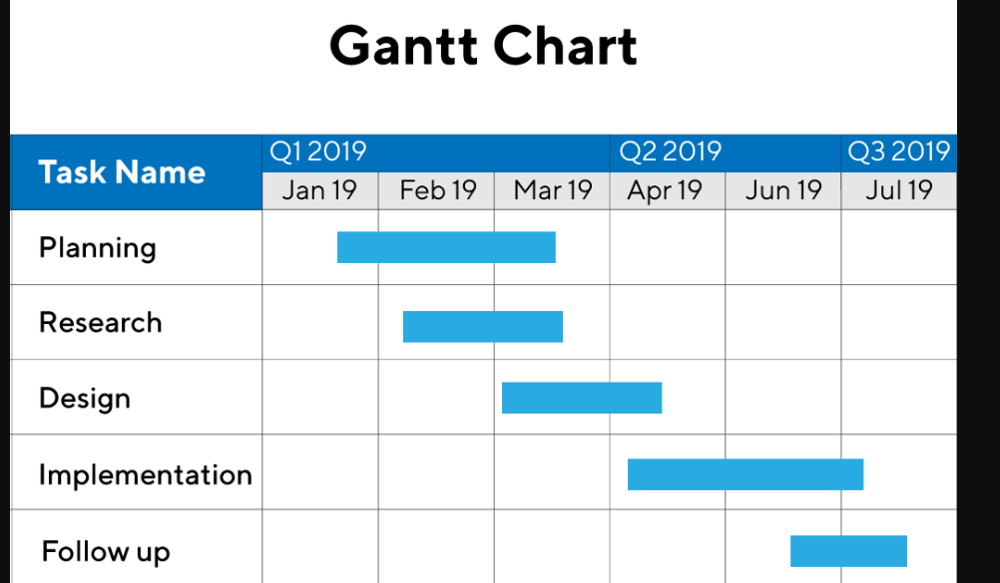

 

# `**Chapter two:**`
 

---

### 1. Why is having a standardized system development process important to an organization?

**English**: A standardized system development process ensures consistency, efficiency, and quality in developing systems. It provides a clear framework for planning, designing, testing, and deploying systems, reducing errors, managing resources effectively, and aligning with organizational goals. It also facilitates collaboration, improves project predictability, and ensures compliance with industry standards.

**Bangla**: একটি মানসম্মত সিস্টেম উন্নয়ন প্রক্রিয়া সংস্থার জন্য ধারাবাহিকতা, দক্ষতা এবং গুণমান নিশ্চিত করে। এটি পরিকল্পনা, নকশা, পরীক্ষণ এবং সিস্টেম মোতায়েনের জন্য একটি স্পষ্ট কাঠামো প্রদান করে, যা ত্রুটি হ্রাস করে, সম্পদের কার্যকর ব্যবস্থাপনা করে এবং সংস্থার লক্ষ্যের সাথে সামঞ্জস্য রাখে। এটি সহযোগিতা সহজ করে, প্রকল্পের পূর্বাভাসযোগ্যতা উন্নত করে এবং শিল্প মানের সাথে সম্মতি নিশ্চিত করে।

---

### 2. How are system life cycle and system development methodology related?

**English**: The system life cycle (SLC) describes the phases a system goes through from inception to retirement (e.g., planning, analysis, design, implementation, maintenance). A system development methodology (SDM) is a structured approach to guide the development process within the SLC, providing specific techniques, tools, and steps for each phase. The SDM operationalizes the SLC, ensuring systematic progression through its phases.

**Bangla**: সিস্টেম লাইফ সাইকেল (SLC) একটি সিস্টেমের শুরু থেকে অবসর পর্যন্ত বিভিন্ন পর্যায় বর্ণনা করে (যেমন, পরিকল্পনা, বিশ্লেষণ, নকশা, বাস্তবায়ন, রক্ষণাবেক্ষণ)। সিস্টেম ডেভেলপমেন্ট মেথডোলজি (SDM) হল SLC-এর মধ্যে উন্নয়ন প্রক্রিয়াকে নির্দেশনা দেওয়ার জন্য একটি কাঠামোগত পদ্ধতি, যা প্রতিটি পর্যায়ের জন্য নির্দিষ্ট কৌশল, সরঞ্জাম এবং ধাপ প্রদান করে। SDM SLC-কে কার্যকর করে, এর পর্যায়গুলোর মাধ্যমে পদ্ধতিগত অগ্রগতি নিশ্চিত করে।

---

### 3. What are the 10 underlying principles for systems development?

**English**: The 10 underlying principles for systems development are:
1. **Get the owner and users involved**: Engage stakeholders for clear requirements.
2. **Use a problem-solving approach**: Systematically address issues.
3. **Establish phases and activities**: Break development into manageable stages.
4. **Establish standards**: Ensure consistency in processes and deliverables.
5. **Justify systems as capital investments**: Evaluate cost-benefit.
6. **Don’t be afraid to cancel or revise scope**: Adapt to changes or infeasibility.
7. **Divide and conquer**: Break complex systems into subsystems.
8. **Design systems for growth and change**: Ensure scalability and flexibility.
9. **Document as you go**: Maintain clear records for reference and audits.
10. **Test thoroughly**: Validate functionality and performance at each stage.

**Bangla**: সিস্টেম উন্নয়নের ১০টি মৌলিক নীতি হল:
1. **মালিক এবং ব্যবহারকারীদের সম্পৃক্ত করুন**: স্পষ্ট প্রয়োজনীয়তার জন্য স্টেকহোল্ডারদের সম্পৃক্ত করুন।
2. **সমস্যা সমাধানের পদ্ধতি ব্যবহার করুন**: পদ্ধতিগতভাবে সমস্যা সমাধান করুন।
3. **পর্যায় এবং কার্যক্রম প্রতিষ্ঠা করুন**: উন্নয়নকে পরিচালনাযোগ্য পর্যায়ে ভাগ করুন।
4. **মান নির্ধারণ করুন**: প্রক্রিয়া এবং ফলাফলের ধারাবাহিকতা নিশ্চিত করুন।
5. **সিস্টেমকে পুঁজি বিনিয়োগ হিসেবে ন্যায্যতা দিন**: খরচ-লাভ মূল্যায়ন করুন।
6. **বাতিল বা স্কোপ সংশোধন করতে ভয় পাবেন না**: পরিবর্তন বা অসম্ভবতার সাথে খাপ খাওয়ান।
7. **ভাগ করুন এবং জয় করুন**: জটিল সিস্টেমকে উপ-সিস্টেমে ভাগ করুন।
8. **বৃদ্ধি এবং পরিবর্তনের জন্য সিস্টেম ডিজাইন করুন**: স্কেলেবিলিটি এবং নমনীয়তা নিশ্চিত করুন।
9. **যেতে যেতে ডকুমেন্ট করুন**: রেফারেন্স এবং অডিটের জন্য পরিষ্কার রেকর্ড রাখুন।
10. **পুঙ্খানুপুঙ্খভাবে পরীক্ষা করুন**: প্রতিটি পর্যায়ে কার্যকারিতা এবং কর্মক্ষমতা যাচাই করুন।

---

### 4. Why is documentation important throughout the development process?

**English**: Documentation is important as it provides a record of requirements, designs, decisions, and processes. It ensures clarity for developers, stakeholders, and future maintainers, reduces miscommunication, supports training, and aids in audits or compliance. It also facilitates troubleshooting and system updates.

**Bangla**: ডকুমেন্টেশন গুরুত্বপূর্ণ কারণ এটি প্রয়োজনীয়তা, নকশা, সিদ্ধান্ত এবং প্রক্রিয়ার রেকর্ড সরবরাহ করে। এটি ডেভেলপার, স্টেকহোল্ডার এবং ভবিষ্যতের রক্ষণাবেক্ষণকারীদের জন্য স্পষ্টতা নিশ্চিত করে, ভুল যোগাযোগ হ্রাস করে, প্রশিক্ষণে সহায়তা করে এবং অডিট বা সম্মতিতে সহায়ক। এটি সমস্যা সমাধান এবং সিস্টেম আপডেট সহজ করে।

---

### 5. Why are process management and project management necessary?

**English**: **Process management** ensures the development methodology is followed, deliverables meet quality standards, and workflows are optimized (using process management tools). **Project management** plans, schedules, and monitors tasks, resources, and budgets to ensure timely completion within scope (using project management tools). Both are necessary for coordination, efficiency, and successful project outcomes.

**Bangla**: **প্রক্রিয়া ব্যবস্থাপনা** নিশ্চিত করে যে উন্নয়ন পদ্ধতি অনুসরণ করা হয়, ফলাফল গুণমানের মান পূরণ করে এবং কর্মপ্রবাহ অপ্টিমাইজ করা হয় (প্রক্রিয়া ব্যবস্থাপনা সরঞ্জাম ব্যবহার করে)। **প্রকল্প ব্যবস্থাপনা** কাজ, সম্পদ এবং বাজেট পরিকল্পনা, সময়সূচী এবং পর্যবেক্ষণ করে যাতে স্কোপের মধ্যে সময়মতো সম্পন্ন হয় (প্রকল্প ব্যবস্থাপনা সরঞ্জাম ব্যবহার করে)। সমন্বয়, দক্ষতা এবং সফল প্রকল্প ফলাফলের জন্য উভয়ই প্রয়োজনীয়।

---

### 6. What is risk management? Why is it necessary?

**English**: Risk management involves identifying the  potential risks that could impact a project’s success (e.g., technical failures, budget shortage, delays). It is necessary to minimize risk, ensure project stability, and protect resources by proactively addressing uncertainties.

**Bangla**: ঝুঁকি ব্যবস্থাপনা হল এমন সম্ভাব্য ঝুঁকি চিহ্নিত করা, মূল্যায়ন করা এবং প্রশমন করা যা প্রকল্পের সাফল্যকে প্রভাবিত করতে পারে (যেমন, প্রযুক্তিগত ব্যর্থতা, বাজেট অতিক্রম, বিলম্ব)। এটি বাধা কমাতে, প্রকল্পের স্থিতিশীলতা নিশ্চিত করতে এবং অনিশ্চয়তাগুলো সক্রিয়ভাবে মোকাবেলা করে সম্পদ রক্ষা করতে প্রয়োজন।

---

### 7. Which stakeholders initiate most projects? What is the impetus for most projects?

**English**: Most projects are initiated by **business stakeholders** (e.g., executives, managers) or **clients**. The impetus is typically a **business need** (e.g., improving efficiency, addressing market demands, complying with regulations) or an **opportunity** (e.g., leveraging new technology, gaining competitive advantage).

**Bangla**: বেশিরভাগ প্রকল্প **ব্যবসায়িক স্টেকহোল্ডার** (যেমন, নির্বাহী, ম্যানেজার) বা **ক্লায়েন্ট** দ্বারা শুরু হয়। প্রধান প্রেরণা সাধারণত একটি **ব্যবসায়িক প্রয়োজন** (যেমন, দক্ষতা উন্নত করা, বাজারের চাহিদা মেটানো, নিয়ম মেনে চলা) বা একটি **সুযোগ** (যেমন, নতুন প্রযুক্তি ব্যবহার, প্রতিযোগিতামূলক সুবিধা অর্জন)।

---

### 8. Who are the main participants in the scope definition? What are their goals in the scope definition?

**English**: Main participants include **business stakeholders** (e.g., managers, clients), **project managers**, **systems analysts**, and **end-users**. Their goals are to:
- Define clear project objectives and deliverables.
- Establish boundaries (what is included/excluded).
- Align the project with business needs and user requirements.
- Ensure feasibility and resource availability.

**Bangla**: প্রধান অংশগ্রহণকারীদের মধ্যে রয়েছে **ব্যবসায়িক স্টেকহোল্ডার** (যেমন, ম্যানেজার, ক্লায়েন্ট), **প্রকল্প ম্যানেজার**, **সিস্টেম বিশ্লেষক** এবং **শেষ-ব্যবহারকারী**। তাদের লক্ষ্য হল:
- স্পষ্ট প্রকল্প উদ্দেশ্য এবং ফলাফল নির্ধারণ করা।
- সীমানা নির্ধারণ করা (কী অন্তর্ভুক্ত/বাদ দেওয়া হবে)।
- প্রকল্পটিকে ব্যবসায়িক প্রয়োজন এবং ব্যবহারকারীর প্রয়োজনীয়তার সাথে সামঞ্জস্য করা।
- সম্ভাব্যতা এবং সম্পদের প্রাপ্যতা নিশ্চিত করা।

---

### 9. What are the three most important deliverables in scope definition?

**English**: The three most important deliverables are:
1. **Project charter**: Outlines objectives, scope, and stakeholders.
2. **Scope statement**: Defines what is included/excluded in the project.
3. **Work breakdown structure (WBS)**: Breaks the project into manageable tasks.

**Bangla**: তিনটি সবচেয়ে গুরুত্বপূর্ণ ফলাফল হল:
1. **প্রকল্প সনদ**: উদ্দেশ্য, স্কোপ এবং স্টেকহোল্ডারদের রূপরেখা দেয়।
2. **স্কোপ বিবৃতি**: প্রকল্পে কী অন্তর্ভুক্ত/বাদ দেওয়া হবে তা নির্ধারণ করে।
3. **কাজের ভাঙ্গন কাঠামো (WBS)**: প্রকল্পটিকে পরিচালনাযোগ্য কাজে ভাগ করে।

---

### 10. Who are the main participants in the requirements analysis phase? Why are they the main participants?

**same question: 08**

---

### 11. What feasibility analyses are made in the decision analysis?

**same question in murad sir pdf:**

---

### 12. What is model-driven development?

**English**: Model-driven development (MDD) is an approach where systems are designed using abstract models (e.g., diagrams, UML->Unified Model Language) before coding. And sometime use CASE tools for forward engineering.

**Bangla**: মডেল-চালিত উন্নয়ন (MDD) হল এমন একটি পদ্ধতি যেখানে কোডিংয়ের আগে বিমূর্ত মডেল (যেমন, ডায়াগ্রাম, UML) ব্যবহার করে সিস্টেম ডিজাইন করা হয়। এই মডেলগুলো সিস্টেমের উপাদান, আচরণ এবং মিথস্ক্রিয়াকে প্রতিনিধিত্ব করে, যা পরে প্রায়শই CASE সরঞ্জাম ব্যবহার করে ফরোয়ার্ড ইঞ্জিনিয়ারিংয়ের মাধ্যমে কার্যকর কোডে রূপান্তরিত হয়।

---

### 13. Why is model-driven development popular?

**English**: MDD is popular because it:
- Simplifies complex systems through visualization.
- Improves communication between stakeholders and developers.
- Reduces errors by validating models before coding.
- Supports automation (e.g., code generation via forward engineering).
- Enhances maintainability and scalability.

**Bangla**: MDD জনপ্রিয় কারণ এটি:
- দৃশ্যমান মডেলের মাধ্যমে জটিল সিস্টেমকে সরল করে।
- স্টেকহোল্ডার এবং ডেভেলপারদের মধ্যে যোগাযোগ উন্নত করে।
- কোডিংয়ের আগে মডেল যাচাই করে ত্রুটি হ্রাস করে।
- স্বয়ংক্রিয়তা সমর্থন করে (যেমন, ফরোয়ার্ড ইঞ্জিনিয়ারিংয়ের মাধ্যমে কোড তৈরি)।
- রক্ষণাবেক্ষণযোগ্যতা এবং স্কেলেবিলিটি বাড়ায়।

---

### 14. What is rapid application development (RAD)?

**English**: Rapid Application Development (RAD) is a methodology that emphasizes quick development and iteration through prototyping, user feedback, and minimal planning. It uses tools like ADEs to accelerate coding and testing, focusing on delivering functional software in shorter timeframes.

**Bangla**: র‍্যাপিড অ্যাপ্লিকেশন ডেভেলপমেন্ট (RAD) হল এমন একটি পদ্ধতি যা প্রোটোটাইপিং, ব্যবহারকারীর প্রতিক্রিয়া এবং ন্যূনতম পরিকল্পনার মাধ্যমে দ্রুত উন্নয়ন এবং পুনরাবৃত্তির উপর জোর দেয়। এটি ADE-এর মতো সরঞ্জাম ব্যবহার করে কোডিং এবং পরীক্ষণ ত্বরান্বিত করে, স্বল্প সময়ের মধ্যে কার্যকরী সফটওয়্যার সরবরাহের উপর ফোকাস করে।

---

### 15. What benefits can RAD bring to the system development process?

**English**: RAD benefits include:
- Faster delivery of functional software.
- Increased user involvement and satisfaction through iterative feedback.
- Reduced development costs via prototyping and reuse.
- Flexibility to adapt to changing requirements.
- Improved quality through continuous testing.

**Bangla**: RAD-এর সুবিধাগুলোর মধ্যে রয়েছে:
- কার্যকরী সফটওয়্যারের দ্রুত সরবরাহ।
- পুনরাবৃত্ত প্রতিক্রিয়ার মাধ্যমে ব্যবহারকারীর সম্পৃক্ততা এবং সন্তুষ্টি বৃদ্ধি।
- প্রোটোটাইপিং এবং পুনঃব্যবহারের মাধ্যমে উন্নয়ন খরচ হ্রাস।
- পরিবর্তনশীল প্রয়োজনীয়তার সাথে খাপ খাওয়ানোর নমনীয়তা।
- ক্রমাগত পরীক্ষণের মাধ্যমে উন্নত গুণমান।

---

### 16. What is computer-assisted software engineering (CASE)? List some examples of CASE.

**English**: Computer-Assisted Software Engineering (CASE) refers to software tools that automate and support system development tasks, such as modeling, code generation, and documentation. A **CASE repository** stores system models, descriptions, and specifications. **Forward engineering** transforms models into code, while **reverse engineering** converts code into models for refinement.

**Examples of CASE tools**:
- Enterprise Architect
- Rational Rose
- Visual Paradigm
- ERwin (for database modeling)
- ArgoUML

**Bangla**: কম্পিউটার-সহায়ক সফটওয়্যার ইঞ্জিনিয়ারিং (CASE) হল এমন সফটওয়্যার সরঞ্জাম যা সিস্টেম উন্নয়নের কাজ যেমন মডেলিং, কোড জেনারেশন এবং ডকুমেন্টেশনকে স্বয়ংক্রিয় এবং সমর্থন করে। একটি **CASE রিপোজিটরি** সিস্টেম মডেল, বিবরণ এবং স্পেসিফিকেশন সংরক্ষণ করে। **ফরোয়ার্ড ইঞ্জিনিয়ারিং** মডেলকে কোডে রূপান্তর করে, আর **রিভার্স ইঞ্জিনিয়ারিং** কোডকে মডেলে রূপান্তর করে পরিমার্জনের জন্য।TAC

**CASE সরঞ্জামের উদাহরণ**:
- এন্টারপ্রাইজ আর্কিটেক্ট
- র‍্যাশনাল রোজ
- ভিজুয়াল প্যারাডাইম
- ERwin (ডাটাবেস মডেলিংয়ের জন্য)
- ArgoUML

 
 
---
---

# `# Exam Question:`

---
---
 
 

**i) As a new project manager in a rapidly growing organization, you have been asked to lead a project team for an important project. The scope of the project is not too broad, project time frames are somewhat on the tight side but definitely duable, and the budget is more than generous. In fact, you have been given the authority to hire as many people as you want for your project team. Your eastimate that 5 people would be about right for this type of project, 8 would provide a healthy amout of backup and 10 could give you the resources to deliver an outstanding system in record time. What is something you might want to keep in mind before making yoiur decision on how many pople to hire.**

`**ANS:**`

**English Answer**:
When deciding how many people to hire for your project team, you need to think carefully about **team size, coordination, and efficiency**. While a bigger team (like 10 people) can make the project faster and better, it can also cause problems like miscommunication or delays due to too many people working together. Here’s what to keep in mind:
- **Coordination Challenges**: More than 8 people might make it harder to manage tasks and communication. For example, everyone needs to stay updated, which takes time.
- **Right Skills**: Make sure the people you hire have the exact skills needed for the project. Hiring extra people who don’t fit can waste time and money.
- **Teamwork Issues**: A larger team might struggle to gel or work smoothly, especially under tight deadlines.
- **Budget Use**: Even though the budget is big, hiring too many people could look like poor planning and waste resources.

**Suggestion**: Hiring 5–8 people is usually the best choice for a balance of speed, quality, and easy management. Only choose 10 if you’re ready to handle the extra effort and want an exceptional outcome.

**Bangla Translation and Explanation**:
**প্রশ্ন**: প্রকল্পের জন্য কতজন লোক নিয়োগ করার আগে কী ভাবতে হবে?  
**উত্তর**: প্রকল্পের জন্য কতজন লোক নিয়োগ করবেন তা ঠিক করার আগে **টিমের সাইজ, সমন্বয়, এবং কার্যক্ষমতা** নিয়ে ভাবতে হবে। বড় টিম (যেমন ১০ জন) কাজ দ্রুত এবং ভালো করতে পারে, কিন্তু এতে ভুল যোগাযোগ বা দেরির সমস্যা হতে পারে। যা মনে রাখতে হবে:  
- **সমন্বয়ের সমস্যা**: ৮ জনের বেশি হলে কাজ বণ্টন এবং যোগাযোগ কঠিন হয়। উদাহরণস্বরূপ, সবাইকে আপডেট রাখতে অনেক সময় লাগে।  
- **সঠিক দক্ষতা**: প্রকল্পের জন্য দরকারি দক্ষতার লোক নিন। অযথা লোক নিলে সময় ও টাকা নষ্ট হবে।  
- **টিমের মিল**: বড় টিমে সবাই একসঙ্গে ভালো কাজ নাও করতে পারে, বিশেষ করে সময় কম থাকলে।  
- **বাজেটের ব্যবহার**: বাজেট বেশি থাকলেও অতিরিক্ত লোক নিয়োগ খারাপ পরিকল্পনার মতো দেখায়।  
- **গতি ও গুণমানের ভারসাম্য**: ৫ জন সাধারণ প্রকল্পের জন্য যথেষ্ট, ৮ জন বাড়তি সুবিধা দেয়, ১০ জন দারুণ ফলাফল দিতে পারে কিন্তু বেশি ব্যবস্থাপনা লাগে।  

**পরামর্শ**: ৫-৮ জন নিয়োগ করা ভালো, কারণ এতে গতি, গুণমান, এবং ব্যবস্থাপনা সহজ থাকে। ১০ জন তখনই নিন যদি বাড়তি পরিশ্রম সামলাতে পারেন এবং অসাধারণ ফলাফল চান।  

**ব্যাখ্যা**: এই প্রশ্নে বলা হচ্ছে যে আপনি যত খুশি লোক নিয়োগ করতে পারেন, কিন্তু সিদ্ধান্ত নেওয়ার আগে সাবধানে ভাবতে হবে। বেশি লোক মানে বেশি সমন্বয়ের ঝামেলা, তাই টিমের সাইজ, দক্ষতা, এবং বাজেটের ব্যবহার নিয়ে ভাবা জরুরি। ৫-৮ জন হলে কাজ সহজে হয়, কিন্তু ১০ জন নিলে দারুণ ফলাফল পাওয়া যায় যদি আপনি ঝামেলা সামলাতে পারেন।

---

**ii) What is the trigger for communicating the project plan and who is the audience? why is communicating the project plan important?**

`**ANS:**`
**English Answer**:
- **When to Share**: Share the project plan after it’s complete and approved by important people like the project sponsor or boss. This usually happens right before the project work starts.
- **Who to Share With**: Share it with the project team, bosses, clients, and anyone else who is part of or affected by the project (like other departments or partners).
- **Why It Matters**:
  - **Clear Understanding**: It helps everyone know the project’s goals, tasks, deadlines, and their own roles.
  - **Team Alignment**: It makes sure everyone is working toward the same goal and avoids confusion.
  - **Builds Trust**: Sharing the plan openly shows transparency and keeps everyone informed.
  - **Avoids Problems**: Clear communication prevents mistakes and helps spot issues early.

**Bangla Translation and Explanation**:
**প্রশ্ন**: প্রকল্প পরিকল্পনা কখন শেয়ার করতে হবে, কার সাথে, এবং কেন এটা গুরুত্বপূর্ণ?  
**উত্তর**:  
- **কখন শেয়ার করবেন**: পরিকল্পনা তৈরি হয়ে গেলে এবং বড় কর্তা বা স্পনসরের অনুমোদন পাওয়ার পর শেয়ার করুন। এটা সাধারণত কাজ শুরুর ঠিক আগে হয়।  
- **কার সাথে শেয়ার করবেন**: প্রকল্প দল, বড় কর্তা, ক্লায়েন্ট, এবং যারা প্রকল্পে জড়িত বা এর দ্বারা প্রভাবিত (যেমন অন্য বিভাগ বা পার্টনার)।  
- **কেন গুরুত্বপূর্ণ**:  
  - **স্পষ্ট বোঝাপড়া**: সবাই প্রকল্পের লক্ষ্য, কাজ, সময়সীমা, এবং নিজের দায়িত্ব বুঝতে পারে।  
  - **দলের একতা**: সবাই একই লক্ষ্যের দিকে কাজ করে, বিভ্রান্তি এড়ানো যায়।  
  - **ভরসা তৈরি**: পরিকল্পনা খোলাখুলি শেয়ার করলে সবাইকে জানানো থাকে এবং ভরসা বাড়ে।  
  - **সমস্যা এড়ানো**: স্পষ্ট যোগাযোগ ভুল কমায় এবং সমস্যা আগে থেকে ধরতে সাহায্য করে।  

**ব্যাখ্যা**: প্রকল্প পরিকল্পনা শেয়ার করা জরুরি কারণ এটা দল এবং অন্যদের প্রকল্প সম্পর্কে একই পাতায় রাখে। এটা তখনই শেয়ার করতে হবে যখন পরিকল্পনা পুরোপুরি তৈরি এবং অনুমোদিত হয়। সবাইকে জানালে কাজ সহজ হয়, ভুল কমে, এবং সবাই একসঙ্গে কাজ করতে পারে।

---

**iii) Show the business factors that are driving system analysis. Based on these factors, what should system analysis address?**

`**ANS:**`

**English Answer**:
**Why It Happens** (Business Reasons):
System analysis is done to make sure the system meets the company’s needs. The main reasons are:
1. To make work faster, easier, or cheaper (e.g., automating tasks).
2. To give customers better products or services (e.g., a user-friendly app).
3. To beat competitors by using new technology or ideas.
4. To follow rules or laws (e.g., data privacy laws).
5. To replace old systems or use new tools for better results.

**What It Should Focus On**:
- **Understand Needs**: Find out what the company and users want from the system.
- **Improve Processes**: Look at current work and suggest better ways.
- **Check Feasibility**: See if the system is possible with the available money, tech, and time.
- **Find Problems**: Spot risks like technical issues or user resistance early.
- **User-Friendly Design**: Make the system easy and pleasant to use.

**Bangla Translation and Explanation**:
**প্রশ্ন**: সিস্টেম বিশ্লেষণ কেন হয় এবং এটা কী নিয়ে কাজ করবে?  
**উত্তর**:  
**কেন হয়** (ব্যবসার কারণ):  
সিস্টেম বিশ্লেষণ করা হয় যাতে সিস্টেম কোম্পানির চাহিদা পূরণ করে। প্রধান কারণ:  
1. কাজ দ্রুত, সহজ, বা সস্তা করতে (যেমন, স্বয়ংক্রিয় কাজ)।  
2. গ্রাহকদের ভালো পণ্য বা সেবা দিতে (যেমন, সহজে ব্যবহারযোগ্য অ্যাপ)।  
3. প্রতিযোগীদের হারাতে নতুন প্রযুক্তি বা আইডিয়া ব্যবহার।  
4. নিয়ম বা আইন মানতে (যেমন, ডেটা গোপনীয়তার আইন)।  
5. ব্যবসার বৃদ্ধির জন্য প্রস্তুতি (যেমন, বেশি গ্রাহক বা ডেটা সামলানো)।  
6. পুরনো সিস্টেম বদলাতে বা নতুন টুল ব্যবহার করে ভালো ফলাফল পেতে।  

**এটা কী নিয়ে কাজ করবে**:  
- **চাহিদা বোঝা**: কোম্পানি এবং ব্যবহারকারীরা সিস্টেম থেকে কী চায় তা খুঁজে বের করা।  
- **কাজের উন্নতি**: বর্তমান কাজের ধরন দেখে ভালো করার উপায় সাজানো।  
- **সম্ভাব্যতা যাচাই**: টাকা, প্রযুক্তি, এবং সময় দিয়ে সিস্টেম সম্ভব কিনা দেখা।  
- **সমস্যা খুঁজে বের করা**: প্রযুক্তিগত সমস্যা বা ব্যবহারকারীর অসুবিধা আগে থেকে ধরা।  
- **ব্যবসার লক্ষ্যের সাথে মিল**: সিস্টেম যেন কোম্পানির পরিকল্পনা পূরণ করে।  
- **ব্যবহারকারী-বান্ধব ডিজাইন**: সিস্টেম যেন সহজ এবং ব্যবহারে আরামদায়ক হয়।  

**ব্যাখ্যা**: সিস্টেম বিশ্লেষণ হলো এমন একটা প্রক্রিয়া যেটা নিশ্চিত করে যে নতুন সিস্টেম কোম্পানির জন্য উপকারী হবে। এটা ব্যবসার চাহিদা (যেমন গ্রাহকের সেবা বাড়ানো বা খরচ কমানো) পূরণ করতে হয়। বিশ্লেষণের সময় চাহিদা বোঝা, কাজের উন্নতি, এবং সমস্যা খুঁজে বের করা জরুরি যাতে সিস্টেম কার্যকর এবং ব্যবহারকারীদের জন্য সহজ হয়।

---

**iv) Briefly describe about the eight major activities in the project management like Below is the answer to question **iv)** with a slightly more detailed explanation in very simple English, making it easy to understand and perfect for exam writing. The answer is followed by a Bangla translation and explanation in simple terms, as requested. The focus is on clarity, memorability, and covering all key points with a bit more detail while keeping the language easy.

---

### iv) Briefly Describe the Eight Major Activities in the Project Management Lifecycle

**English Answer**:
The project management lifecycle has eight main steps that help guide a project from start to end. These steps make sure the project is planned well, done properly, and finished successfully:

1. **Start the Project**: Decide what the project is about, why it’s needed, and what it aims to achieve. Identify the team, stakeholders (like bosses or clients), and get their approval to begin. For example, write a project charter to make things clear.

2. **Make a Plan**: Create a detailed plan that lists all tasks, how long they’ll take, how much money is needed, who will do what, and what risks might happen. This plan acts like a roadmap to keep the project on track.

3. **Assign Resources**: Choose the right people, tools, and materials for each task. For example, pick team members with the right skills and ensure they have computers or other equipment they need.

4. **Do the Work**: Start working on the tasks according to the plan. The project manager leads the team, solves problems, and makes sure everyone is doing their job to produce the results (like a new system or product).

5. **Check Progress**: Keep an eye on how the project is going. Compare the work done to the plan to see if it’s on time and within budget. If there are issues (like delays or overspending), fix them quickly.

6. **Handle Risks**: Look for things that could go wrong, like technical problems or team members getting sick. Make plans to avoid these risks or solve them if they happen, so the project stays safe.

7. **Communicate**: Talk to the team, bosses, and stakeholders regularly. Share updates on progress, answer questions, and fix any misunderstandings. Good communication keeps everyone happy and informed.

8. **Finish the Project**: Complete all tasks, deliver the final product or result, and get approval from stakeholders. Write down what went well and what didn’t (lessons learned), close all contracts, and officially end the project.

---

**Bangla Translation and Explanation**:

**প্রশ্ন**: প্রকল্প ব্যবস্থাপনার জীবনচক্রের আটটি প্রধান কার্যক্রম সংক্ষেপে বর্ণনা করুন।  

**উত্তর**:  
প্রকল্প ব্যবস্থাপনার জীবনচক্রে আটটি প্রধান ধাপ আছে যা প্রকল্পকে শুরু থেকে শেষ পর্যন্ত সঠিক পথে রাখে। এই ধাপগুলো নিশ্চিত করে যে প্রকল্প ভালোভাবে পরিকল্পিত, সঠিকভাবে করা, এবং সফলভাবে শেষ হয়:

1. **প্রকল্প শুরু**: প্রকল্প কী, এটা কেন দরকার, এবং এর লক্ষ্য কী তা ঠিক করা। দল, স্টেকহোল্ডার (যেমন বড় কর্তা বা ক্লায়েন্ট) চিহ্নিত করা এবং তাদের অনুমোদন নেওয়া। উদাহরণস্বরূপ, একটা প্রকল্প চার্টার লিখে সবকিছু পরিষ্কার করা।  

2. **পরিকল্পনা তৈরি**: সব কাজ, কত সময় লাগবে, কত টাকা খরচ হবে, কে কী করবে, এবং কী কী সমস্যা হতে পারে তা নিয়ে বিস্তারিত পরিকল্পনা করা। এই পরিকল্পনা একটা মানচিত্রের মতো কাজ করে যাতে প্রকল্প ঠিক পথে থাকে।  

3. **সম্পদ বরাদ্দ**: প্রতিটি কাজের জন্য সঠিক লোক, সরঞ্জাম, এবং উপকরণ বেছে নেওয়া। যেমন, সঠিক দক্ষতার লোক নির্বাচন করা এবং তাদের কম্পিউটার বা অন্য জিনিস দেওয়া।  

4. **কাজ করা**: পরিকল্পনা অনুযায়ী কাজ শুরু করা। প্রকল্প ব্যবস্থাপক দলকে নেতৃত্ব দেয়, সমস্যা সমাধান করে, এবং নিশ্চিত করে যে সবাই তাদের কাজ করে ফলাফল তৈরি করছে (যেমন নতুন সিস্টেম বা পণ্য)।  

5. **অগ্রগতি পরীক্ষা**: প্রকল্প কীভাবে চলছে তা নিয়মিত দেখা। পরিকল্পনার সাথে তুলনা করে দেখা যে কাজ সময়মতো এবং বাজেটের মধ্যে হচ্ছে কিনা। যদি সমস্যা হয় (যেমন দেরি বা বেশি খরচ), তা দ্রুত ঠিক করা।  

6. **ঝুঁকি সামলানো**: কী কী সমস্যা হতে পারে (যেমন প্রযুক্তির ত্রুটি বা দলের কেউ অসুস্থ হওয়া) তা খুঁজে বের করা। এই ঝুঁকি এড়ানোর বা সমাধানের পরিকল্পনা করা যাতে প্রকল্প নিরাপদ থাকে।  

7. **যোগাযোগ**: দল, বড় কর্তা, এবং স্টেকহোল্ডারদের সাথে নিয়মিত কথা বলা। অগ্রগতির খবর দেওয়া, প্রশ্নের জবাব দেওয়া, এবং ভুল বোঝাবুঝি ঠিক করা। ভালো যোগাযোগ সবাইকে খুশি এবং জানানো রাখে।  

8. **প্রকল্প শেষ**: সব কাজ শেষ করা, চূড়ান্ত ফলাফল হস্তান্তর করা, এবং স্টেকহোল্ডারদের অনুমোদন নেওয়া। কী ভালো হয়েছে এবং কী খারাপ হয়েছে (শিক্ষা) লিখে রাখা, সব চুক্তি বন্ধ করা, এবং প্রকল্প আনুষ্ঠানিকভাবে শেষ করা।  

viii) Show the popular tool used to Identify tasks in the project management life cycle.

**v) Which reponsibility project managers do to manage changes that occur and/or are requested during a project? List out the factors to consider in estimating task durations.**

`**ANS:**`
**Responsibilities for Managing Changes**:
Project managers handle changes (like new requests or unexpected issues) to keep the project on track. Their responsibilities include:
- **Evaluate Changes**: Check if the change is necessary, how it affects the project’s scope, timeline, budget, and quality. For example, assess if a client’s new feature request is feasible.
- **Get Approval**: Discuss changes with stakeholders (like the client or boss) and get their approval before making them.
- **Update Plans**: Adjust the project plan, schedule, or budget to include the change. For example, add extra time for a new task.
- **Communicate Changes**: Inform the team and stakeholders about the change and how it affects their work to avoid confusion.
ty.

**Factors to Consider in Estimating Task Durations**:
To estimate how long tasks will take, consider:
- **Task Complexity**: Simple tasks (like writing a report) take less time than complex ones (like coding a system).
- **Team Skills**: Experienced team members can complete tasks faster than beginners.
- **Resources Available**: Having enough tools, software, or people makes tasks quicker.
- **Dependencies**: Some tasks can’t start until others are done (e.g., testing can’t begin until coding is finished).
- **Risks**: Potential issues (like equipment failure) may delay tasks, so add extra time for safety.
- **Past Experience**: Use data from similar projects to estimate time more accurately.

**Bangla Translation and Explanation**:
**প্রশ্ন**: প্রকল্প ব্যবস্থাপকদের পরিবর্তন ব্যবস্থাপনার দায়িত্ব কী? কাজের সময়কাল অনুমান করার সময় কী কী বিষয় বিবেচনা করতে হবে তা তালিকাভুক্ত করুন।  
**উত্তর**:  
**পরিবর্তন ব্যবস্থাপনার দায়িত্ব**:  
প্রকল্প ব্যবস্থাপকরা নতুন অনুরোধ বা অপ্রত্যাশিত সমস্যার পরিবর্তন সামলান যাতে প্রকল্প ঠিক পথে থাকে। তাদের দায়িত্ব:  
- **পরিবর্তন মূল্যায়ন**: পরিবর্তন দরকার কিনা, এটা প্রকল্পের সুযোগ, সময়, বাজেট, এবং গুণমানের উপর কী প্রভাব ফেলবে তা যাচাই করা। যেমন, ক্লায়েন্টের নতুন ফিচারের অনুরোধ সম্ভব কিনা দেখা।  
- **অনুমোদন নেওয়া**: স্টেকহোল্ডারদের (যেমন ক্লায়েন্ট বা বড় কর্তা) সাথে পরিবর্তন নিয়ে আলোচনা করে তাদের সম্মতি নেওয়া।  
- **পরিকল্পনা আপডেট**: পরিবর্তন অনুযায়ী প্রকল্পের পরিকল্পনা, সময়সূচী, বা বাজেট সামঞ্জস্য করা। যেমন, নতুন কাজের জন্য বাড়তি সময় যোগ করা।  
- **পরিবর্তন জানানো**: দল ও স্টেকহোল্ডারদের পরিবর্তন এবং এর প্রভাব সম্পর্কে জানানো যাতে বিভ্রান্তি না হয়।  
- **পরিবর্তন ট্র্যাক**: সব পরিবর্তনের রেকর্ড রাখা যাতে এর প্রভাব পর্যবেক্ষণ করা যায় এবং জবাবদিহিতা থাকে।  

**কাজের সময়কাল অনুমানের বিষয়**:  
কাজ কত সময় লাগবে তা অনুমান করতে যা বিবেচনা করতে হবে:  
- **কাজের জটিলতা**: সহজ কাজ (যেমন রিপোর্ট লেখা) কম সময় নেয়, জটিল কাজ (যেমন সিস্টেম কোডিং) বেশি সময় নেয়।  
- **দলের দক্ষতা**: অভিজ্ঞ লোক দ্রুত কাজ শেষ করে, নতুনরা বেশি সময় নেয়।  
- **সম্পদের উপলব্ধতা**: পর্যাপ্ত সরঞ্জাম, সফটওয়্যার, বা লোক থাকলে কাজ দ্রুত হয়।  
- **নির্ভরতা**: কিছু কাজ অন্য কাজ শেষ হওয়ার পর শুরু হয় (যেমন, কোডিং না হলে টেস্টিং শুরু হয় না)।  
- **ঝুঁকি**: সম্ভাব্য সমস্যা (যেমন সরঞ্জাম নষ্ট) দেরি করতে পারে, তাই বাড়তি সময় রাখা।  
- **অতীত অভিজ্ঞতা**: আগের একই ধরনের প্রকল্পের তথ্য ব্যবহার করে সময় সঠিকভাবে অনুমান করা।  

**ব্যাখ্যা**: প্রকল্প চলাকালীন নতুন চাহিদা বা সমস্যার কারণে পরিবর্তন হতে পারে। প্রকল্প ব্যবস্থাপককে এগুলো সাবধানে মূল্যায়ন, অনুমোদন, এবং পরিকল্পনায় যোগ করে সবাইকে জানাতে হয়। কাজের সময় অনুমান করতে কাজের ধরন, দলের দক্ষতা, এবং সম্ভাব্য সমস্যার কথা মাথায় রাখতে হবে যাতে সময়সূচী বাস্তবসম্মত হয়।

---

**vi) Suppose you are the project manage of a medium-size project that is scheduled to take 10 months from project initation on september 1st throught delivery on june 30th. It is now April 1st, seven months since the project began and the project is slightly behind schedule by perhaps a week. Draw a grantt chart assume you ar eusing the fast methodology and hteat project phases can overlap.**

**English Answer**:
You’re the project manager of a medium-size project that started on **September 1** and is scheduled to end on **June 30** (10 months). It’s now **April 1**, and the project is **one week behind schedule**. The project uses the **FAST methodology** (Framework for Agile Systems Technology), which allows phases to overlap for faster delivery. Below is a description of the Gantt chart:

**Project Phases and Assumptions**:
- **Initiation (Sep 1 – Sep 15)**: Define goals, scope, and team. (Completed)
- **Planning (Sep 10 – Oct 15)**: Create detailed plans for tasks, budget, and risks. Overlaps with Initiation. (Completed)
- **Requirements Analysis (Oct 1 – Nov 30)**: Gather and finalize user needs. Overlaps with Planning. (Completed)
- **Design (Nov 15 – Jan 15)**: Create system designs. Overlaps with Requirements. (Completed)
- **Development (Jan 1 – Apr 30)**: Build the system. Overlaps with Design. (Ongoing, slightly behind)
- **Testing (Mar 15 – May 31)**: Test the system for errors. Overlaps with Development. (Ongoing)
- **Deployment (May 15 – Jun 15)**: Install and launch the system. Overlaps with Testing. (Not started)
- **Closure (Jun 15 – Jun 30)**: Finalize deliverables, get approval, and close. (Not started)

---

**vii) Why is critical path analysis important for project management?**

**English Answer**:
Critical Path Analysis (CPA) is a tool used to find the **critical path**, which is the longest sequence of tasks that determines the shortest time to complete the project. It’s important because:
- **Identifies Key Tasks**: Shows which tasks (on the critical path) must be done on time to avoid delaying the entire project.
- **Sets Project Duration**: Helps calculate the minimum time needed to finish the project.
- **Manages Delays**: Highlights tasks with no flexibility (zero slack), so managers can focus on them to prevent delays.
- **Optimizes Resources**: Helps assign people and tools to critical tasks first to keep the project on schedule.
- **Improves Planning**: Allows managers to see task dependencies (e.g., Task B can’t start until Task A is done) and plan better.
- **Handles Risks**: Helps identify where delays might happen and plan backup options.

For example, if coding is on the critical path, any delay in coding will delay the whole project, so the manager can prioritize it.

**Bangla Translation and Explanation**:
**প্রশ্ন**: প্রকল্প ব্যবস্থাপনায় ক্রিটিক্যাল পাথ বিশ্লেষণ কেন গুরুত্বপূর্ণ?  
**উত্তর**:  
ক্রিটিক্যাল পাথ বিশ্লেষণ (CPA) হলো একটি টুল যা **ক্রিটিক্যাল পাথ** খুঁজে বের করে, যা প্রকল্পের সবচেয়ে দীর্ঘ কাজের ধারা এবং প্রকল্প শেষ করার সবচেয়ে কম সময় নির্ধারণ করে। এটা গুরুত্বপূর্ণ কারণ:  
- **গুরুত্বপূর্ণ কাজ চিহ্নিত**: দেখায় কোন কাজগুলো (ক্রিটিক্যাল পাথে) সময়মতো শেষ করতে হবে যাতে পুরো প্রকল্প দেরি না হয়।  
- **প্রকল্পের সময় নির্ধারণ**: প্রকল্প শেষ করার জন্য সর্বনিম্ন সময় গণনা করে।  
- **দেরি ব্যবস্থাপনা**: যে কাজগুলোর কোনো নমনীয়তা নেই (জিরো স্ল্যাক) তা দেখায়, যাতে ব্যবস্থাপক সেগুলোর উপর ফোকাস করতে পারে।  
- **সম্পদের সঠিক ব্যবহার**: গুরুত্বপূর্ণ কাজে প্রথমে লোক ও সরঞ্জাম দেওয়া যায় যাতে সময়সূচী ঠিক থাকে।  
- **উন্নত পরিকল্পনা**: কাজের নির্ভরতা (যেমন, কাজ A শেষ না হলে কাজ B শুরু হবে না) দেখায় এবং ভালো পরিকল্পনা করতে সাহায্য করে।  
- **ঝুঁকি সামলানো**: কোথায় দেরি হতে পারে তা দেখায় এবং ব্যাকআপ পরিকল্পনা করতে সহায়তা করে।  

যেমন, যদি কোডিং ক্রিটিক্যাল পাথে থাকে, তাহলে কোডিংয়ে দেরি হলে পুরো প্রকল্প দেরি হবে, তাই ব্যবস্থাপক এটাকে প্রাধান্য দেবে।  

**ব্যাখ্যা**: ক্রিটিক্যাল পাথ বিশ্লেষণ প্রকল্পের সবচেয়ে গুরুত্বপূর্ণ কাজগুলো চিহ্নিত করে যেগুলো দেরি হলে পুরো প্রকল্প পিছিয়ে যায়। এটা প্রকল্পের সময় নির্ধারণ, সম্পদ ব্যবহার, এবং ঝুঁকি সামলানোর জন্য খুব জরুরি। এর মাধ্যমে ব্যবস্থাপক জানতে পারে কোন কাজে বেশি মনোযোগ দিতে হবে।

---

### viii) Popular Tools Used to Identify Tasks in the Project Management Lifecycle

**English Answer**:
Several tools help identify tasks in the project management lifecycle by breaking down the project into manageable parts. Popular tools include:
- **Work Breakdown Structure (WBS)**: A chart that divides the project into smaller tasks and subtasks. For example, a software project might break into design, coding, and testing tasks.
- **Gantt Chart**: A timeline showing tasks, their start/end dates, and dependencies. It helps visualize when each task happens.
- **PERT Chart (Program Evaluation and Review Technique)**: A diagram that maps tasks, their order, and dependencies to estimate project duration. It’s useful for complex projects.
- **Mind Mapping**: A visual tool to brainstorm and organize tasks by connecting related ideas. For example, a mind map can list all tasks under categories like “Planning” or “Execution.”
- **Spreadsheets**: Simple lists in tools like Excel or Google Sheets to write down tasks, assignees, and deadlines.

These tools make it easier to list, organize, and track tasks throughout the project.

**Bangla Translation and Explanation**:
**প্রশ্ন**: প্রকল্প ব্যবস্থাপনার জীবনচক্রে কাজ চিহ্নিত করার জনপ্রিয় টুলগুলো দেখান।  
**উত্তর**:  
প্রকল্প ব্যবস্থাপনার জীবনচক্রে কাজ চিহ্নিত করতে বিভিন্ন টুল ব্যবহার করা হয় যা প্রকল্পকে ছোট ছোট অংশে ভাগ করে। জনপ্রিয় টুলগুলো হলো:  
- **ওয়ার্ক ব্রেকডাউন স্ট্রাকচার (WBS)**: একটি চার্ট যা প্রকল্পকে ছোট কাজ ও উপ-কাজে ভাগ করে। যেমন, একটি সফটওয়্যার প্রকল্পে ডিজাইন, কোডিং, এবং টেস্টিং কাজে ভাগ করা।  
- **গ্যান্ট চার্ট**: একটি সময়রেখা যা কাজ, তাদের শুরু/শেষের তারিখ, এবং নির্ভরতা দেখায়। এটা কাজ কখন হবে তা বোঝায়।  
- **PERT চার্ট (প্রোগ্রাম ইভালুয়েশন অ্যান্ড রিভিউ টেকনিক)**: একটি ডায়াগ্রাম যা কাজ, তাদের ক্রম, এবং নির্ভরতা ম্যাপ করে প্রকল্পের সময় অনুমান করে। জটিল প্রকল্পে এটা কার্যকর।  
- **মাইন্ড ম্যাপিং**: একটি ভিজ্যুয়াল টুল যা কাজের আইডিয়া সংগঠিত করে। যেমন, “পরিকল্পনা” বা “কার্যকরণ” ক্যাটাগরির অধীনে কাজ তালিকাভুক্ত করা।  
- **টাস্ক লিস্ট/স্প্রেডশিট**: এক্সেল বা গুগল শিটে সহজ তালিকা যেখানে কাজ, দায়িত্বপ্রাপ্ত ব্যক্তি, এবং সময়সীমা লেখা হয়।  

এই টুলগুলো কাজ তালিকাভুক্ত, সংগঠিত, এবং ট্র্যাক করা সহজ করে।  

**ব্যাখ্যা**: প্রকল্পের কাজ চিহ্নিত করতে এই টুলগুলো প্রকল্পকে ছোট ছোট অংশে ভাগ করে এবং পরিকল্পনা সহজ করে। WBS এবং গ্যান্ট চার্ট সবচেয়ে বেশি ব্যবহৃত হয় কারণ এগুলো কাজের ধারা এবং সময় পরিষ্কারভাবে দেখায়। মাইন্ড ম্যাপিং বা স্প্রেডশিট সহজ প্রকল্পে কার্যকর।

---

**ix) Suppose you assigned a project manager for a XYZ project. During one phase of the project, you review the project schedule and realize that a member of your project them has been assigned multiple task that add up to more hours than the person has available to work during that period . What technique could you use to resolve this?**

**English Answer**:
If a team member in the XYZ project is assigned multiple tasks that exceed their available working hours during a phase, you can use **Resource Leveling** to resolve this. Resource leveling is a technique that balances the workload by redistributing tasks or adjusting the schedule to ensure no one is overloaded. Steps to apply it:
- **Identify Overload**: Check the schedule to confirm the team member’s tasks exceed their available hours (e.g., 50 hours of tasks in a 40-hour workweek).
- **Prioritize Tasks**: Decide which tasks are most important or on the critical path to avoid delaying the project.
- **Reassign Tasks**: Move some tasks to other team members with available time or hire additional help if the budget allows.
- **Adjust Schedule**: Delay non-critical tasks to a later time when the team member has capacity, without affecting the project’s deadline.
- **Communicate**: Inform the team and stakeholders about the changes to keep everyone aligned.

For example, if a developer is assigned coding and testing tasks in the same week, you could assign testing to another team member or delay it to the next week if it’s not urgent.

**Bangla Translation and Explanation**:
**প্রশ্ন**: আপনি XYZ প্রকল্পের প্রকল্প ব্যবস্থাপক। একটি ধাপে, আপনি দেখেন যে একজন দলের সদস্যের উপর তাদের কাজের সময়ের চেয়ে বেশি কাজ দেওয়া হয়েছে। এটি সমাধানের জন্য কোন টেকনিক ব্যবহার করতে পারেন?  
**উত্তর**:  
যদি XYZ প্রকল্পে একজন দলের সদস্যের উপর তাদের কাজের সময়ের চেয়ে বেশি কাজ দেওয়া হয়, তাহলে **রিসোর্স লেভেলিং** টেকনিক ব্যবহার করা যায়। এটি কাজের ভারসাম্য করে এবং সময়সূচী সামঞ্জস্য করে নিশ্চিত করে যে কেউ অতিরিক্ত চাপে নেই। এটি করার ধাপ:  
- **অতিরিক্ত কাজ চিহ্নিত**: সময়সূচী দেখে নিশ্চিত করুন যে সদস্যের কাজ তাদের সময়ের চেয়ে বেশি (যেমন, ৪০ ঘণ্টার সপ্তাহে ৫০ ঘণ্টার কাজ)।  
- **কাজের অগ্রাধিকার**: কোন কাজ সবচেয়ে গুরুত্বপূর্ণ বা ক্রিটিক্যাল পাথে আছে তা ঠিক করুন যাতে প্রকল্প দেরি না হয়।  
- **কাজ পুনর্বণ্টন**: কিছু কাজ অন্য সদস্যদের দিন যাদের সময় আছে, অথবা বাজেট থাকলে নতুন লোক নিয়োগ করুন।  
- **সময়সূচী সামঞ্জস্য**: জরুরি নয় এমন কাজ পরে সরান যখন সদস্যের সময় থাকবে, যাতে প্রকল্পের সময়সীমা প্রভাবিত না হয়।  
- **যোগাযোগ**: দল ও স্টেকহোল্ডারদের পরিবর্তন সম্পর্কে জানান যাতে সবাই একমত থাকে।  

যেমন, যদি একজন ডেভেলপারকে একই সপ্তাহে কোডিং এবং টেস্টিং দেওয়া হয়, তাহলে টেস্টিং অন্য সদস্যকে দেওয়া যায় বা জরুরি না হলে পরের সপ্তাহে সরানো যায়।  

**ব্যাখ্যা**: যখন একজন দলের সদস্যের উপর অতিরিক্ত কাজ থাকে, তখন রিসোর্স লেভেলিং ব্যবহার করে কাজ পুনর্বণ্টন বা সময়সূচী সামঞ্জস্য করা হয়। এটি নিশ্চিত করে যে কেউ অতিরিক্ত চাপে নেই এবং প্রকল্প ঠিক সময়ে শেষ হয়। গুরুত্বপূর্ণ কাজ প্রাধান্য পায়, এবং সবাইকে পরিবর্তন জানানো হয়।

