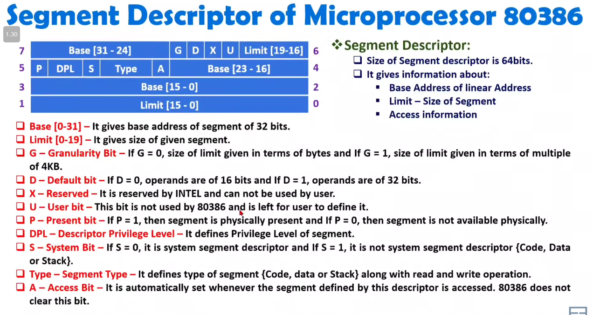
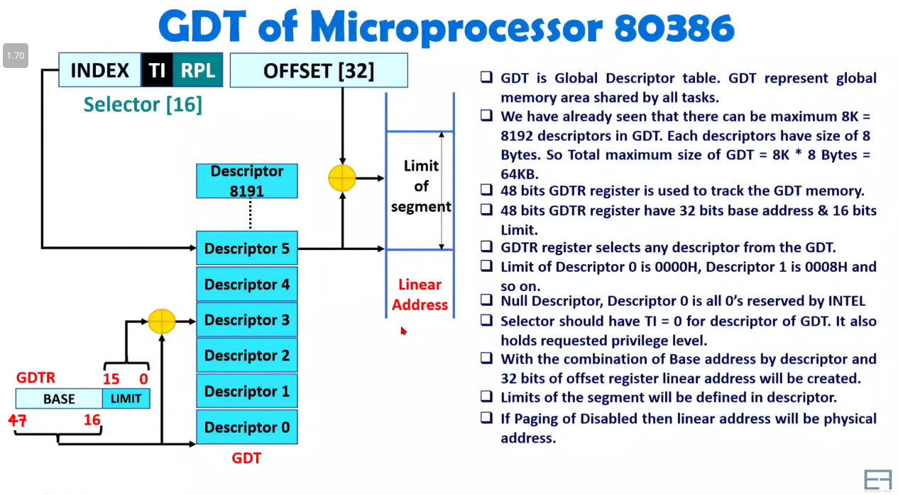
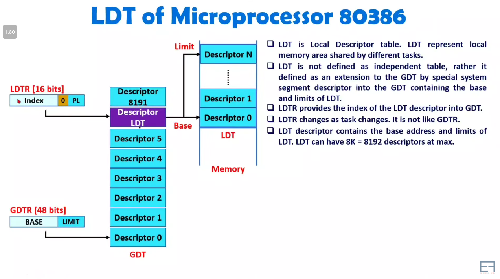

 

# `#Follow the Inter Microprocessors Book Chapter: 2 Along with this note:`

 

# `#Descriptor`

 

 

# `GDT:`

 

- **Throught GDTR Register all the Descriptior GDT Memory(Descriptor-0,Descriptor-1..Descriptor-8191) pointed**

- **Null Descriptor: Descriptor-0**

 

# `LDT:`

 

 
 

# `#Paging of Microprocessor 80836:`

 
 

