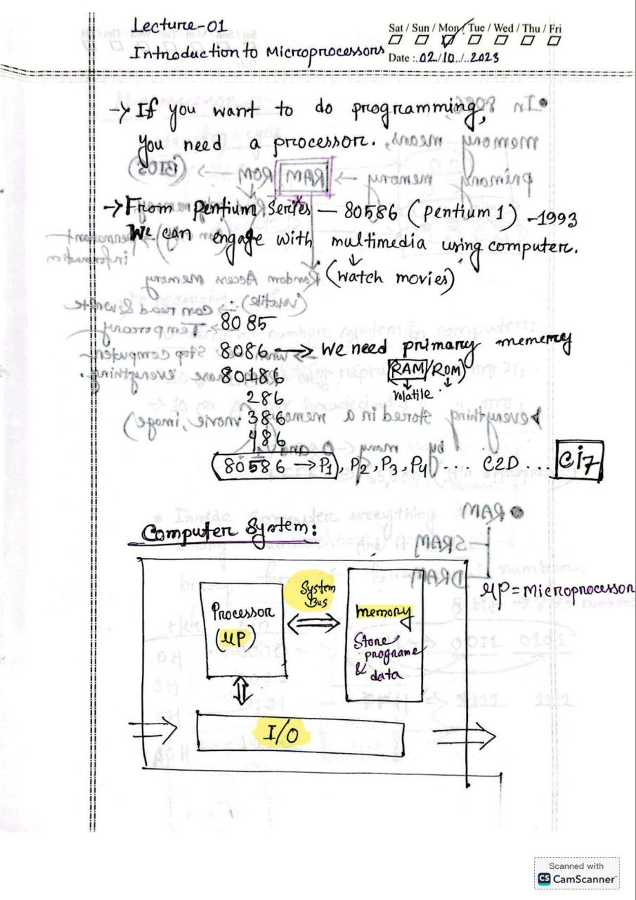
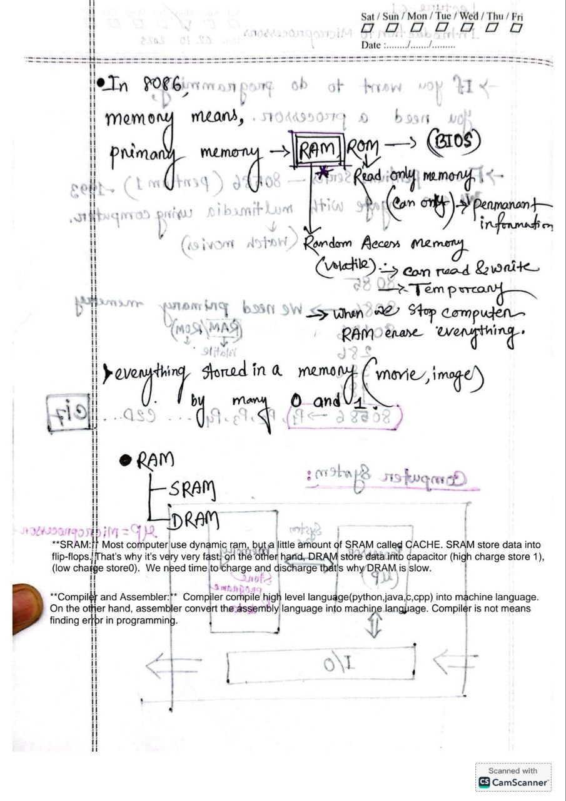
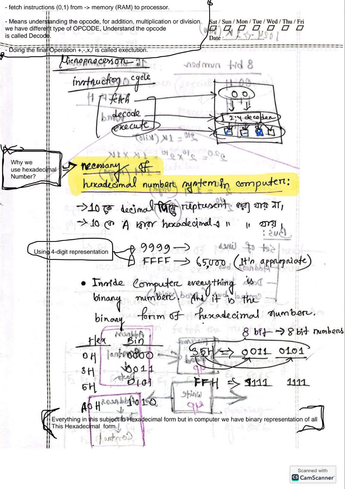
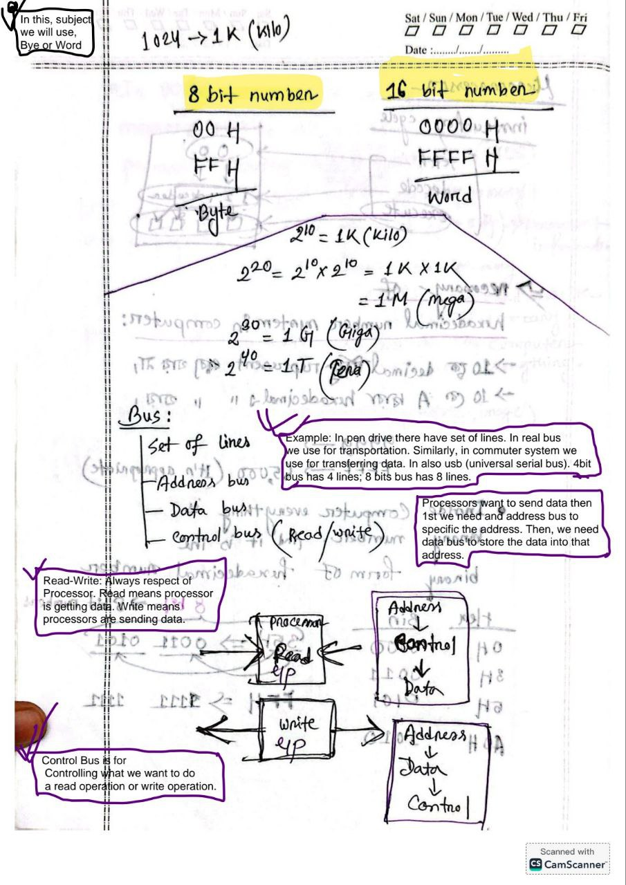
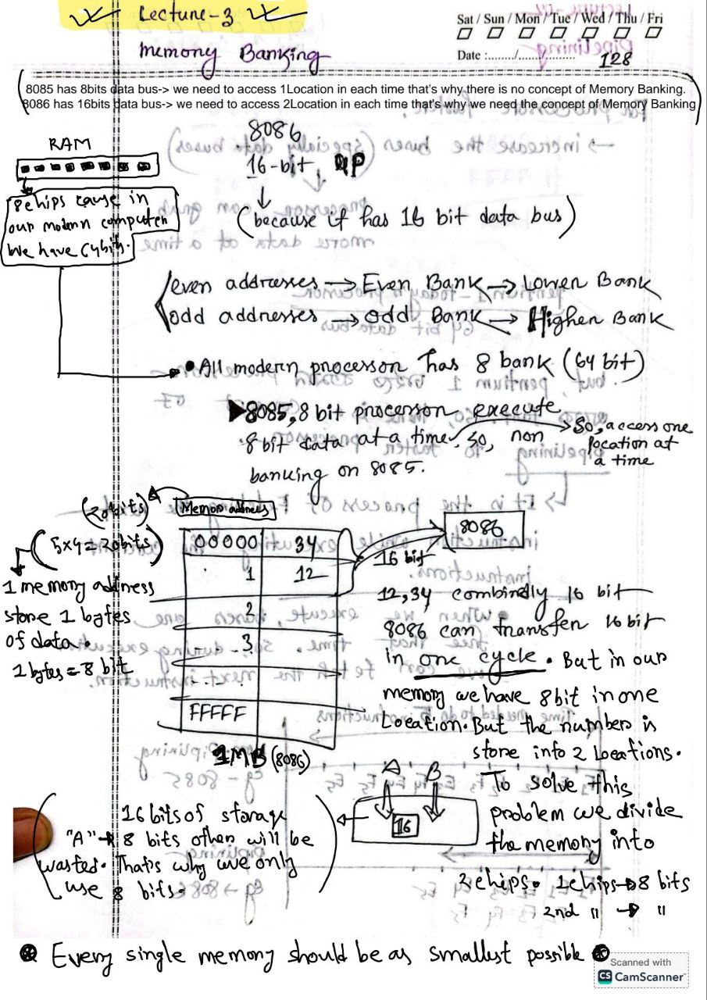
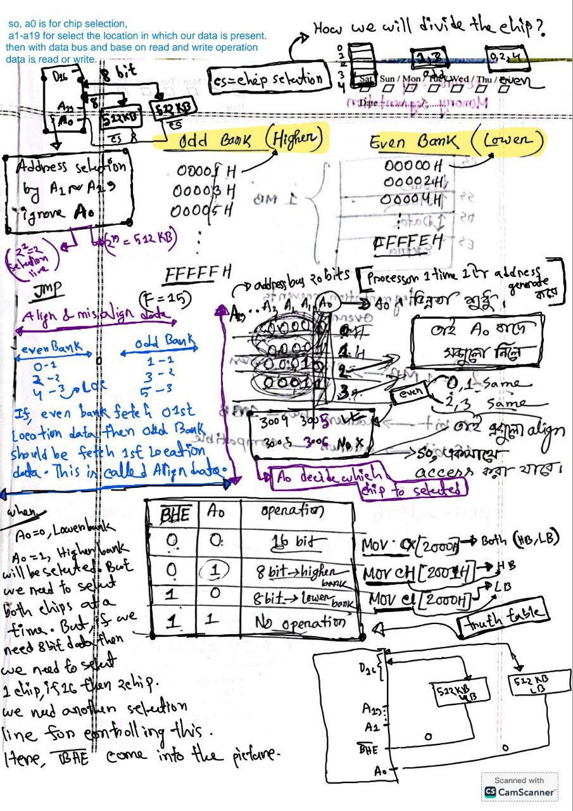
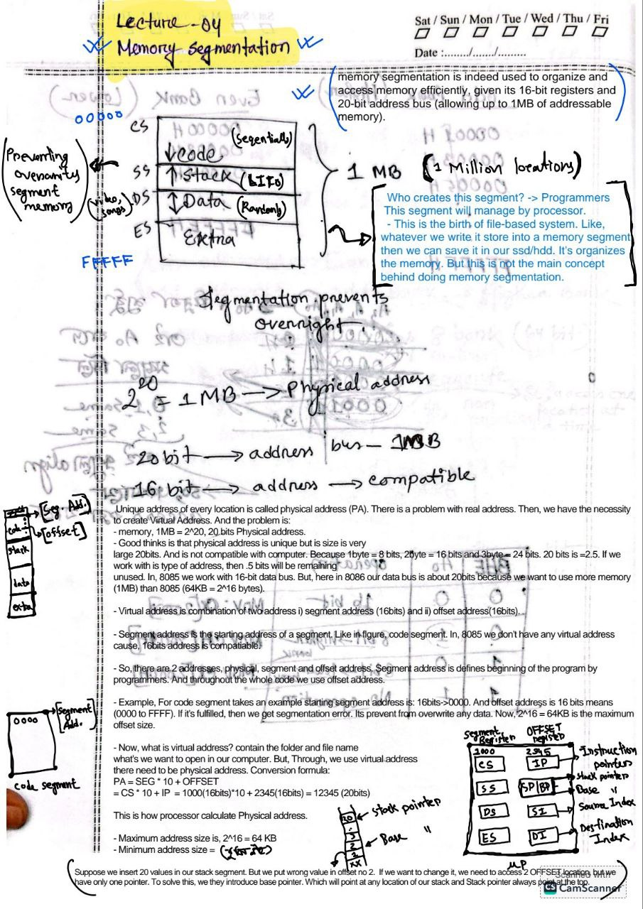
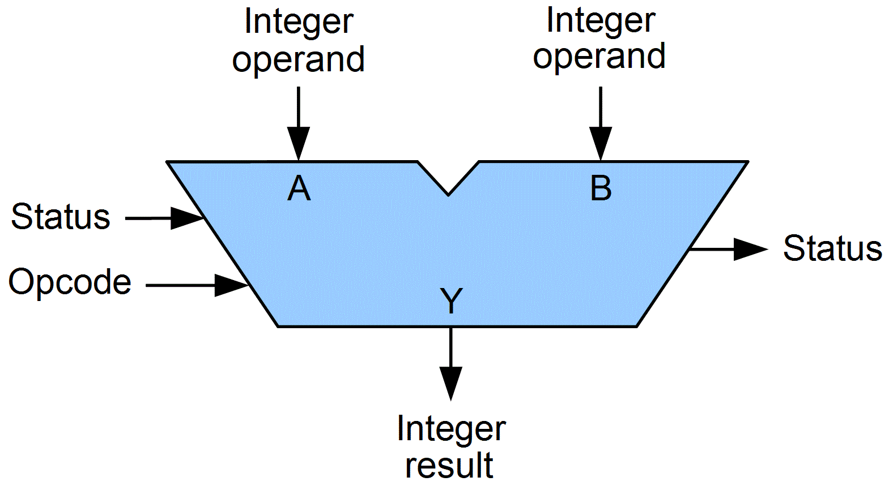

 

**Topics:**
- 01: Introduction 
- 02: Pipelining
- 03: Memory Banking
- 04: Memory Segmentation

 
 

## `#01: Introduction` 
 
 

 
 

# `#02: Pipelining` 
 
 

 
 

# `#03: Memory Banking` 
 
 

 
 

# `#04: Memory Segmentation` 
 
 

 
 

# `#05:8086 Architecture Diagram` 
 
 

**Why there are two part of 8086?**

- Cause for pipelining, see the lecture 02. To speed up the process. Here, BUI(Bus Interface Unit) is for fetching data from memory and EU(Exection unit) what we see in our 
pipelining lecture. 

`If there any sturucture like the above image in our microprocessor architecture, there will perform some operation like addition. This type of circuit is called arithemetic circuit. Both of the arithemetic circuit is not ALU. In BIU we calculate the physical address of our memory. Don't think it's a complitated thing. At the end it's a processor. What a processor do, fetch, decode and executute instructions.`

## `BIU: BUS Interfetch Unit:`
Take an example we have a 1TB hard disk. There are one trillion address. Do we remember the address? No, we just go to that folder and open a specific file. And that's the virtual address. Cause, we give the folder name and file name. In the ssd's memory there is no folder name and file. There are just 1 trillon memory address. In 8086 we do the same thing here, we give the segment address(16bits) and offset address(16bits). Then from this address our microporcessor calculate the real physical address. When our EU exectue 
an instruction in that time our BIU calculate the physical address of the next instructions. Here, (CS,SS,DS,ES) is not the segment that we read in memeory segmentation. 
Memory segment present in the memory. But, here (CS,SS,DS,ES) is segment registers. And, Code Segment Registers contains the beginning address of Code Segment that are present in the memory. Similly, for Stack Segment, Data Segment and Extra segment. Hence, we can say that, segment register contain the segmentation address. IP means instructions  pointers, it contains the the offset address of segments. Now, CS,SS,DS,ES contains segment address and they will not change. But the IP will be change. It fetch the offset address that what need to be execture next. In that time EU execture the current process. Then, we give the 
segment address and offset address to BIU, then it calculate it's physical address. And then through data bus it fetch the instruction from the memory(There is not memory inside 8086,here memory RAM). Then for pipepine we immedietly not execture that current instruction. In pipelining concpet, we read that address are pre-fetch. Then, this pre-fetch address is store in 6-byte prefetch-queue(1st in 1st out).  

Now, the size of prefetch-queue is of 6 bytes.

i) MOV BL, CL (BL registers get the value of CL registers.).  
ii) MOV BL, 25H (BL registers get the value of 25H).  
iii) MOV BX,2000H (BX register get the value of 2000H)  

This is all assembly language, then assembler convert it machine language. And put 
the program in to the memory. Now this machine language contains 0's and 1's and this 
is equvalent to our instruction and this is called opcode (operational code). Then, 
we can say every instruction has its own unique opcode. But the problem is, in the second instruction 25H is an number. But our opcode does not contian the number. It's just contain the information about which operation will be perform like: add, sub etc. and their corresponding registers. Now, our 1st instruction contain only opcode. 2nd instruction contains register info and a 8 bit or 1 byte operator. 3rd instruction contains about register info and 16bits or 2bytes operator. That's why our instruction 
size should be different size. And the maximum size of our instruction is 6bytes . That's why we have 6 bytes queue. Now, while executing an instruction the next 6 bytes of the program are store into the 6-byte prefetch queue. Now, from this queque instuction will go in the execution units. The question is how the queque will refill?? Yessss! 8086 is an 16 bits processor means it's have 16bits data bus. In 1 cycle it will contains 16bits or 2bytes. When, there will absence of 2bytes in the pre-fetch queque then cpu automatically fill up this queue again. But, our biggest instruction can be of 6bytes. Prefetch queque does not care this conditions. 

Normally, a program execute in sequential manners. But sometimes we have jumping operations (go to statement). Like in the above image instrucitons 1 is exectuting currently, but the next instruction is 9 then the pipeline fails when there is a branch. And immediately flush the 6bytes from queue then the processor goes to the new location and fetch the 6bytes of instructions into the queue.

Summary:
- BIU, calculate PA.
- Fetch instruction from memory by the help of databus.
- Store the fetch instruction into 6bytes queue.
- Manage the queue when there is a jumping operations.

## `Control sections:`
Our, ALU can perform addition, subtraction and many more operations. But, who will control this operation?? Yes! control sections. Control section fetch instruction for 6bytes queue and decode the instruction where the alu will do addition, multiplication subtraction etc.

 

## `EU: Execution Unit`

In, EU there is also a table, at the down of the table, we have, (SP,BP,SI,DI) are offset registers. And, (AH-8bits,AL-8bits)=AX(16-bits),BX,CX,DX are called General Purpouse Registers. Like, we sum two number, 4 and 5, 1st we take them into two registers then we add them and the result (4+5)=9 is also save into a registers and then we display that registers. In this seniro General Purpouse registers come into picture. `Here, U,L is Lower bank and upper bank.`

- Ax = 1234 (16bits number). Here, 34 is LowerBank will store in AL, and 12 Higher Bank 
will store in AH.  Okay. let's see some instructions:

