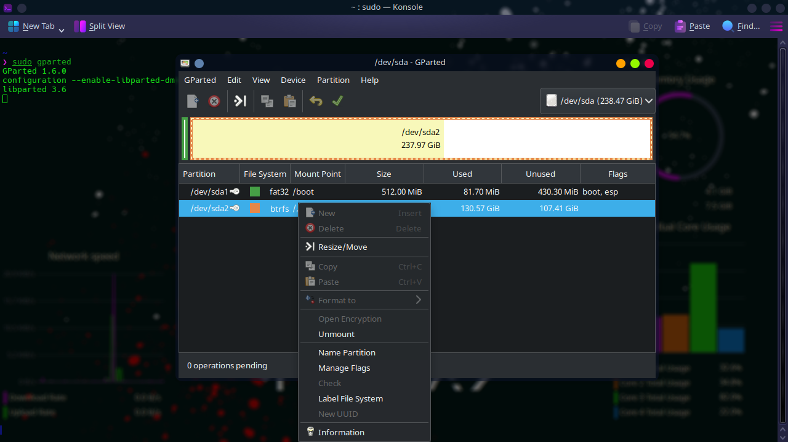
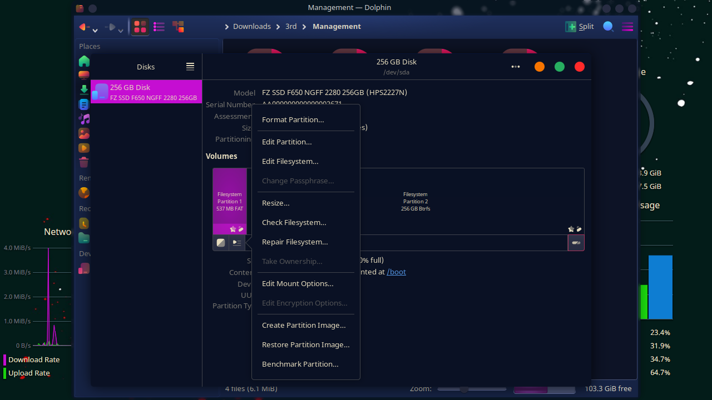

<br>
<br>

---

# `# 1.1 Create a mount point with command: `

<br>

### Steps to Create a Mount Point

1. **Create the Mount Point Directory:**
   First, you need to create a directory that will serve as the mount point. For example, if you want to mount a disk at `/mnt/mydisk`, create the directory using the following command:
   ```bash
   sudo mkdir -p /mnt/mydisk
   ```

2. **Identify the Partition or Disk:**
   Use the `lsblk` command to list available disks and partitions. This will help you identify the device name (e.g., `/dev/sda1`):
   ```bash
   lsblk
   ```
   You'll see an output listing your disks and partitions, such as `/dev/sda1`, `/dev/nvme0n1p1`, etc.

3. **Mount the Partition:**
   To mount the partition to the created mount point, use the `mount` command. Replace `/dev/sda1` with the correct partition identifier:
   ```bash
   sudo mount /dev/sda1 /mnt/mydisk
   ```
<br>

---

# # `1.2 Make the Mount Permanent.`

<br>

- If we make the mount permanent, your partition will automatically mount at `/mnt/mydisk` every time the system boots.

### To Make the Mount Permanent (Optional)
To automatically mount the partition at boot, you need to edit the `/etc/fstab` file.

1. **Get the UUID of the Partition:**
   Use the `blkid` command to get the UUID of the partition:
   ```bash
   sudo blkid /dev/sda1
   ```
   You will get output like this:
   ```
   /dev/sda1: UUID="abcd-1234" TYPE="ext4"
   ```

2. **Edit `/etc/fstab`:**
   Open `/etc/fstab` in a text editor (e.g., `nano` or `vim`):
   ```bash
   sudo nano /etc/fstab
   ```
   Add a new line with the partition's UUID, mount point, file system type, and options. For example:
   ```
   UUID=abcd-1234 /mnt/mydisk ext4 defaults 0 2
   ```
   Replace `UUID=abcd-1234` with the actual UUID, `/mnt/mydisk` with the mount point, and `ext4` with the correct file system type.

3. **Test the `/etc/fstab`:**
   You can test the new entry without rebooting by unmounting the partition and remounting it using the `mount` command:
   ```bash
   sudo umount /mnt/mydisk
   sudo mount -a
   ```
   If no errors occur, the mount point is successfully configured.

Now, your partition will automatically mount at `/mnt/mydisk` every time the system boots.

<br>


# `# 2. Now By the help of UI : `

---

<br>

## `# 2.1  Partition with gparted: `



To install **GParted** (a popular graphical disk partitioning tool) in Arch Linux, you can use the following command:

```bash
sudo pacman -S gparted
```

Once installed, you can launch GParted by searching for it in your application menu or by running the following command in the terminal:

```bash
gparted
```

This tool allows you to manage partitions, format drives, and configure mount points with a graphical interface.


## `# 2.2 Mount with disks `

To install GNOME Disks (a graphical utility to manage disk partitions, mount points, etc.) on Arch Linux, you can follow these steps:

1. **Update your system:**
   Open a terminal and run:
   ```bash
   sudo pacman -Syu
   ```

2. **Install GNOME Disks:**
   You can install the `gnome-disk-utility` package using `pacman`:
   ```bash
   sudo pacman -S gnome-disk-utility
   ```

3. **Launching GNOME Disks:**
   Once installed, you can launch GNOME Disks either by searching for "Disks" in your application menu or by running the following command in the terminal:
   ```bash
   gnome-disks
   ```




<br>
<br>
<br>


# `# 3. See type file system type: `

Here is a list of all the commands you can use to check the file system type in Linux:

1. **`lsblk -f`**
   - Lists block devices along with their file system types.
   ```bash
   lsblk -f
   ```

2. **`blkid`**
   - Displays information about block devices, including the file system type.
   ```bash
   sudo blkid
   ```

3. **`df -T`**
   - Shows mounted file systems and their types.
   ```bash
   df -T
   ```

4. **`mount | grep "^/dev"`**
   - Lists all mounted partitions along with their file system types.
   ```bash
   mount | grep "^/dev"
   ```

5. **`sudo fdisk -l`**
   - Displays partition information, including partition types (but not always the exact file system type).
   ```bash
   sudo fdisk -l
   ```

These commands cover various ways to check the file system type in Linux.

<br>
<br>
<br>