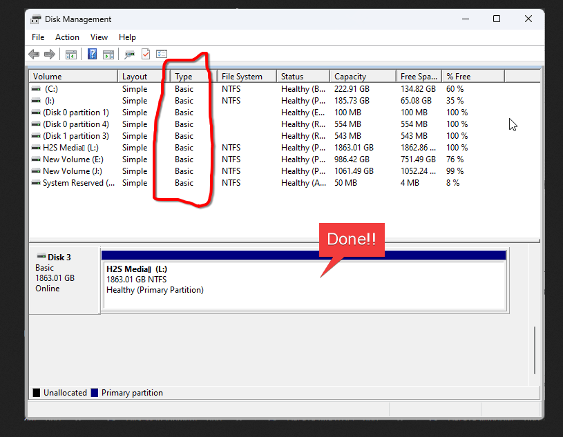

<br>
<br>

# `#01: Duel boot arch linux`

<br>
<br>




`Type should be Basic. If not then linux will not be found the formated disk.`

<br> 

- /boot (fat32 must 1GB)
- / (must ext4 minimum 50GB)
- /home (must ext4)

<br> 


- Remember must download the latest arch linux file.    
```bash
iwctl 
station wlan0 get-networks
station wlan0 connect "Network_SSID"
pass 
pacman-key --init
pacman -Sy 
pacman -S archinstall
```


