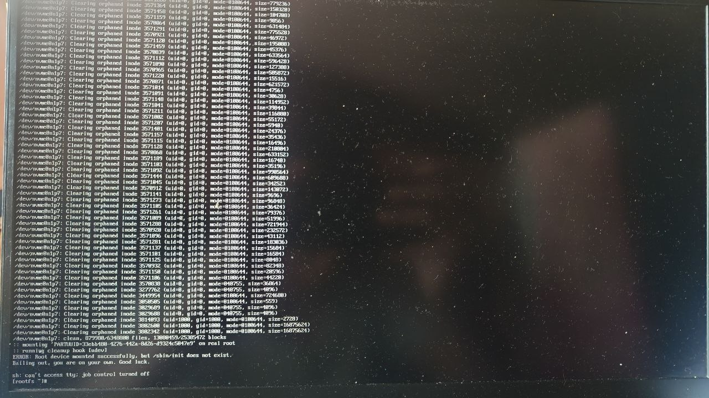

## 1. Solution:
**Arch Linux ISO দিয়ে বুট করো**, তারপর:

```bash
# check 
# from the error our arch linux in /dev/nvme0n1p7 
#nvme0n1
#├─nvme0n1p1   (EFI)
#├─nvme0n1p6   (Maybe Windows)
#└─nvme0n1p7   (Maybe Arch - ROOT)
lsblk 


# mount the partition:
mount /dev/nvme0n1p7 /mnt

# with chroot enter(chroot make it easy): 
arch-chroot /mnt

# reinstall systemd:
pacman -Syy
pacman -S base systemd
```

## 2. Why we got this problem?
Why we will install systemd?
`/sbin/init linked with systemd file. Problem is that while updating sudo pacman -Syu, internet gone or somthing then /sbin/init file broken or somehow it deleted. `

```text
/sbin/init → /usr/lib/systemd/systemd

Computer ON
     ↓
Bootloader (GRUB)
     ↓
Linux Kernel
     ↓
/sbin/init = systemd ← এখানেই সমস্যা তোমার!
     ↓
সব service start করে:
  - Network
  - Display (Xorg/Wayland)
  - Login screen
  - Bluetooth
  - ইত্যাদি...
     ↓
তুমি login করতে পারো
```


