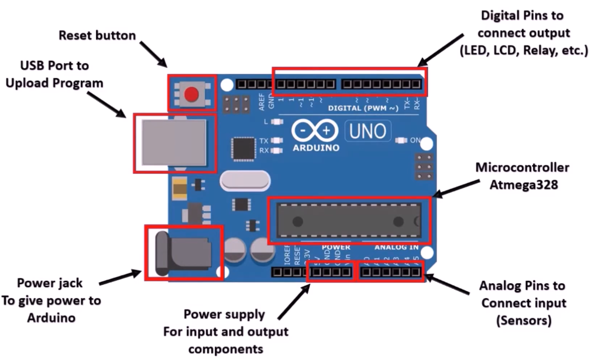

<br>
<br>

# 1. Aurdino Board: 

<br>
<br>




[explation_of_these_components](https://www.youtube.com/watch?v=6v_DF-zhrPw&list=PLV3C-t_tgjGE1USbPg2jrrDMu26F_M7K-)


<br>
<br>

# 2. Three Basic Function to control arduino board:

<br>
<br>


pinMode() <br>
digitalWrite() <br>
delay() <br>

Here’s a short explanation of each function:


1. **`pinMode(pin, mode)`**:
   - **Purpose**: Configures a specified pin on the Arduino as either an input or output.
   - **Usage**:
     - `pin`: The pin number to configure (e.g., `13`).
     - `mode`: Can be `INPUT`, `OUTPUT`, or `INPUT_PULLUP`.
   - **Example**: 
     ```cpp
     pinMode(13, OUTPUT);  // Set pin 13 as an output
     ```

2. **`digitalWrite(pin, value)`**:
   - **Purpose**: Sets a digital pin to either `HIGH` (on) or `LOW` (off).
   - **Usage**:
     - `pin`: The pin number to write to (e.g., `13`).
     - `value`: Can be `HIGH` (5V) or `LOW` (0V).
   - **Example**:
     ```cpp
     digitalWrite(13, HIGH);  // Turn on the pin 13
     ```

3. **`delay(milliseconds)`**:
   - **Purpose**: Pauses the program for a specified amount of time.
   - **Usage**:
     - `milliseconds`: The number of milliseconds to wait (1000 milliseconds = 1 second).
   - **Example**:
     ```cpp
     delay(1000);  // Wait for 1 second
     ```

### `Simple Project:  LED Control in arduino board at pin number 13 `

```ino

void setup() {
  pinMode(13, OUTPUT);  // Set pin 13 as an output
}

void loop() {
  digitalWrite(13, HIGH);  // Turn the LED on
  delay(1000);             // Wait for 1 second
  digitalWrite(13, LOW);   // Turn the LED off
  delay(1000);             // Wait for 1 second
}

```

<br>
<br>

#  3. Serial communication:

<br>
<br>


Serial.began() <br>
Serial.read() <br>
Serial.print() <br>
Serial.available()  <br>


### 1. **`Serial.begin(baud rate)`**
   - **Purpose**: Initializes the serial communication between the Arduino and a connected device (usually a computer) at a specific baud rate (speed).
   - **Usage**:
     ```cpp
     Serial.begin(9600);  // Start serial communication at 9600 baud rate
     ```
   - **Baud Rate**: Common values are 9600, 115200, etc. It defines how fast the communication happens.

### 2. **`Serial.read()`**
   - **Purpose**: Reads incoming data from the serial port (one byte at a time).
   - **Usage**:
     ```cpp
     int incomingByte = Serial.read();  // Read the next byte of data
     ```
   - **Returns**: The byte read (or `-1` if no data is available).

### 3. **`Serial.print(data)`**
   - **Purpose**: Sends data to the serial monitor (or connected device) to be displayed or used.
   - **Usage**:
     ```cpp
     Serial.print("Hello, World!");  // Send text
     Serial.print(123);              // Send a number
     ```
   - **Note**: Use `Serial.println()` to send data with a newline character at the end, so each message appears on a new line.

### 4. **`Serial.available()`**
   - **Purpose**: Returns the number of bytes available to read from the serial buffer.
   - **Usage**:
     ```cpp
     if (Serial.available() > 0) {
       int incomingByte = Serial.read();  // Read only if data is available
     }
     ```
   - **Returns**: The number of bytes available in the serial buffer.


```ino
void setup() {
  // Start the serial communication at 9600 baud rate
  Serial.begin(9600);
  
  // Give some time for the Serial Monitor to initialize
  delay(1000);
  
  // Print a message when the program starts
  Serial.println("Serial communication started. Type something:");
}

void loop() {
  // Check if any data is available to read from the Serial port
  if (Serial.available() > 0) {
    // Read the incoming byte from the Serial buffer
    char incomingByte = Serial.read();
    
    // Echo the byte back to the Serial Monitor
    Serial.print("You sent: ");
    Serial.println(incomingByte);
  }
}


```

<br>
<br>

#  4. Numerical Data type in Aurdino:

<br>
<br>

1. **`byte`**
   - **Declaration**: 
     ```cpp
     byte myByte = 255;
     ```
   - **Range**: `0` to `255` (8 bits).

2. **`word`**
   - **Declaration**:
     ```cpp
     word myWord = 65535;
     ```
   - **Range**: `0` to `65535` (16 bits, unsigned).

3. **`short`**
   - **Declaration**:
     ```cpp
     short myShort = -32768;
     ```
   - **Range**: `-32,768` to `32,767` (16 bits, signed).

4. **`int`**
   - **Declaration**:
     ```cpp
     int myInt = 32767;
     ```
   - **Range**: `-32,768` to `32,767` (16 bits, signed).
   - On some platforms (like Arduino Due), `int` may be 32 bits.

5. **`long`**
   - **Declaration**:
     ```cpp
     long myLong = 2147483647;
     ```
   - **Range**: `-2,147,483,648` to `2,147,483,647` (32 bits, signed).

6. **`float`**
   - **Declaration**:
     ```cpp
     float myFloat = 3.14;
     ```
   - **Range**: Approximately `-3.4 × 10^38` to `3.4 × 10^38` (32 bits, floating-point precision).
   - **Note**: Precision is only about 6–7 digits.

7. **`double`**
   - **Declaration**:
     ```cpp
     double myDouble = 3.14159;
     ```
   - **Range**: Same as `float` on most Arduino boards (32 bits). Some boards like the Arduino Due support 64-bit doubles.

8. **`unsigned int`**
   - **Declaration**:
     ```cpp
     unsigned int myUnsignedInt = 65535;
     ```
   - **Range**: `0` to `65,535` (16 bits, unsigned).

9. **`unsigned long`**
   - **Declaration**:
     ```cpp
     unsigned long myUnsignedLong = 4294967295;
     ```
   - **Range**: `0` to `4,294,967,295` (32 bits, unsigned).

### Summary of Ranges:

| **Data Type**      | **Size** | **Range**                                                |
|--------------------|----------|----------------------------------------------------------|
| `byte`             | 8 bits   | `0` to `255`                                              |
| `word`             | 16 bits  | `0` to `65535`                                            |
| `short`            | 16 bits  | `-32,768` to `32,767`                                     |
| `int`              | 16 bits  | `-32,768` to `32,767` (platform-dependent, may be 32 bits)|
| `long`             | 32 bits  | `-2,147,483,648` to `2,147,483,647`                       |
| `float`            | 32 bits  | Approximately `-3.4 × 10^38` to `3.4 × 10^38`             |
| `double`           | 32 bits  | Same as `float` on most boards; 64 bits on some platforms |
| `unsigned int`     | 16 bits  | `0` to `65,535`                                           |
| `unsigned long`    | 32 bits  | `0` to `4,294,967,295`                                    |


<br>
<br>

# 5. Text data type:

<br>
<br>

- char
- String 


<br>
<br>

#  6. Array:

<br>
<br>

- how to insert,delete,update element in an array


<br>
<br>

# 7. Digital input And output Function: 

<br>
<br>


### 1. **`pinMode(pin, mode)`**
   - **Purpose**: Configures a specified pin to behave as either an **input** or an **output**.
   - **Usage**:
     ```cpp
     pinMode(13, OUTPUT);  // Set pin 13 as an output pin
     pinMode(12, INPUT);   // Set pin 12 as an input pin
     ```
   - **Modes**: Can be `INPUT`, `OUTPUT`, or `INPUT_PULLUP`.

### 2. **`digitalWrite(pin, value)`**
   - **Purpose**: Sends a **HIGH** or **LOW** signal to a digital pin (turns the pin on or off).
   - **Usage**:
     ```cpp
     digitalWrite(13, HIGH);  // Set pin 13 to HIGH (5V)
     digitalWrite(13, LOW);   // Set pin 13 to LOW (0V)
     ```

### 3. **`digitalRead(pin)`**
   - **Purpose**: Reads the value from a digital pin and returns either **HIGH** (1) or **LOW** (0), depending on the input signal.
   - **Usage**:
     ```cpp
     int state = digitalRead(12);  // Read the value from pin 12
     ```

### 4. **`INPUT_PULLUP`**
   - **Purpose**: Enables an internal pull-up resistor on the pin, so it defaults to **HIGH** when not connected to anything.
   - **Usage**:
     ```cpp
     pinMode(12, INPUT_PULLUP);  // Set pin 12 as input with a pull-up resistor
     ```
   - **Behavior**: When a button or sensor is connected to the pin and grounded, it reads **LOW**; otherwise, it reads **HIGH**. This helps avoid floating input values.


### ` By using digital pin 12. we will control arduino led by a switch.`


```ino 

void setup() {
  pinMode(12, INPUT_PULLUP);  // Set pin 12 as an input with a pull-up resistor
  pinMode(13, OUTPUT);        // Set pin 13 as an output
  Serial.begin(9600);         // Start serial communication at 9600 baud rate
}

void loop() {
  int val = digitalRead(12);  // Read the state of pin 12
  Serial.println(val);        // Print the state to the Serial Monitor
  digitalWrite(13, val);      // Write the state to pin 13
}

```

<br>
<br>

# `8. Analog Input and Output Functions: `

<br>
<br>


