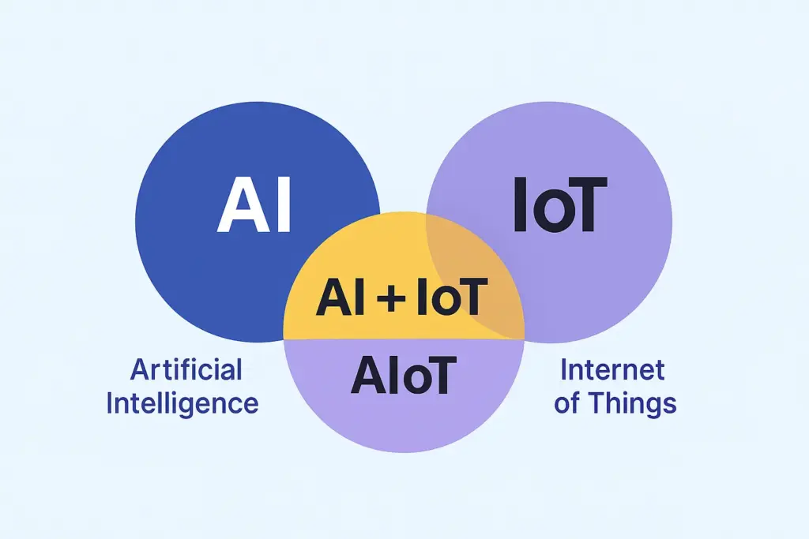
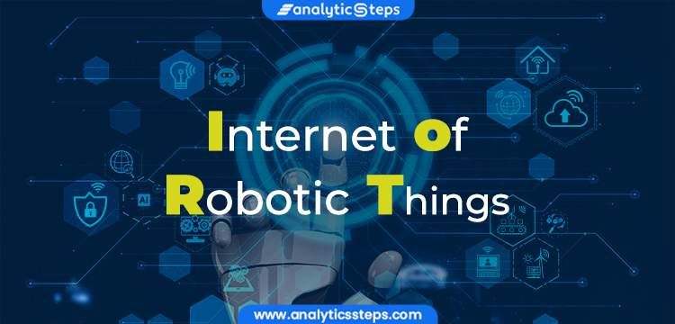
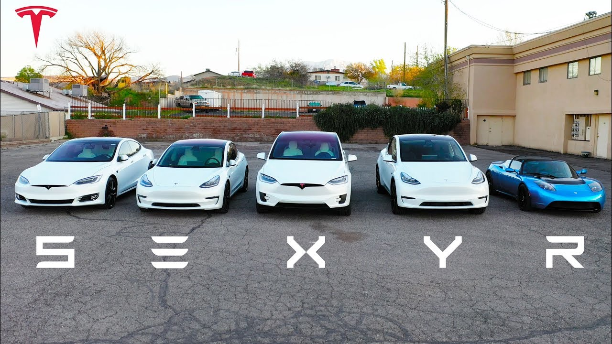
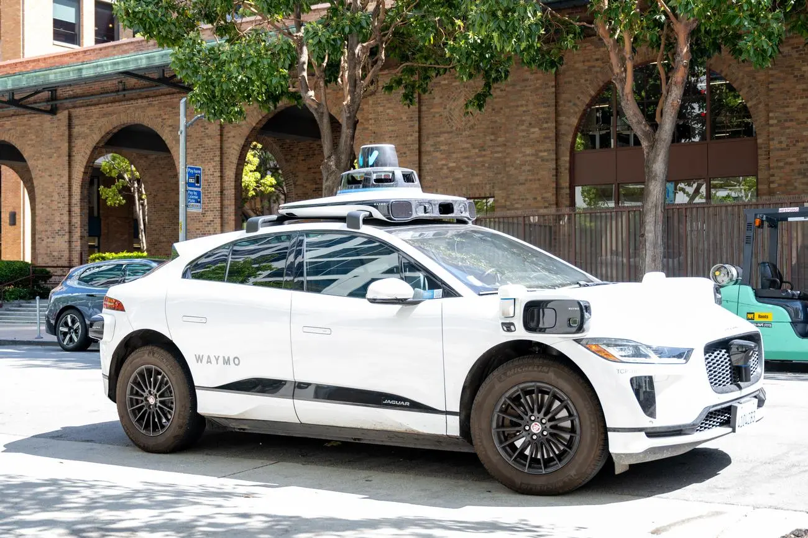
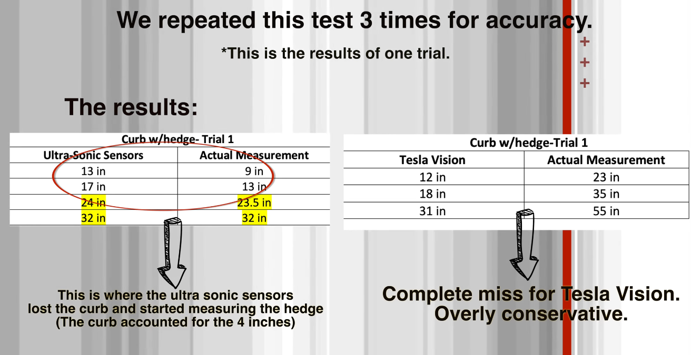
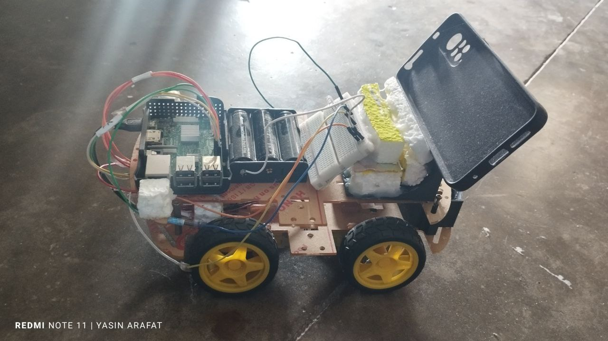
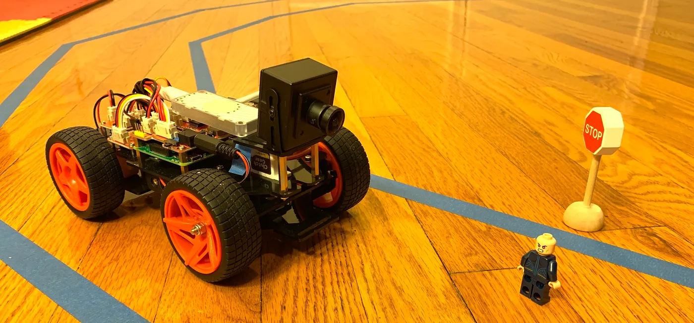
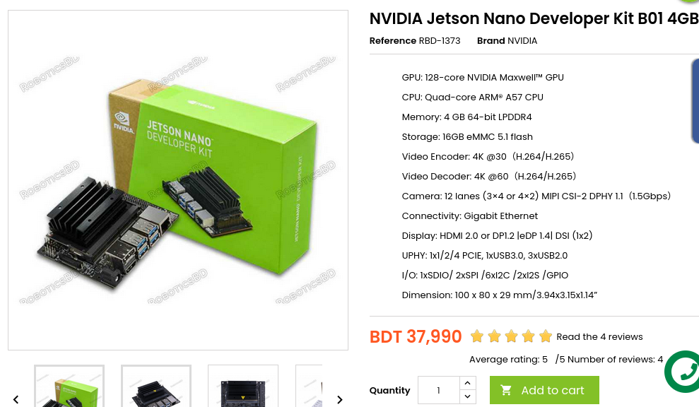
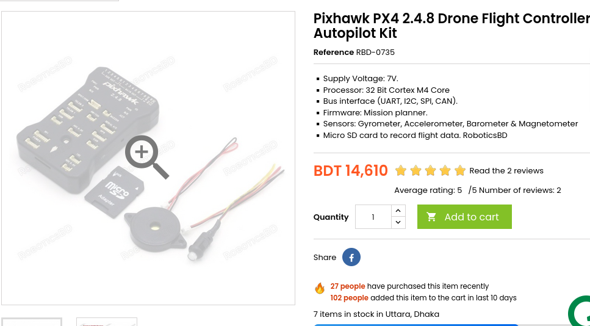
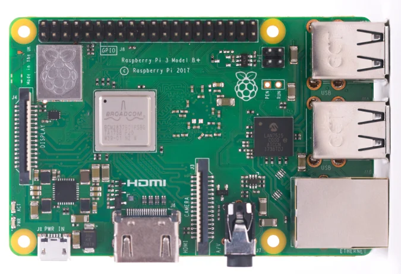

# 1. IOT: 

### **Defination:** IoT (Internet of Things) refers to the vast network of physical objects—from smart home devices and wearables to industrial `sensors—embedded with software`, sensors, and connectivity, allowing them to collect and exchange data over the `internet without direct human intervention`, creating smart, responsive environments. Essentially, it's about connecting everyday "things" to the internet to gather data, automate tasks, and improve efficiency and decision-making across many sectors.  

 
 

# 2. IOT With AI(Artificial Intelligence) And Robotics:

 

- AI(Artificial Intelligence)
- ML(Machine Learning)
- DL(Deep Learning)

    
    

 
 

# 3. Tesla 

 

    
    

 

## Computer Vision:

- **Tesla vision:** Tesla Vision is `Tesla's camera-based system`, replacing `ultrasonic sensors`, that uses the car's cameras and neural networks for features like Park Assist, Autopilot, and `Full Self-Driving (FSD)`, `creating 3D environmental models` for object detection, spatial awareness, and navigation, though its effectiveness, especially for blind spots, can vary and depends heavily on ongoing software improvements and lighting conditions

 

    
    

 
 

# 4. How Machine Learning Impact In IOT

 
 

# - [Tesla](https://www.youtube.com/watch?v=q1ZIbNWdS2o) VS [Waymo](https://www.youtube.com/watch?v=hA_-MkU0Nfw)

| Feature                | Waymo                                               | Tesla                                                 |                   |
| ---------------------- | --------------------------------------------------- | ----------------------------------------------------- | ----------------- |
| Autonomy level         | **Level 4** (driver not required in approved zones) | **Level 2+** (driver required, supervision mandatory) |                   |
| True driverless        | Yes (in service areas)                              | No (still needs human)                                |                   |
| Public rides available | Yes (Waymo One)                                     | No (only robotaxi pilot / supervised tests now)       |

# - [tesla with and without ultrasonic sensors](https://www.youtube.com/watch?v=I_3y0N4sX8M) 

    
    

 

#  - But can't make a tesla?

 

- [Blog How to make a simple self-driving car with neural network](https://medium.com/data-science/deeppicar-part-1-102e03c83f2c)

    
    

 
 

# 5. Jetson Nano, Pixhawk, Pi, Arduino:

 
 

    
    

 
 

    
    

 
 

## More Project: 
- Hand Controlling Light 
- Face Locking Door 

 
