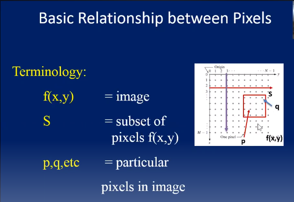
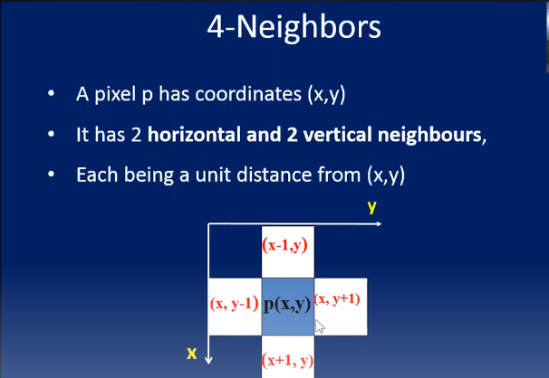
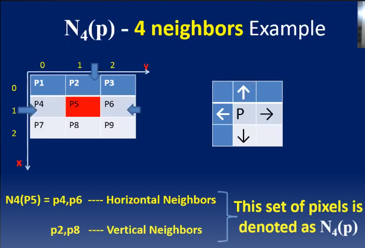
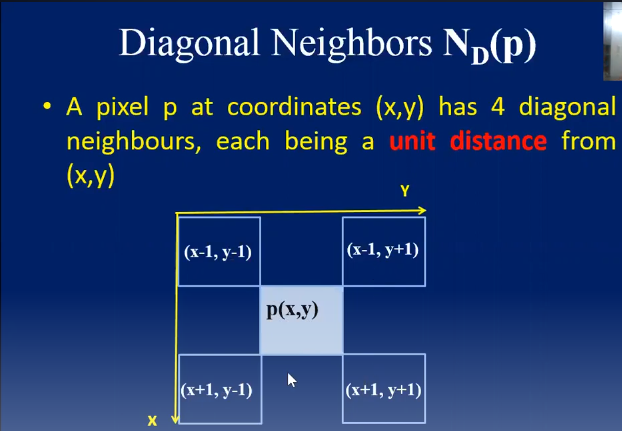

# Digital Image Processing

[PlayListLINK](https://www.youtube.com/watch?v=N7CY0IqGpXQ&list=PLd7ZnpYrroloHZN6Tc-mLSUifWobdFctR&ab_channel=TheVertex)

# ______________________ Lecture-01 ______________________

## Relation Between Pixels

### 4-Neighbors 

### Example of 4-Neighbors

`4-Neighbors relationship represent as N4(p)`

### Diagonal Neighbors ND(p)

