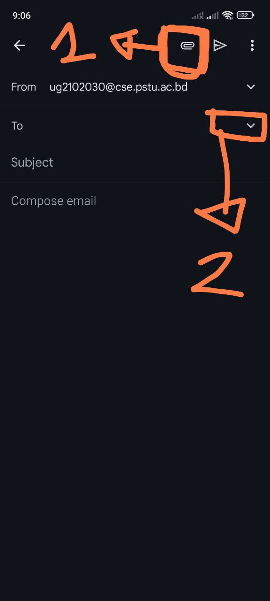
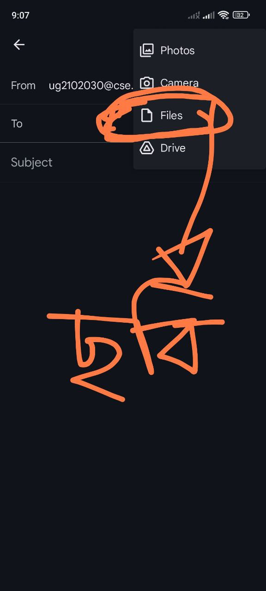
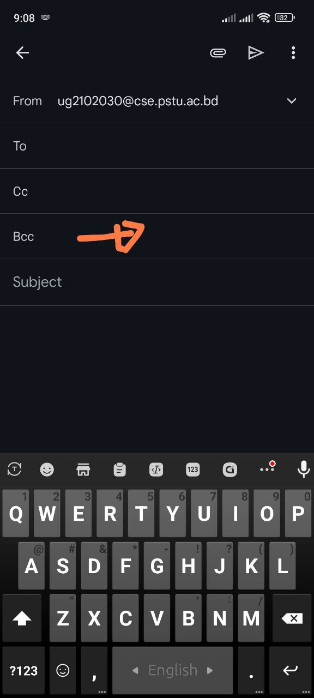
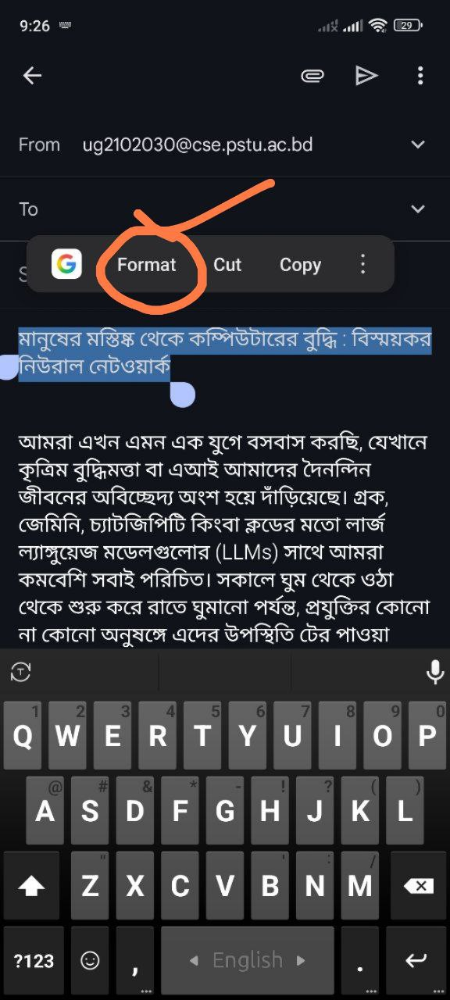
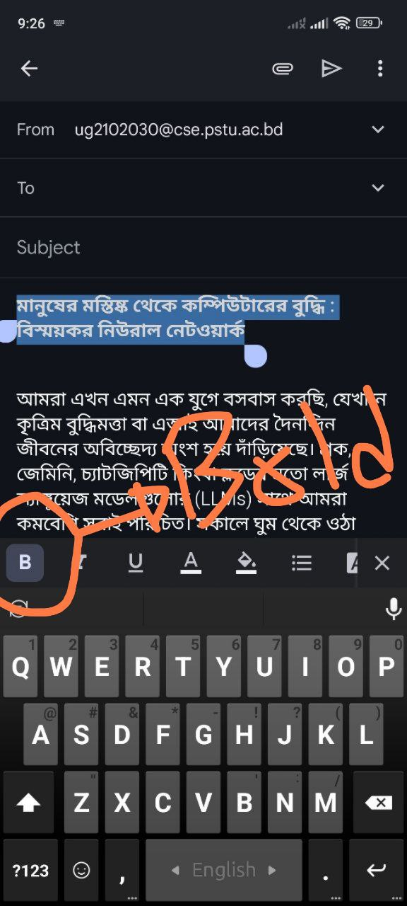
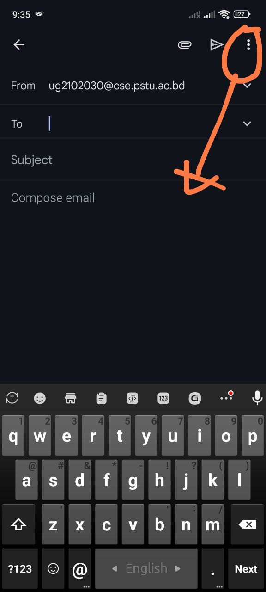
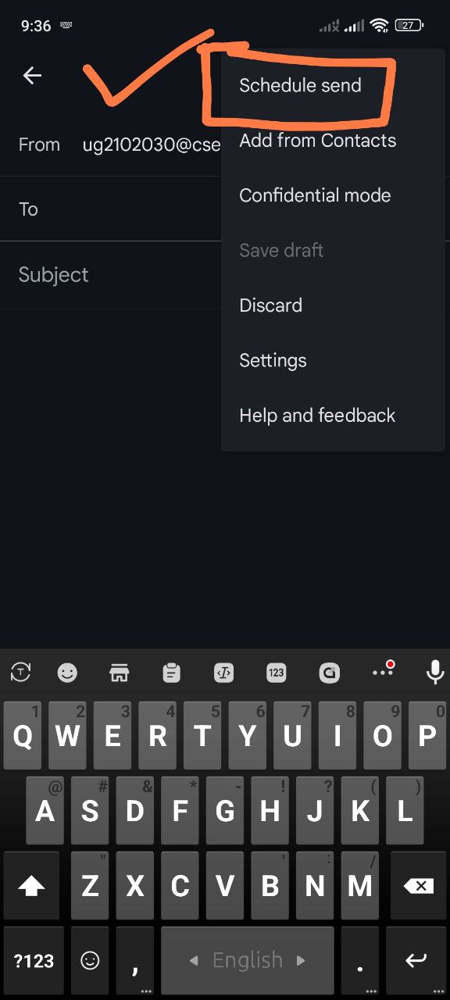

<br>
<br>

# `#প্রত্রিকায় কীভাবে লেখা পাঠাবো? `

- #01: যদি কলাম লিখতে চাই
- #02: যদি লেটার লিখতে চাই 
- #03: যদি ইসলাম ধর্ম নিয়ে কিছু লিখতে চাই
- #04: কিছু সংবাদপত্রের তালিকা
- #05: text formatting? Heading কেমন হবে?

<br>
<br>


<br>
<br>

# `#01: যদি কলাম লিখতে চাই তাহলে নিচের email গুলো ব্যবহার করতে পারবো:`

<br>
<br>

```md
editorialajkalerkhobor@gmail.com
```

```md
editorial@ajkerpatrika.com
```

```md
editorial.sharebiz@gmail.com
```

```md
editorial.kalbela@gmail.com 
```

```md
columnittefaq@gmail.com 
```

```md
samakal.editorial@gmail.com 
max words: 700-800
```

```md
editorial@prothomalo.com 200
```

```md
dailykaratoaeditorial@gmail.com 
max words: 600
```

```md
editorial.jugantor@gmail.com 
```

```md
inqilab.info@gmail.com 
```

```md
editorial@dailyamardesh.com 
```

```md
janakanthaeditorial@gmail.com 
```

```md
editorial@kalerkantho.com 
```

```md
editorialdiganta21@gmail.com 
```

```md
amadershomoyeditorial@gmail.com
```

```md
editorial.sangbad@gmail.com
```

```md
editorial.manobkantha@gmail.com 
```

```md
editorial@deshrupantor.com 
```

```md
alokito2020.bd@gmail.com 
```

```md
pdsangbadeditorial@gmail.com 
```

```md
dinkaleditorial2024@gmail.com 
```

```md
editorialdsa@gmail.com 
```

```md
kholakagojed2@gmail.com 
maximum words: 1000
```

```md
dsangram@gmail.com 
```


```md
thebdbulletin@gmail.com
```

```md
bkeditorial@yahoo.com
```

```md
editorial@dainikpurbokone.net
```

```md
deltatimes24@gmail.com
```

```md
azadieditorial@gmail.com 
max-word: 1000
```

```md
bkhaboreditorial@gmail.com 
```


<br>
<br>


# `#02: যদি লেটার লিখতে চাই তাহলে নিচের email গুলো ব্যবহার করতে পারবো:`

<br>
<br>

```md
letters.ittefaq@gmail.com 
```

```md
letterpathao@gmail.com 
```


<br>
<br>


# `#03: যদি ইসলাম ধর্ম নিয়ে কিছু লিখতে চাই তাহলে নিচের email গুলো ব্যবহার করতে পারবো:`

<br>
<br>


```md
dharmochinta63@gmail.com
islam.jugantor@gmail.com
islamizibonpata@gmail.com 
islam@dailyamardesh.com
shomajjanakantha@gmail.com
islamijibon@kalerkantho.com
ndislamicjibon2@gmail.com
islamojibonmk@gmail.com
abislamosomaj@gmail.com
islameralodsa@gmail.com
```

<br>
<br>

# `#04: কিছু সংবাদপত্রের তালিকা :`

<br>
<br>

- ভোরের কাগজ
- বাংলাদেশের খবর
- দেশ রূপান্তর 
- করতোয়া
- সংগ্রাম
- স্বদেশ প্রতিদিন 
- প্রতিদিনের সংবাদ
- খোলাকাগজ
- আলোকিত বাংলাদেশ
- ডেল্টা টাইমস


<br>
<br>


# `#05: text formatting? Heading কেমন হবে?:`

<br>
<br>


## **1: ছবিকে ফাইল আকারে পাঠাতে হবে ।** <br>

## **2: Email BCC  তে দিতে হবে । না হলে, প্রত্রিকার mail থেকে  Block করে দেওয়ার possibility আছে ।**

<br>



<br>







## **3: শিরোনাম email এর subject হিসেবে দিতে হবে ।**
## **4: body তেও শিরোনাম থাকবে, কিন্তু সেইটাকে blod করে দিতে হবে । যতটুকু শিরোনাম সেইটাকে select করে format এ click করলে blod করার অপশন চলে আসবে । **






## **সকাল ৮ থেকে ১২ টার মধ্যে পাঠাতে হবে । যদি time না মিললে তাহলে নিচের ছবির দেখানো 3 dot এ click করে schedule email sending করতে পারবো **





